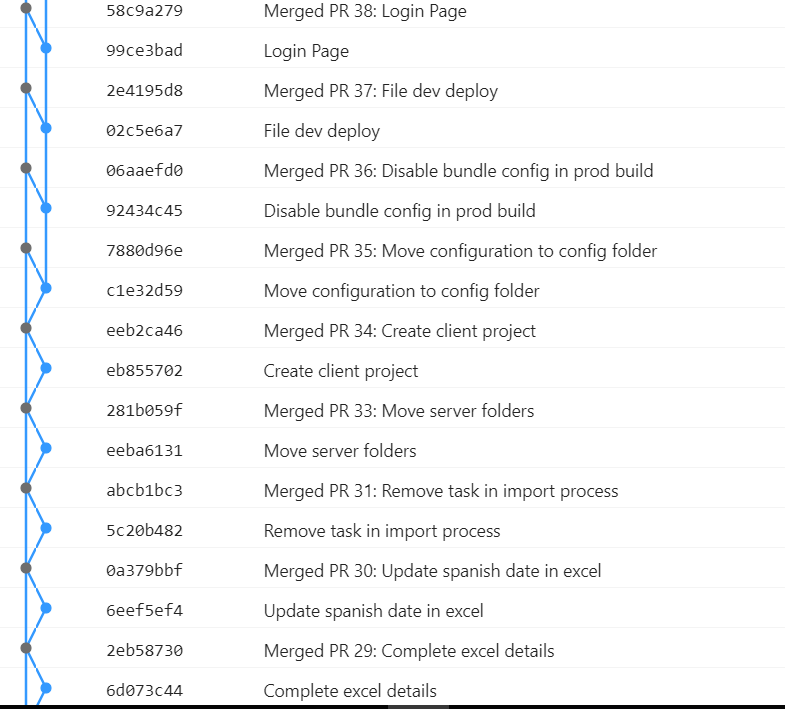

> "Somos lo que hacemos de forma repetida. La excelencia, entonces, no es un acto, sino un hábito." Aristoteles

# Pull Requests

La traducción directa sería algo así como "Petición de Validación". Una Pull Request es la acción de validar un código que se va a mergear de una rama a otra. En este proceso de validación pueden entrar los factores que queramos: Builds (validaciones automáticas), asignación de código a tareas, validaciones manuales por parte del equipo, despliegues, etc.

## Planteamiento

¿Por qué las PullRequests? No sé si has oido hablar de ellas, pero la comunidad está muy dividida de si aportan o no aportan valor. Este documento tiene como objetivo servir de base para los nuevos y dar los puntos de vista de por qué se han elegido las Pull Requests (PRs a partir de ahora) como una rutina más en mi equipo.

### Estética del Repositorio de Git

_Git_ se ha asentado como nuestro repositorio de código fuente. Todos lo usamos, pero a mi me gustaría ir más allá y lanzar una pregunta: como desarrolladores, ¿cual es nuestra responsabilidad con el repositorio de código?

Creo que todo DoD ([Definition of Done](https://apiumhub.com/tech-blog-barcelona/definition-of-done-examples-software-projects/)) tiene como primer paso subir el código al repositorio. Parece algo básico pero siempre viene bien recordarlo. Esto es crucial para que no existan las clásicas complicaciones de que "el código solo está en mi máquina". Estas cosas siempre suelen suceder cuando el programador que tiene el código en su equipo local está de vacaciones.

Pero si vamos un poco más allá, en nuestro equipo nos planteamos el dilema de __¿cómo de responsables somos de como queda el código en el repo de Git?__. Muchas veces uno empieza a hacer un commit detrás de otro, con nombres como _"Fix task 12553"_, _"Change name"_, etc. que dejan el repo muy feo de ver. Es cierto que el código compila y funciona pero ¿es esto suficiente? ¿somos responsables de hacer buenos commits? ¿o eso da un poco igual?

La respuesta para nosotros es clara: __el desarrollador es responsable de que los commits que haga queden los más limpios posibles__. Poner el nombre a un _Commit_ es todo un arte, ya que tiene que ser claro y simple, pero además hay que intentar ser profesional o lo que es lo mismo, hay que darle cariño al repositorio. Esto no quiere decir que si nos equivocamos no podamos subir un commit de Fix, porque el error es inevitable, pero si que estos _Commits_ deberían ser excepcionales.

A todo esto también nos van a ayudar las Pull Requests. Cuando hagamos un PR, el resto del equipo podrá ver el nombre que le queremos poner al Commit y discutir si es un buen nombre o se podría mejorar con algún matiz. Y he dicho al Commit, porque finalmente __la rama que queremos mergear con nuestra rama principal acabará convertida en un solo Commit__. El proceso y los Commits que han hecho falta para llegar al código final da igual. Han podido haber muchos commits de "Fix Styles", "Change Service Name", etc. todos esos Commits se juntarán en uno con un nombre claro de la tarea que se ha realizado. "Create login page", por ejemplo, reescribiendo toda la historia del procedimiento, ya que en el resultado final lo único que nos interesará por tarea es este último Commit final.

Por ello, lo que hemos planteado aquí en el equipo son PRs con [un rebase interativo](https://git-scm.com/book/es/v1/Las-herramientas-de-Git-Reescribiendo-la-historia). Vamos a usar toda la potencia de Git para juntar estos commits en uno para que cuando podamos ver el resultado final, todo quede bien enmarcado en un _commit_. Esto lo conseguimos con:

```bash
git rebase -i develop
```

No os preocupéis de momento por el procedimiento, quedaos con el concepto. Si os imagináis una rama _develop_ a la cual se le hacen PRs constantemente desde otras ramas tipo _feature/12545_, al final develop tendrá dos _commits_ por PR, el _commit_ creado y el commit del merge a develop o incluso podemos juntar estos dos commits en uno y dejar un solo commit por PR con un último squash en el interfaz de la herramienta de PR que usemos. Así cuidamos nuestro repositorio, y una vez que lo veamos desde _Git_ será estético de ver y podremos movernos por los commits de manera cómoda.



__Hacer las cosas bien en el repositorio es importante y siempre cuesta más trabajo que dejarlo todo descuidado__; pero es verdad que para hacer todo esto no son necesarias las PRs, aunque sí son un buen instrumento de que todo este procedimiento no se olvide y salga de manera natural casi sin darnos cuenta de que está ahí. 

### Herramienta de hacer equipo

Todo lo ágil está de moda; pero la pregunta que surge aquí es: __¿de qué somos responsables en el proyecto?__ Es decir, si yo soy desarrollador de backend, me da igual como esté el código en frontend. ¿Es cada desarrollador responsable del código que sube? ¿yo no tengo responsabilidad del código que están picando mis compañeros? Estos pensamientos no pueden existir en nuestro equipo. Los proyectos son un todo y todos somos responsables de todo lo del proyecto y los proyectos que tenga el equipo. El cliente al final no va a decir: "¡Que bien está la arquitectura del proyecto!". El cliente va a querer un buen desarrollo en su conjunto, por lo que, nosotros, como equipo, debemos ir [pulgada a pulgada](https://www.youtube.com/watch?v=FNy4r_8_xHo) juntos apoyándonos en todas las partes de los diferentes proyectos. 

Por tanto, si en una demo se ha olvidado poner cualquier cosa, no es culpa del desarrollador que lo hizo, es siempre culpa del equipo. Los proyecto**s** son parte del equipo, es decir, no solo su proyecto en la parte que esté desarrollando; sino todos los proyectos serán objetos de PRs y usted, como miembro del equipo deberá ser proactivo y participar en la mayoría de PRs que pueda:

* Las PRs serán una revisión de código. No pueden usarse las PRs como enfrentamientos personales. Es una revisión de código donde si el desarrollador lo ve oportuno puede dejar su comentario y parar el PR para que le den respuesta. Para ello pondrá el estado de su revisión a _Pending for the Author_ en el _VSTS_.
* El desarrollador también puede dejar preguntas de como se ha realizado cierta tarea y como se ha llegado a esa solución, para que la PR también sirva de aprendizaje. En estos casos es recomendable no parar las PRs, sino aprobarlas con comentarios. El autor siempre nos responderá y podrá plantear o bien una charla al equipo o una respuesta con algún artículo sobre el tema o algún debate, pero si se ha aprobado la PR, el propio autor resolverá el comentario con "Won't Fix" y mergeará.
* Las PRs no son revisiones solo negativas. Le animamos a que pueda poner comentarios positivos a algo que vea muy bien. Incluso los gifs suelen darle mucha vida a las revisiones de código. VSTS soporta _markdown_ por lo que cualquier comentario creativo es bienvenido. __Los comentarios positivos son__, me atrevería a decir, __más importantes que los comentarios negativos__. Premie el buen trabajo de su equipo.

__Un PR sin comentarios seguramente sea un PR mal revisado__. No es que siempre se cometan errores, pero seguro que siempre hay ideas que debatir. La riqueza en el intercambio de opiniones debería fluir. __Un código revisado por un compañero siempre será mejor código que un código que solo lo haya desarrollado usted__. Incluso una revisión propia siempre es mejor que dejarlo sin ninguna revisión, ya que durante el desarrollo solemos estar viciados y puede que se nos haya escapado algún detalle tonto. Esto también ayudará a los miembros del equipo que estén solos en el proyecto a poder compartir sus ideas y su código y que no se sientan la soledad en su solución. Recordamos que todos los proyectos son de todos, por lo que ellos recibirán _feedback_ de su código y podrán salir a ver otro tipo de proyectos.

Por último, si lleva un día sin hacer un solo PR, esto será un mal síntoma. Los PRs deben ser cuanto más cortos mejor, ya que así la revisión será más efectiva. Si hacemos PRs de dos archivos la gente que los revises encontrará más cosas que si pone un PR con 30 archivos, donde sus revisores se cansaran y estarán muy tentados a darle al botón de aprobar sin apenas echarle un vistazo a su código. ¡Los PRs y las ramas en _Git_ no valen dinero! Por lo que le animamos a hacer cuantas más PRs mejor, así se tiene más posibilidades de ser el que haga la PR número 100, 1.000 o 10.000, en nuestro equipo seguro que le cae alguna cerveza gratis.

## Procedimiento

El procedimiento de generar las PRs dependerá de la estrategia de ramas que tengamos. En nuestro equipo tenemos dos estrategias de ramas, con _feature/branches_ y con _tasks/branches_.

### Estrategia de ramas

Hay mucha teoría sobre la estrategia que se pueden llevar con las ramas y os recomiendo echar un vistazo a [Git Flow](http://aprendegit.com/que-es-git-flow/)


Aquí vamos a ver las estrategias de ramas que se llevan a cabo en mi equipo. En ambas estrategias tendremos dos ramas principales: _master_ y _develop_:

* _master_: será la rama que contendrá el código que está puesto en producción.
* _develop_: será la rama que contendrá el código en desarrollo.

En la estrategia de _feature/branches_ se sacará una rama por cada _feature_ de _develop_. Esta rama no se mergeará con _develop_ hasta que no se haya finalizado la _feature_ completa. Se irán sacando ramas de la rama de la _feature_, para implementar las diferentes tareas y están serán las ramas que al querer ir a su rama de feature se crearán las PRs. Cuando se mergee la rama de la feature contra develop habrá otro PR de revisión de que no falta nada de lo realizado en la feature, ya que el código habrá sido revisado en cada una de las PRs de las distintas tareas.

En la estrategia de _task/branches_ directamente se sacan las ramas de _develop_. Esto es para proyectos más pequeños, en las que se pueden juntar los commits de las distintas _features_.

### Procedimiento en Git

Para poner el ejemplo del procedimiento en una consola de Git seguiremos la estrategia de ramas de _tasks/branches_.

Si nos encontramos en _develop_ y queremos llevar a cabo la tarea 23154, crearemos la rama _feature/{idtarea}_. (En el caso de _features/branches_, la nomenclatura para crear ramas será _feature/{idfeature}/{idtask}_). Para crear la rama ejecutamos:

```bash
git checkout -b feature/23154
```

Esto nos generará una nueva rama, y nos hará cambiar a ella. Para crear ramas en Git también se puede usar el comando (```git branch -a feature/23154```) y luego con _checkout_ ir a ella (```git checkout feature/23154```).

Una vez aquí desarrollaremos nuestro código y pondremos varios commit en la rama:

```bash
git commit -m "Create main layout"
git commit -m "Add translations"
git commit -m "Fix styles"
```

Cuando tenemos tres commits, deberemos juntarlos todos en uno con un rebase iterativo.

```bash
git rebase -i develop
```

Esto nos abrirá el editor que tengamos por defecto para trabajar con Git. Si nunca lo habéis configurado os abrirá Vi, que a mí no me convence mucho. Os recomiendo que os bajéis [Notepad++](https://notepad-plus-plus.org/download/v7.5.6.html), y lo pongáis como vuestro editor con este comando. Echarle un vistazo a este [enlace](https://stackoverflow.com/questions/10564/how-can-i-set-up-an-editor-to-work-with-git-on-windows):

```bash
git config --global core.editor "\"c:\Program Files\Notepad++\notepad++.exe\""
```

Una vez hecho esto, se abrirá el editor con los commits que tenemos en la rama.

Para dejar todos los commits como uno, tendremos que dejar el primer commit a _pick_, y poner los restantes a _squash_ (con una s solo también vale). Cuando lo tengamos listo, guardamos el archivo, cerramos el editor y nos saldrá una nueva pantalla con los commits que vamos a "squashear". En esta pantalla podemos cambiar el mensaje del commit general poniendo algo entre la línea 1 y 2, dejando así ese como mensaje global. Suele ser útil si te has despitado en los mensajes de tus commits.


Si todo ha salido correctamente podemos hacer un ```git push origin feature/23154``` y esto subirá la rama al repositorio y podremos crear la PR en el VSTS (ver procedimiento VSTS). Si hemos creado alguna PR en esta rama en VSTS tendremos que usar la opción -f de push: ```git push origin feature/23154 -f```.

Cada vez que actualicemos la PR con cualquier feedback que nos hayan dado, al tener que hacer un nuevo commit sobre la rama, tenemos que repetir el proceso del rebase iterativo. Recuerda que __los PRs no son bloqueantes, y que mientras puedes cambiar de rama y continuar con cualquier otra tarea en una rama diferente.__

Uno de los problemas más comunes al hacer PRs, es que no tengamos _develop_ actualizado. Por lo que tendremos que realizar un ```git fetch``` para actualizar el repo y, una vez actualizado, tendremos que traernos los cambios de develop con:

```bash
git rebase develop
```

No confundir con el comando de _rebase_ anterior, ya que este no tiene el parámetro _i_. Si no hay conflictos ya podremos subir nuestro código si lo tenemos "squasheado", pero si existe algún conflicto tendremos que ir a resolverlo. Para resolver los conflictos podéis usar vuestro editor favorito. Tanto [Visual Studio](https://docs.microsoft.com/en-us/vsts/git/tutorial/merging?view=vsts&tabs=visual-studio) como [Visual Studio Code](https://code.visualstudio.com/docs/editor/versioncontrol) tienen buenas herramientas para resolver conflictos en Git. 

Una vez resueltos los conflictos, hay que añadir los cambios con un ```git add . ``` y luego confirmar el rebase con ```git rebase --continue```. __En los procesos de resolver conflictos no hay que hacer ningún commit.__


Todo resuelto, podemos "squashear" nuestros commits y "pushear" la rama para crear el PR.

### Procedimiento en VSTS

Existen muchas herramientas para poder trabajar con Git. En nuestro caso usamos [VSTS](https://www.visualstudio.com/es/team-services/) pero seguro que herramientas como [Bitbucket](https://bitbucket.org/) o [Gitlab](https://about.gitlab.com/) ofrecen soluciones similares.

Una vez "pusheada" la rama debemos ir al VSTS para poder crear la PR. Hay muchas maneras de crear la PR aunque normalmente si acabas de subir una rama, VSTS te dará la opción por defecto de que se acaba de pushear una rama y si quieres crear un PR. Si no, puedes ir al menú de Branches y en tu branch darle a _Create New Pull Request_ o en _Pull Request_ -> _Create New Pull Request_


Dentro de la creación de la Pull Request se habrá cogido la rama por defecto que querías usar si has ido por Branches o tendrás que elegir ambas. Selecciona que dos ramas quieres mergear y pon abajo en la tarea, el número de la tarea con la que está relacionada este PR. Es una buena práctica poner siempre una tarea asociada para que todo quede armónico entre nuestro repo y las tareas del VSTS. Cuando lo hayas rellenado todo podrás crear la PR.


En tu nueva PR, puede que haya una Build que pasar. Esto lo podrás ver en el menú de la izquierda donde están todas las condiciones obligatorias y opcionales de la PR. Si es así una vez que haya pasado la Build, se quedará el check en verde. Si no se ha pasado, se quedará en rojo y podemos volver a lanzarla en los puntitos que siguen a la Build, una vez hayamos encontrado el problema. Las Builds se lanzan cada vez que hacemos un update sobre el código de la PR. 


Los revisores obligatorios se ven también en este menú. Cuando nos hayan aprobado la PR saldrán ahí. También podemos ver si tenemos comentarios sin resolver. Los comentarios podemos ponerlos en Resolved, si lo hemos resuelto una vez que hemos actualizado la PR o en _Won't Fix_, si consideramos que no lo vamos a resolver, poniendo un comentario de explicación de porque no lo resolvemos.

Podemos configurar todas estas opciones en la pantalla del VSTS de Políticas de Ramas de la rama que queramos obligar a ello. Así, si le ponemos Revisores Obligatorios, esto hará que no podamos hacer un commit directamente a develop desde Git y siempre tengamos que pasar por este procedimiento, por lo que lo que comentamos antes de que el código es responsabilidad del equipo, estaríamos haciendo que se cumpliera. Igual pasa con las Builds, asignación de tareas y otras configuraciones.


#### Flujo de validaciones de los revisores

Como revisores podemos:

* Aprobar un PR.
* Aprobar un PR con comentarios: esto significará que hemos dejado algún comentario, pero que consideramos que la PR puede mergearse sin problemas, ya que ha sido un comentario que al valorarlo el desarrollador decidirá si lo resuelve o no.
* Esperar respuesta del autor: consideramos que nuestra pregunta/comentario es importante para el PR, por lo que esperamos que el autor nos responda antes de poder dar por aprobado este PR. (Insisto una vez más que una PR no es bloqueante para seguir trabajando, ya que se puede crear una rama a parte y seguir con otra tarea mientras esto se resuelve.)

## Chuletas de Git

```bash
# Flujo de una rama de una tarea
git checkout -b feature/23154

git commit -m "Create main layout"
git commit -m "Add translations"
git commit -m "Fix styles"

git rebase -i develop

git push origin feature/23154
```

```bash
# Flujo de actualizacion de develop con conflictos
git checkout develop
git pull origin develop
git checkout feature/23154

git rebase develop
(Conflictos: resolverlos)

git add .
git rebase --continue
```

## Conclusiones

Este es el procedimiento general del equipo, pero seguro que cada proyecto tiene sus particularidades. Esto solo es un punto de vista para que te hagas una idea de nuestro planteamiento a la hora de trabajar con los PRs. Si te atreves a ponerte en marcha con ellas seguro que al principio tiendes a sentirte algo perdido, por lo que no dudes en preguntar a tu equipo y en hacer los primeros PRs con pair programming con algún compañero.

Los primeros PRs serán costosos, pero ya verás como después de un par de PRs acaba siendo una rutina agradable que ni te das cuenta que pasa.
