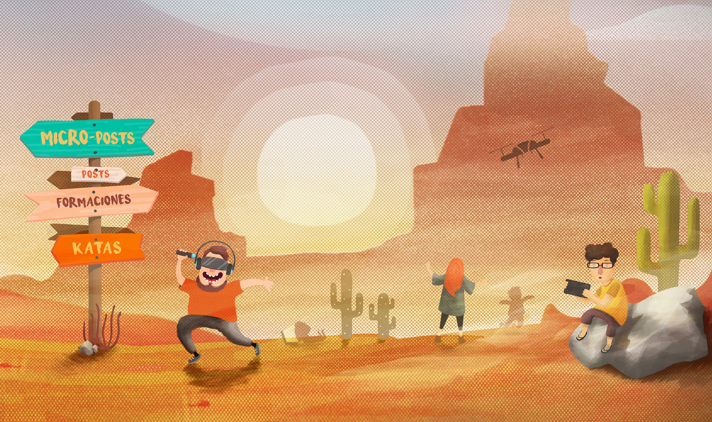

# Hemos tenido un sueño

"La mejor forma de predecir el futuro es implementarlo" [Alan Kay](https://hipertextual.com/2011/10/historia-de-la-tecnologia-alan-kay-padre-legitimo-de-la-computacion-personal)

Hemos tenido un sueño. Hemos tenido un sueño en el cual teníamos todo el tiempo para poder aprender todos los lenguajes. Un sueño en el que quedan atrás todos los prejuicios, en donde la gente siempre mira hacia delante. Un sueño en el cual no existen Global.asax ni WebConfig, un sueño donde Webpack genera todos los js ordenados, un sueño donde la programación funcional va entrando en nuestro código. Un sueño donde había equipo y no gente trabajando junta. Un sueño donde el pair programming surge de forma espontánea. Un sueño donde las Pull Request llegaban a más de 4.000, llenas de comentarios positivos. Un sueño donde nadie piensa eso de "Aquí se viene con to aprendío", donde se valoran las cosas bien hechas, no las cosas funcionales. Un sueño donde el programador busca esa excelencia en su código de manera natural. Un sueño donde escribir código es un arte.

Y así es como nace __No Country For Geeks__. Tenemos un sueño y queremos compartirlo. Queremos programar con C#, con Node, ver el mundo de las APIs con la perspectiva de GraphQL, adentrarnos en React y Webpack, Clojure.js, que nuestros bots hablen como personas, descubrir Cognitives Services con LUIS, Watson, y lo más importante, compartir el mundo que vamos aprendiendo. Porque nosotros somos esos __eternos aprendices__ que están detrás de la pantalla de ordenador picando código, desaprendiendo y aprendiendo constantemente del mundo de los bits, la programación y el trabajo en equipo.

Nuestra única aspiración al compartir nuestro código es que en el mundo haya algunos programadores más que puedan decir:

* Soy un programador a pesar de tener que volver a ser un aprendiz cada día.

Estaríamos aún más satisfechos si algunos de ellos fueran más lejos y dijeran:

* Soy un programador y me encanta tener que volver a ser un aprendiz cada día.

Y para ello podéis seguirnos en este blog y nuestras redes sociales:

* Blog:         [http://www.nocountryforgeeks.com/](http://www.nocountryforgeeks.com/)
* Twitter:      [https://twitter.com/nocountry4geeks](https://twitter.com/nocountry4geeks)
* Instagram:    [https://www.instagram.com/nocountryforgeeks/](https://www.instagram.com/nocountryforgeeks/)
* Facebook:     [https://www.facebook.com/No-Country-For-Geeks-463217730714163/](https://www.facebook.com/No-Country-For-Geeks-463217730714163/)
