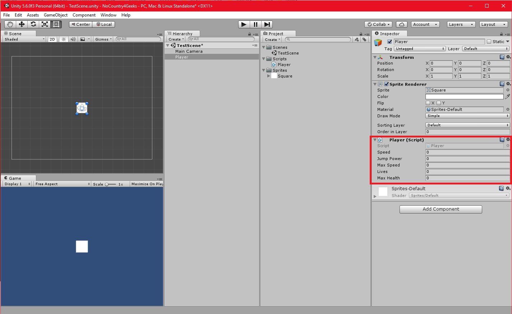
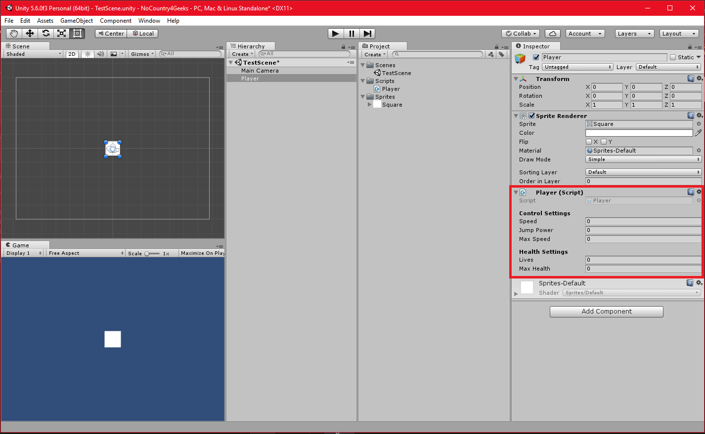
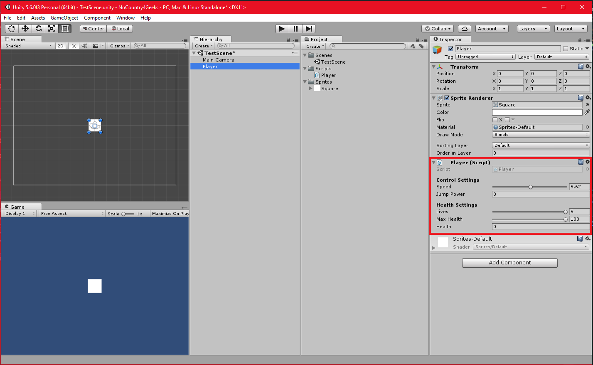
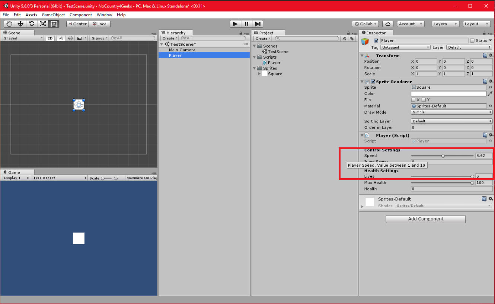
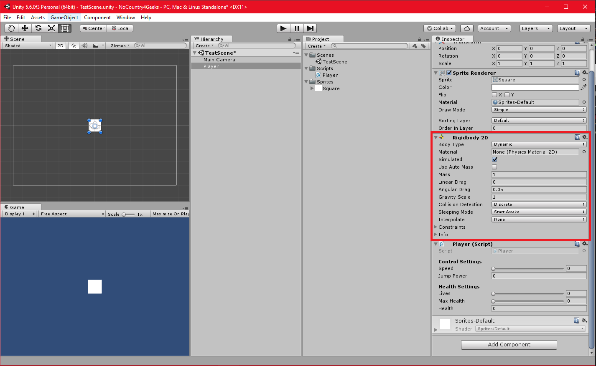

# Atributos en Unity

Buenas a tod@s! Vamos a aprender cómo personalizar las propiedades que se muestran en el inspector de un *Script* mediante atributos. 

Como sabemos, en *Unity*, todas las propiedades que añadimos públicas a un *Script* se muestran automáticamente en el inspector con una forma predeterminada, los '*int*', los '*float*' y los '*string*' por ejemplo, se muestran con una caja de texto, en la que podemos modificar el valor mediante el teclado. Vemos en la siguiente imagen el ejemplo que voy a seguir, con el *Script* de '*Player.cs*'.

```csharp
public class Player : MonoBehaviour
{
    #region Public Fields

    public float Speed = 0.0f;
    public float JumpPower = 0.0f;
    public float MaxSpeed = 0.0f;
    public int Lives = 0;
    public float MaxHealth = 0.0f;

    #endregion

    #region Private Fields

    private float _health;
    private bool _grounded;
    private bool _jump;
    private bool _attack;

    #endregion
}
```




## Atributos

Hay diferentes atributos que nos ofrecen tanto **Unity** como librerias propias de **.NET**. Aquí vamos a ver algunos que considero útiles a la hora de visualizar las propiedades en el inspector. Para saber todo lo que ofrece *Unity* podéis visitar este [link](https://docs.unity3d.com/ScriptReference/AddComponentMenu.html), donde hay un listado completo con todos los atributos.

### Atributo Header

El primero de ellos es el atributo '*Header*', que sirve para agrupar o categorizar propiedades. En nuestro ejemplo podríamos categorizar nuestras propiedades por control de *Player* y por salud del *Player*, por ejemplo. Para que el atributo surja efecto habría que añadirlo delante del grupo de propiedades que queramos categorizar con esta linea: `[Header("Text")]`. En nuestro ejemplo quedaría así:

```csharp
[Header("Control Settings")]
public float Speed = 0.0f;
public float JumpPower = 0.0f;
public float MaxSpeed = 0.0f;

[Header("Health Settings")]
public int Lives = 0;
public float MaxHealth = 0.0f;
```



**Nota:** estos atributos, solo funcionan en propiedades públicas como es lógico, más adelante veremos como mostrar una propiedad privada en el inspector.

### Atributo Range

El segundo que os voy a mostrar es el atributo '*Range*', que nos va a facilitar el uso en el inspector de números enteros y flotantes, mediante una '*slider*', y con la posibilidad de ponerle un mínimo y un máximo. Su nomenclatura sería así: `[Range(min, max)]`. Podríamos añadirlo a cualquier '*int*' o '*float*' que tengamos, pero en nuestro ejemplo vamos añadirlo a la velocidad, a las vidas y a la salud máxima del personaje. 

```csharp
[Header("Control Settings")]
[Range(1.0f, 10.0f)]
public float Speed = 0.0f;
public float JumpPower = 0.0f;
public float MaxSpeed = 0.0f;

[Header("Health Settings")]
[Range(1, 5)]
public int Lives = 0;
[Range(50.0f, 100.0f)]
public float MaxHealth = 0.0f;
```


### Atributos HideInInspector y SerializeField

Estos dos atributos sirven para ocultar variables públicas y para mostrar privadas en el inspector respectivamente. Muy útiles, ya que no siempre queremos que una propiedad pública se modifique en el editor, pero si desde otro *Script* por código. Al igual pasa con las propiedades privadas, no siempre queremos que se tenga acceso desde fuera del *Script*, pero si nos es cómodo poder modificarlas desde el inspector. 

En nuestro ejemplo, la propiedad velocidad máxima es pública, y no queremos que se muestre en el inspector, ya que esta propiedad solo se modificará *in game*, cogiendo algún *power up*, por ejemplo. Solo tendríamos que poner encima de la propiedad la siguiente linea `[HideInInspector]`.

Y en el caso de la propiedad privada de salud, que indica la salud actual del personaje, no queremos que se tenga acceso fuera de nuestro *Script*, pero queremos ir haciendo pruebas en el editor, subiendo y bajando la salud actual del personaje, pues solo necesitaríamos añadir `[SerializeField]` encima de la salud.

```csharp
#region Public Fields

[Header("Control Settings")]
[Range(1.0f, 10.0f)]
public float Speed = 0.0f;
public float JumpPower = 0.0f;
[HideInInspector]
public float MaxSpeed = 0.0f;

[Header("Health Settings")]
[Range(1, 5)]
public int Lives = 0;
[Range(50.0f, 100.0f)]
public float MaxHealth = 0.0f;

#endregion

#region Private Fields

[SerializeField]
private float _health;
private bool _grounded;
private bool _jump;
private bool _attack;

#endregion
```



### Atributo Tooltip

Este atributo es muy útil para trabajar en equipo, si estás trabajando con más compañeros en un componente, para ayudar a los diseñadores a la hora de trabajar con los componentes en el editor o si estás creando un componente para otros usuarios. Se define de esta manera: `[Tooltip("Description")]`. En nuestro ejemplo se lo añado a la propiedad Speed:

```csharp
[Header("Control Settings")]
[Range(1.0f, 10.0f)]
[Tooltip("Player Speed. Value between 1 and 10.")]
public float Speed = 0.0f;
public float JumpPower = 0.0f;
[HideInInspector]
public float MaxSpeed = 0.0f;
```



### Bonus: Atributo RequireComponent

Este atributo ya no se aplica a una propiedad como los anteriores, si no a un *Script* o *Componente*. Y cuando se añade de esta forma `[RequireComponent(typeof(Type))]` delante de la declaración de la clase, hace que todo **GameObject** que lleve el componente '*Player.cs*', va a llevar obligatoriamente un componente del tipo que hemos definido. **Para que surja efecto, debemos de eliminar el componente Player.cs del GameObject si ya lo habiamos incluido**. Lo tenemos que volver a incluir y automaticamente se incluirá también el tipo definido. En nuestro ejemplo vamos a añadir un *Componente* de tipo *Rigidbody2D*:

```csharp
[RequireComponent(typeof(Rigidbody2D))]
public class Player : MonoBehaviour
{
   ...
}
```



Hasta aquí los atributos que más útiles me han sido hasta ahora. Hay muchos más, como veréis en el link anterior, podéis probar por vuestra cuenta y ver si os son útiles o no a la hora de vuestros desarrollos.

Podéis bajar el código del ejemplo desde [GitHub](https://github.com/NoCountryForGeeks/Blog/tree/feature/atributosUnity/carlos/atributos-unity/content)

¡Hasta la Próxima!

@CarlosKlsOne