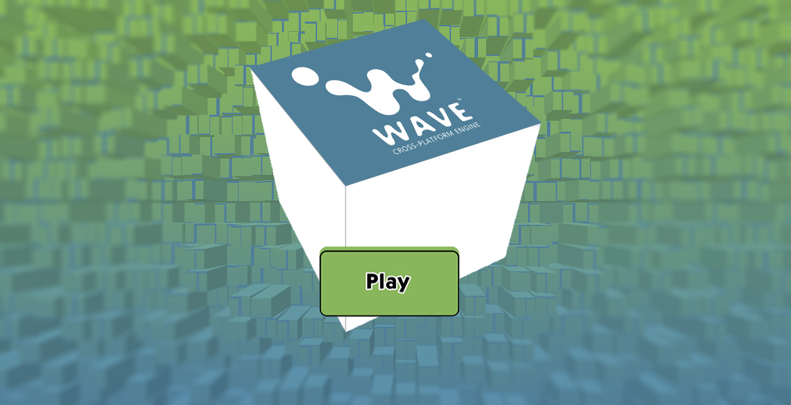
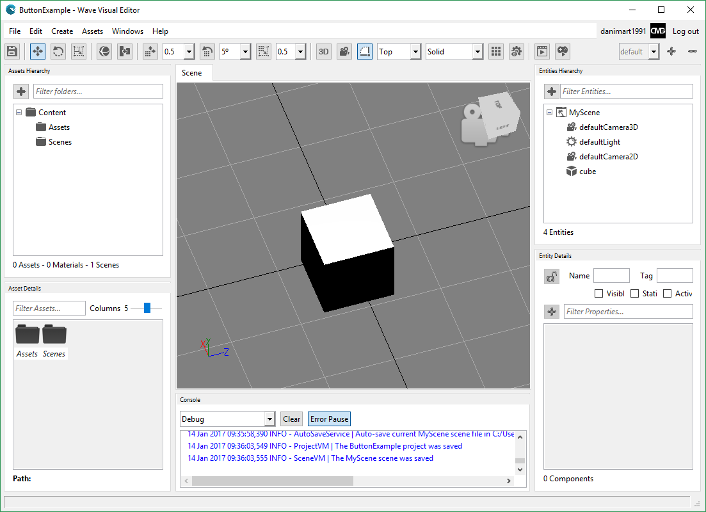
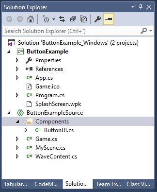
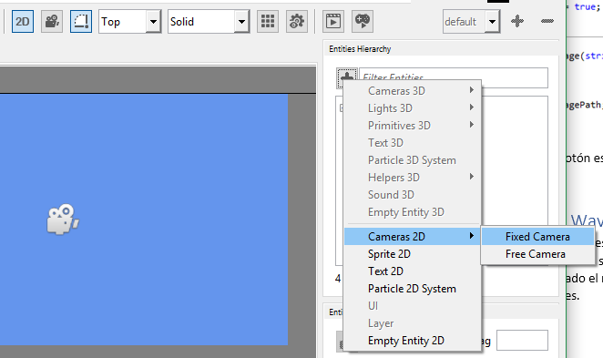
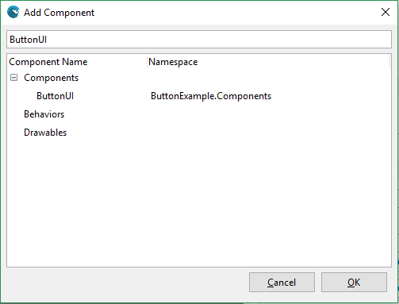
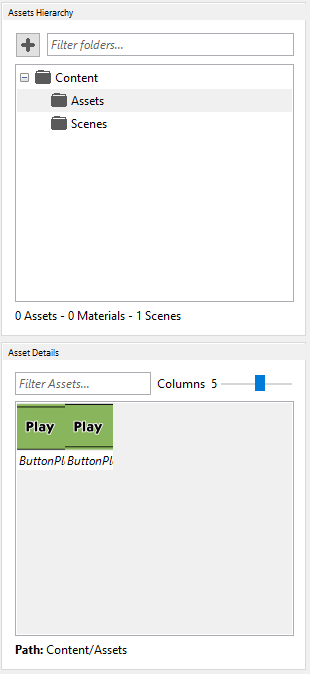
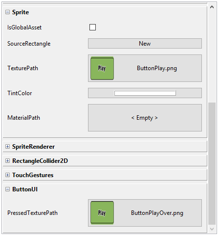
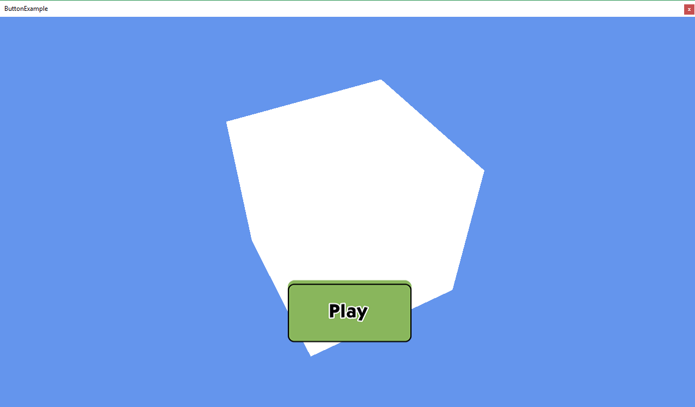
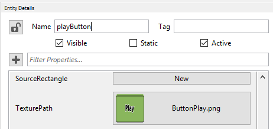

# Crear un botón en Wave Editor (Wave Engine)



Para los que no lo conozcan, [**Wave Engine**](https://waveengine.net/) es un motor para el desarrollo de videojuegos cross-platform orientado a componentes. Ideado para la creación de juegos en **2D y 3D** y totalmente gratuito. Os animamos a que lo probéis. Para este tutorial solo hará falta entender cómo funciona el motor y crear [nuestro primer juego](https://github.com/WaveEngine/Documentation/wiki/My-First-Application).

El código completo está disponible en [***GitHub***](https://github.com/danimart1991/WaveEngine.ButtonUI).

Aunque este artículo pueda parecer básico, por el momento no existe el control **Button** en **Wave Editor**, el editor de desarrollo usado por *Wave Engine*. Por ello, y de manera sencilla, vamos a crear un botón para la [*UI*](https://es.wikipedia.org/wiki/Interfaz_de_usuario) capaz de usarse tanto en juegos *2D*, como *3D*, necesitando en este último caso una cámara *2D* que actúe de [*HUD*](https://es.wikipedia.org/wiki/HUD_(inform%C3%A1tica)).

## Componentes

Partimos del [proyecto base introductorio](https://github.com/WaveEngine/Documentation/wiki/My-First-Application) que *Wave Engine* ofrece a nuevos desarrolladores.

Para ello, creamos un nuevo proyecto e incluimos un objeto *Cube* de tipo *Primitive 3D*. Agregamos el componente *Spinner* al cubo para que rote.



Wave Engine está basado en [la programación orientada a entidades](http://cowboyprogramming.com/2007/01/05/evolve-your-heirachy/). Un componente no es más que cada pieza que compone una entidad. Todos los componentes heredan de la clase [**Component**](http://doc.waveengine.net/index.html#frlrfWaveEngineFrameworkComponentClassTopic.html).

Por el momento, la creación de componentes está supeditada al uso de **Visual Studio**. Abrimos nuestro proyecto en *Visual Studio* y empezamos a trabajar.

## Creación del componente ButtonUI

Es importante tener la solución ordenada. Nuestro proyecto puede crecer y tener la solución ordenada es una forma de acceder a cada elemento del juego de manera rápida.

Una vez abierta la solución en *Visual Studio*. Creamos la carpeta *Components* dentro del proyecto *Shared*. Es decir, dentro del proyecto común a todas las plataformas. Dentro de ella creamos la clase *ButtonUI* que será nuestro componente.



Abrimos la clase recién creada y empezamos a programar.

## Programación base del componente ButtonUI

Indicamos que la clase es pública y hereda de la clase *Component*. Que se encuentra en el namespace *WaveEngine.Framework*. Borramos todos los using, ya que al existir clases con el mismo nombre entre los namespaces de *WaveEngine* y el sistema, pueden entrar en conflicto.

Añadimos a la clase el atributo *DataContract*, cuyo namespace es *System.Runtime.Serialization*. Añadimos como parámetro namespace, *WaveEngine.Components.Gestures*.

```C#
[DataContract(Namespace = "WaveEngine.Components.Gestures")]
public class ButtonUI : Component
{
}
```

Con este atributo. Le indicamos al motor que hemos creado un componente nuevo, que hará uso de los gestos para su funcionalidad. En principio el tipo de componente creado, no es más que una clasificación como veremos más adelante para que el desarrollador conozca qué tipo de funcionalidad esperar a la hora de usar el componente. Se puede indicar cualquier otro tipo existente en el namespace *WaveEngine.Components*.

Agregamos como propiedades los componentes ``TouchGestures`` (*WaveEngine.Components.Gestures*) y ``Sprite`` (*WaveEngine.Components.Graphics2D*) con el atributo *RequiredComponent*. Este atributo indica al motor que estos dos componentes son necesarios, y que para usar el componente que estamos creando es necesario que el usuario agregue a la entidad estos componentes. Ambos componentes se usarán más adelante. El primero para la gestión de los gestos que el usuario realice sobre la entidad, como presionarla; el segundo para mostrar el botón.

```C#
[RequiredComponent]
public TouchGestures TouchGestures = null;

[RequiredComponent]
public Sprite Sprite = null;
```

Agregamos la propiedad *PressedTexturePath*, esta propiedad de tipo *string*, será la ruta de la textura usada para mostrar cuando el botón esté siendo presionado por el usuario. Para evitar problemas de acceso, asignamos el *get* y *set* a un *string* privado.

Añadimos los atributos *DataMember*, que indica al motor que es una propiedad que debe mostrar y que el usuario puede cambiar, y el atributo ``RenderPropertyAsAsset`` con el parámetro ``AssetType.Texture`` (*WaveEngine.Common.Attributes*) que indica al motor que debe mostrar esta propiedad como una selección de texturas.

```C#
private string _pressedTexturePath = null;

[RequiredComponent]
public TouchGestures TouchGestures = null;

[RequiredComponent]
public Sprite Sprite = null;

[RenderPropertyAsAsset(AssetType.Texture)]
[DataMember]
public string PressedTexturePath
{
    get { return _pressedTexturePath; }
    set { _pressedTexturePath = value; }
}
```

Añadimos tres variables privadas más, la primera ``static int instances``, hará de contador para asignar un nombre único a cada botón que añadamos al proyecto; la segunda ``bool backToTexturePath`` hará de control para saber si el botón tiene que cambiar de textura entre la usada en un estado normal y la usada en un estado presionado; la tercera ``string texturePath`` será la variable donde guardaremos la textura inicial del botón para no perderla al cambiar a la textura cuando el botón está presionado.

```C#
private static int _instances;

private string _texturePath = null;
private bool _backToTexturePath = false;
```

Para terminar la programación básica del componente, incluimos el constructor haciendo referencia al constructor base con el nombre del botón.

```C#
public ButtonUI()
:base("Buttons" + _instances++)
{
}
```

## Añadiendo funcionalidad al botón

Para que el botón haga lo que debe, debemos añadir una serie de métodos:

Sobrescribimos el método ``Initialize``, en este método le indicamos al componente lo que debe hacer cuando sea inicializado. Por el momento, nos registramos a los eventos de presión del botón y guardamos la textura inicial del botón para usarla más tarde.

```C#
protected override void Initialize()
{
    base.Initialize();

    TouchGestures.TouchPressed -= OnTouchGesturesTouchPressed;
    TouchGestures.TouchPressed += OnTouchgesturesTouchPressed;
    TouchGestures.TouchReleased -= OnTouchGesturesTouchReleased;
    TouchGestures.TouchReleased += OnTouchGesturesTouchReleased;

    if (Sprite != null && !string.IsNullOrEmpty(Sprite.TexturePath))
    {
        _texturePath = Sprite.TexturePath;
    }
}
```

En los eventos registrados vamos a poner la funcionalidad de cambio de textura. Con esto, el jugador verá como el botón cambia cuando es presionado y vuelve a un estado normal cuando deja de presionarlo.

```C#
private void OnTouchGesturesTouchReleased(object sender, GestureEventArgs e)
{
    if (!string.IsNullOrWhiteSpace(_texturePath && _backToTexturePath)
    {
        _backToTexturePath = false;
        ChangeSpriteTexturePath(_texturePath);
    }
}

private void OnTouchGesturesTouchPressed(object sender, GestureEventArgs e)
{
    // Asking for !_backToTexturePath avoids to execute the if when has been done once before
    if (!string.IsNullOrWhiteSpace(_pressedTexturePath) && !_backToTexturePath)
    {
        ChangeSpriteTexturePath(_pressedTexturePath);
        _backToTexturePath = true;
    }
}

private void ChangeSpriteTexturePath(string imagePath)
{
    if (Sprite != null)
    {
        Sprite.TexturePath = imagePath;
    }
}
```

La funcionalidad principal del botón está terminada.

## Probando el botón en Wave Editor

Para ver si funciona el botón, y que resultados hemos obtenido de este simple componente, volvemos a *Wave Editor*, y añadimos si no tenemos ya una cámara *2D*. Para ello, tenemos que asegurarnos de tener seleccionado el modo *2D* del editor, y añadimos una entidad de tipo *Fixed Camera 2D* a la lista de entidades.



A continuación, añadimos un *Sprite2D*, al que añadimos los componentes necesarios *RectangleCollider2D* y *TouchGestures*, aunque el primero no lo hemos indicado en el componente ButtonUI, el componente *TouchGestures* lo necesita para saber en qué punto el usuario ha realizado el gesto en la entidad. Por último, añadimos nuestro componente ButtonUI.



Una vez añadidos los componentes, tenemos que configurarlos. Para ello, añadimos los assets necesarios para el botón en estado normal y presionado.


Podemos meterlos dentro de la carpeta *Assets* de nuestro proyecto.



Por último, añadimos los *assets* a las propiedades *TexturePath* del componente *Sprite* y *PressedTexturePath* de nuestro componente.



Ya podemos probar el botón en nuestro juego y ver como la textura cambia cuando es presionado.



## Incluyendo eventos y acciones

Ahora mismo tenemos un botón que visualmente cumple su función, pero que no realiza ninguna acción al ser presionado. Para que realice esta y otras acciones, solo tenemos que añadir el manejador de eventos común y lanzarlo cuando nos interese, en este caso, cuando el usuario termine de presionar el botón.

```C#
public event EventHandler Click;

protected override void Initialize()
{
    base.Initialize();
    TouchGestures.TouchPressed -= OnTouchGesturesTouchPressed;
    TouchGestures.TouchPressed += OnTouchgesturesTouchPressed;
    TouchGestures.TouchReleased -= OnTouchGesturesTouchReleased;
    TouchGestures.TouchReleased += OnTouchGesturesTouchReleased;

    if (Sprite != null && !string.IsNullOrEmpty(Sprite.TexturePath))
    {
        _texturePath = Sprite.TexturePath;
    }
}

private void OnTouchGesturesTouchReleased(object sender, GestureEventArgs e)
{
    if (!string.IsNullOrWhiteSpace(_texturePath) && _backToTexturePath)
    {
        _backToTexturePath = false;
        ChangeSpriteTexturePath(_texturePath);
    }

    if (Click != null)
    {
        Click(sender, e);
    }
}
```

Ahora que el botón avisa a cualquiera que esté suscrito a él de que ha sido presionado, podemos irnos a la escena donde esté colocado el botón y suscribirnos para realizar una acción. Para probar, vamos a hacer que el cubo active y desactive el giro cada vez que presionemos el botón.

Abrimos la clase *MyScene*, sobrescribiremos el método *Start* y *End* para buscar el botón en la escena, suscribirnos y desuscribirnos del evento. No se nos puede olvidar incluir una variable donde guardar el botón.

```C#
private ButtonUI _playButtonUI;

protected override void CreateScene()
{
    Load(WaveContent.Scenes.MyScene);
}

protected override void Start()
{
    base.Start();

    _playButtonUI = EntityManager.Find("playButton").FindComponent<ButtonUI>();
    _playButtonUI.Click += OnPlayButtonClicked;
}

protected override void End()
{
    base.End();

    _playButtonUI.Click -= OnPlayButtonClicked;
}

private void OnPlayButtonClicked(object sender, EventArgs e)
{

}
```

El nombre indicado para buscar el botón tiene que ser exactamente el nombre del botón indicado en el editor:



A continuación, buscamos del mismo modo el cubo y su componente *Spinner* para poder activarlo y desactivarlo.

```C#
private ButtonUI _playButtonUI;
private Spinner _cubeSpinner;

protected override void CreateScene()
{
    Load(WaveContent.Scenes.MyScene);
}

protected override void Start()
{
    base.Start();

    _playButtonUI = EntityManager.Find("playButton").FindComponent<ButtonUI>();
    _playButtonUI.Click += OnPlayButtonClicked;

    _cubeSpinner = EntityManager.Find("cube").FindComponent<Spinner>();
}

protected override void End()
{
    base.End();
    _playButtonUI.Click -= OnPlayButtonClicked;
}

private void OnPlayButtonClicked(object sender, EventArgs e)
{
    _cubeSpinner.IsActive = !_cubeSpinner.IsActive;
}
```

Guardamos, volvemos al editor y ejecutamos. Veremos cómo al presionar activaremos y desactivaremos el giro del cubo.

## Conclusión

Hemos visto como de manera sencilla podemos crear un componente que actúe de botón y poder usarlo en *Wave Editor* para, de una manera más gráfica, diseñar nuestras interfaces en *Wave Engine*.

El código completo de este artículo está disponible en [**GitHub**](https://github.com/danimart1991/WaveEngine.ButtonUI).