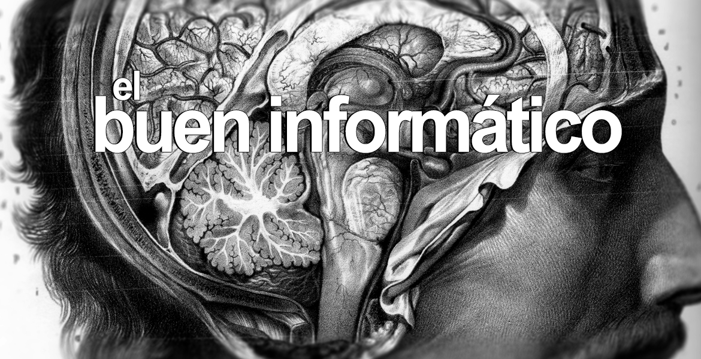

# El buen informático

> Available in English [here](https://github.com/danimart1991/danimart1991.github.io/blob/master/_posts/2018-04-19-the-good-it-guy/readme.md).

Llegas a la oficina. Como cada día, enciendes tu ordenador, revisas los correos, los [*Pull Request*](../../aclopez/PullRequests/PullRequest.md) de tu equipo; y, finalmente, qué tarea tienes que desempeñar hoy. El proyecto, un sistema de mensajería entre empleados de una gran empresa.

> Incluir rol de administrador para ver y gestionar los mensajes privados entre los usuarios. (1 Jornada)

Te preguntas, ¿Cómo es posible que al *Product Owner* se le ha olvidado incluir una descripción detallada?, ¿1 Jornada? Me parece poco.

**Ryan, cazaba con su padre cuando era pequeño**. Era algo que le gustaba. La mezcla de naturaleza en estado puro, con la unión que conseguía en esas pocas horas que disfrutaba junto a su padre, le transmitía bastante serenidad y confianza en sí mismo. Aunque ahora vivía en la ciudad. Se sacó hace unos meses su permiso de armas para, siendo ahora el padre, disfrutar junto a su hijo de esos momentos que obtuvo cuando era niño. De paso, podría aprovechar el arma para, gracias a la segunda enmienda, proteger su casa ante cualquier asaltante que quisiese arrebatar la paz a su familia.

**Rudolf, es un pandillero de 16 años**. Vive en un barrio nada recomendado de Chicago, y junto a su mejor amigo de la infancia, le han ordenado la tarea de robar todos los paquetes de droga posibles en un almacén de una banda rival. En su tarea, pese a que no debería haber nadie en la zona, se encuentran con pandilleros de la banda a la que iban a robar y se enzarzan en un tiroteo en el que matan a su mejor amigo.

Estados Unidos lleva casi toda su historia moderna con un **fuerte debate sobre las armas**. En un país donde tener arma es un derecho, pero cada hora, se producen tres muertes por arma de fuego, llegamos a un choque en ámbitos de sociedad y política difícilmente asumible.

Empiezas a hacer la tarea asignada. Tras preguntar al *Product Owner*, a tus compañeros de equipo… Por fin tienes claro lo que tienes que hacer, y con una jornada de retraso por fin tienes lista la funcionalidad.

Te dispones a probar la nueva funcionalidad antes de hacer un [*Pull Request*](../../aclopez/PullRequests/PullRequest.md) a la rama *develop*.

Como **administrador**, ves varios mensajes privados entre usuarios quejándose de los sueldos, otros tantos de las horas extra, y unos pocos con insultos a los responsables que tienen por encima, incluido el jefe de la empresa.

**Un “click” resuena en tu cabeza.** Un resquicio de lo pasado con Cambridge Analytica y Facebook. Personas que, por tener un trato especial, tienen acceso a datos que quizás no deberían.

¿Qué pasará con esos empleados el día que a algún responsable le dé por mirar estos **mensajes “privados”**?

Hablas con el equipo. Variedad de opiniones.

- **Éticamente no se debería hacer**. Estas poniendo el riesgo el trabajo y la reputación de los empleados de la empresa.

- **Deberíamos hacerlo**. Los empleados no deberían escribir en la herramienta este tipo de contenido. Además, el cliente paga por nuestros servicios y no deberíamos preocuparnos de si es ético o no.

Quizás más importante. ¿Qué pasa si se usa inadecuadamente? ¿De quién es la responsabilidad? ¿Tuya por desarrollarlo? ¿Del cliente? ¿De todo el equipo?

Si lo piensas, no se aleja mucho de las historias que he contado unos párrafos más arriba. La aplicación ahora incluye una funcionalidad o herramienta que puede usarse con fines ilícitos. Pero nos encontramos con la misma discusión que el hecho de poseer un arma.

**Un arma no es más que una herramienta**. Puede usarse para distintos fines, muchos de ellos no éticos. Tu has creado una funcionalidad o herramienta que puede usarse con los mismos fines. Quizás pueda parecer nimio. Pero estás jugando con el empleo de personas y sus familias. Es posible que el ejemplo que he puesto no sea muy grave, pero ¿qué pasa con los informáticos encargados de programar armas para el ejercito? Entraríamos en una línea muy delgada difícil de trazar.

**La conclusión**, al igual que pasa con el debate de las armas en Estados Unidos, y con los soldados en el campo de batalla, creo que está en la conciencia de cada uno. Lo que espero es que al menos como desarrollador, te preocupen estos temas, te plantees como afecta la ética de tu trabajo al resto de personas, y que hagas lo posible por seguir tus convicciones. Solo con eso, ya serás mejor persona y mejor informático.
