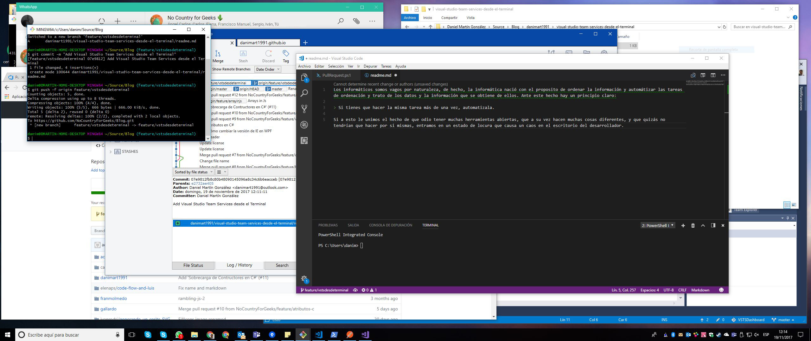
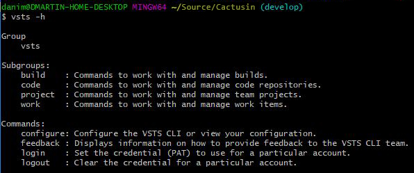
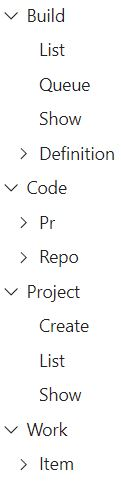
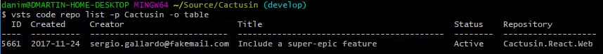
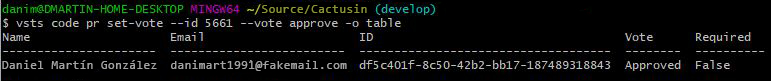
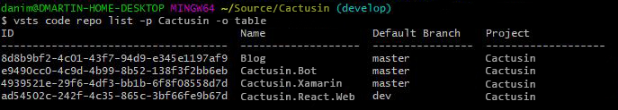
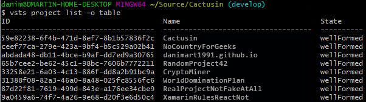
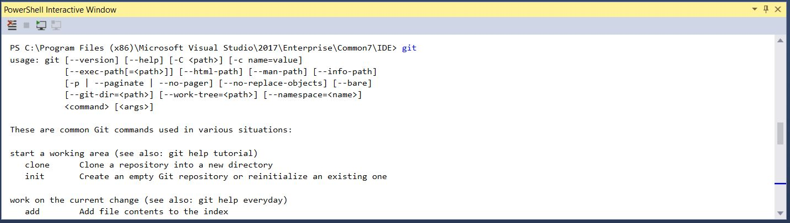

# Visual Studio Team Services desde Terminal

Los informáticos somos vagos por naturaleza, de hecho, la informática nació con el propósito de ordenar la información y automatizar las tareas de ordenación y tratamiento de los datos y la información que se obtiene de ellos. Ante este hecho hay un principio claro:

> Si tienes que hacer la misma tarea más de una vez, automatízala.

Si a esto le unimos el hecho de que odio tener muchas herramientas abiertas, que a su vez hacen muchas cosas diferentes, y que quizás no tendrían que hacer por sí mismas, entramos en un estado de locura que causa un caos en el escritorio del desarrollador.



Vamos a intentar recortar la cantidad de herramientas abiertas para que sea más sencillo y productivo avanzar en nuestro proyecto con una serie de post.

## Microsoft Visual Studio Team Services CLI

En el equipo de **No Country For Geeks** usamos *Git* y publicamos código a través de *Pull Request* en *Visual Studio Team Services*. No vamos a entrar en porque las ***Pull Request* son una de las mejores formas de hacer avanzar al equipo en calidad de código, compromiso con los proyectos y conocimiento compartido:** está de sobra demostrado.

Para ver el listado de las *Pull Request* en las que trabaja el equipo en los diferentes proyectos basta con acceder a la sección ``https://{account}.visualStudio.com/_pulls``. El problema con esta página es que no posee notificaciones, por tanto, pese a ser una buena práctica acceder a la página nada más empezar la jornada laboral y revisar las *Pull Request* pendientes de tu equipo, es cierto que en una jornada de 8 horas pueden surgir una gran cantidad de *Pull Request* y al final acabas teniendo siempre la página abierta.

Lo que hacemos hasta el momento es tener notificaciones con algunas alertas a través de correo electrónico, que es actualmente lo que permite *Microsoft* en su herramienta. Sin embargo, que os podemos contar de los correos electrónicos, en la mayoría de casos tenemos una regla de que todos los avisos que suceden en *VSTS (Visual Studio Team Services)* se pasen a una carpeta silenciada que se revisa cada varios días porque no son avisos tan importantes como para tenerlos en cuenta.

Como he dicho usamos *Git*, y además como somos puristas solemos usar la consola para realizar comandos sobre el repositorio. ¿Y si no necesitásemos tener abierto el correo electrónico, ni el navegador web para realizar la consulta de las *Pull Request* pendientes del equipo? Entra en juego [Microsoft Visual Studio Team Services CLI](https://github.com/Microsoft/vsts-cli).

> **[VSTS CLI](https://docs.microsoft.com/en-us/cli/vsts/overview)** is a new command line interface for *Visual Studio Team Services (VSTS)* and *Team Foundation Server (TFS) 2017 Update 2* and later.

En qué se traduce esto. Pues a grandes rasgos es una interfaz para nuestra línea de comandos que agrega funcionalidades extra para trabajar con *Visual Studio Team Services* y *Team Foundation Server*.

### Instalación

**VSTS CLI** tiene soporte **Cross-Platform** para *Windows, Linux, MacOS* e imagen *Docker*, y para instalarlo solo hemos de seguir este [**link**](https://docs.microsoft.com/es-es/cli/vsts/install?view=vsts-cli-latest). En *Windows* la instalación es tan sencilla como descargar y ejecutar un instalador.

Una vez instalado, podemos abrir nuestra consola favorita y ejecutar los siguientes comandos. Si recibimos un listado de comandos disponibles la instalación ha sido exitosa:

```Shell
vsts -h
vsts code -h
```



### Iniciando sesión

Para poder acceder a la información contenida en la instancia de *Visual Studio Team Services* en la que solemos trabajar necesitamos iniciar sesión, para ello ejecutamos el siguiente comando:

```Shell
vsts login --instance https://MYACCOUNT.visualstudio.com --token MYTOKEN
```

Para obtener el *token* necesario, basta con acceder a la sección seguridad de nuestra cuenta en la instancia de **VSTS** y solicitar un **Personal Access Token**. Más información [aquí](https://docs.microsoft.com/es-es/vsts/accounts/use-personal-access-tokens-to-authenticate).

Si queremos que esa instancia sea la usada por defecto, solo tenemos que usar el siguiente comando:

```Shell
vsts configure --defaults instance=http:/MYACCOUNT.visualstudio.com
```

### Parámetros globales

Antes de entrar en materia y describir algunos de los comandos más interesantes, conviene detallar algunos parámetros comunes a la mayoría de comandos que vendrán genial para obtener el mejor rendimiento a la herramienta.

``--debug``
Aumenta el nivel de detalle de la respuesta con datos de depuración.

``--help -h``
Como ya es común en los comandos de consola, muestra ayuda acerca del comando que se está ejecutando

``--output -o``
Detalla el formato de salida del comando. Se contempla:

- ``json``: Texto en *json*. Por defecto.

- ``jsonc``: Texto en *json* con colores (puede no funcionar en algunos terminales).

- ``table``: Formato tabla con columnas para una lectura más sencilla.

- ``tsv``: Formato separado por tabulador.

Puedes cambiar la salida por defecto ejecutando ``vsts configure --default-output [json, jsonc, table, tsv]``

``--query``
Consulta *JMESPath*. En [http://jmespath.org/](http://jmespath.org/) tienes más información y ejemplos.

``--verbose``
Incrementa el nivel de detalle. Pero sin datos de depuración, usa ``--debug`` para si es lo que necesitas.

### Todo listo

Ya tenemos todo listo para realizar consultas y obtener la información que nos interesa, para ello disponemos de la sección [**Reference** de la documentación](https://docs.microsoft.com/en-us/cli/vsts/get-started?view=vsts-cli-latest).



Algunos ejemplos:

- Ver todas las *Pull Request* de un proyecto (de manera amigable):

    ```Shell
    vsts code pr list -p PROYECTO -o table
    ```

    

- Abrir una *Pull Request* en el navegador:

    ```Shell
    vsts code pr show --id 5661 --open
    ```

- Aprobar una *Pull Request*:

    ```Shell
    vsts code pr set-vote --id 5661 --vote approve -o table
    ```

    

- Ver un listado de todos los repositorios de un proyecto:

    ```Shell
    vsts code repo list -p PROYECTO -o table
    ```

    

- Ver un listado de todos los proyectos del equipo:

    ```Shell
    vsts project list -o table
    ```

    

- Crear un *Work Item* en un proyecto:

    ```Shell
    vsts work item create --title "Login has a bug." --type "Bug"
    ```

Y esto son solo unos pocos ejemplos.

Como vemos podemos de manera sencilla movernos por *Visual Studio Team Services* sin necesidad de acceder al navegador, ni de tener otras ventanas abiertas. Como con todo, hace falta práctica para ir cogiendo todos los comandos disponibles y agilidad en su uso, pero una vez conseguido es bastante sencillo y se pueden hacer la mayoría de cosas que se hacen en el día a día sin tener que abrir otras herramientas.

## One more thing

Os dejo un par de anotaciones que pueden todavía mejorar más nuestros desarrollos.

### Usar VSTS CLI con GIT

Dado que en muchos casos lo que ocurre es que simplemente queremos unificar *Git* con *VSTS* realizando una unión a través de las *Pull Request*, podemos agregar alias a *Git* para realizar esta gestión de manera sencilla y rápida. Para ello, solo debemos ejecutar la siguiente línea:

```Shell
vsts configure --use-git-aliases yes
```

Con ello, hacemos que podamos ejecutar el comando ``git pr`` y que se traduzca en ``vsts code pr`` con todas sus variantes como, por ejemplo:

```Shell
vsts code pr create --target-branch {branch_name}
```

puede escribirse como:

```Shell
git pr create --target-branch {branch_name}
```

### Usando la consola desde Visual Studio

Si además de todo lo hecho, queremos quitarnos una ventana más. Podemos incluir una consola con todos estos comandos en nuestro *IDE* de desarrollo favorito *Visual Studio*. Para ello, basta con instalar desde el instalador [PowerShell Tools for Visual Studio](https://marketplace.visualstudio.com/items?itemName=AdamRDriscoll.PowerShellToolsforVisualStudio2017-18561).

A continuación, abrimos Visual Studio y podremos desde el menú *View -> Other Windows -> PowerShell Interactive Window*.

Desde esta ventana podremos ejecutar cualquier comando de `git` o `vsts`.

