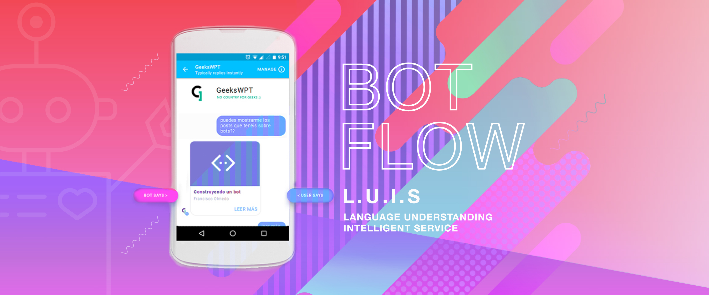

## Introducción

Aunque ya hace como un año que se presentó **Bot Framework** en su **Microsoft Build2016**, es en estos últimos meses cuando hemos percibido un notable crecimiento en el interés de diversos clientes en adquirir su propio bot-chat.

Este servicial, incansable y humanizado bot conversacional hace que las empresas se froten las manos:  un sólo asistente puede ser capaz de solventar dudas a multitud de clientes a través de diferentes canales de comunicación, tienen disponibilidad absoluta y suponen un coste muy bajo. Por supuesto, la realidad difiere bastante de lo que parece. Todavía es necesario un humano cuando se requiere de un servicio algo más personalizado.

La evolución de la inteligencia artificial también está teniendo muy buena aceptación en la comunidad de desarrolladores. Estos asistentes personalizados  pueden desarrollarse a través de diferentes tecnologías, captando así un mayor número de desarrolladores que se encuentran cómodos dentro de su especialidad. Como ya se comentó en la pasada Build2016, Bot Framework ofrece unos servicios y un SDK para desarrollar nuestro bot tanto en C# como en Node.js.

Con esta entrada nace una serie de posts dedicados a cómo crear nuestro propio bot conversacional desde cero:

1. Diseño del flujo de los diálogos y su entrenamiento con LUIS
2. Bot Framework y cómo desarrollar un bot conversacional con el SDK para **Node.js**. Lo haremos de esta manera puesto que nuestro compañero [Francisco Olmedo](https://geeks.ms/windowsplatform/author/folmedo/) ya nos explicó cómo hacerlo en C# : [Construyendo un bot (parte 1)](https://geeks.ms/windowsplatform/2016/04/27/construyendo-un-bot-parte-1/).
3. Desplegar el bot sobre cualquiera de los canales de comunicación disponibles como: Skype, Facebook, Teams, Slack, Cortana, etc.

## A tener en cuenta
Puntos importantes a tener en cuenta antes de empezar a diseñar el flujo para nuestro bot:

* Qué información queremos ofrecer
* Cuáles serán los limites dentro del flujo
* Cómo será la interacción entre el usuario y el bot
* Cuál será el rol de nuestro bot

Me gustaría comentar estos dos últimos puntos ya que creo que van bastante ligados entre sí. No debemos olvidar que el bot tiene ciertas limitaciones, y si no queremos que los usuarios se cansen y abandonen la conversación, éste tendrá que dar respuestas concretas y coherentes.

Además, deberemos analizar en profundidad la identidad que podría adoptar.
Una buena posibilidad es que dé respuestas y sugerencias en un tono divertido e ingenioso. El usuario obtendrá una experiencia positiva y la sensación de estar teniendo una conversación lo más fiel posible a la que tendría con un humano… divertido y afable 😊.
En cualquier caso, esto queda a criterio de cada creador.

Por el momento, en este post nos centraremos en los **flujos conversacionales y cómo trasladarlos a LUIS**.

## Muy brevemente, ¿Qué es LUIS?
Aunque en el siguiente [enlace](https://docs.microsoft.com/es-es/azure/cognitive-services/LUIS/Home) podéis leeros toda la documentación, me gustaría explicar muy por encima cómo funciona LUIS.

L.U.I.S **(Language Understanding Intelligent Service)** es un servicio cognitivo creado por Microsoft con el fin de reconocer el lenguaje natural. Se trata de una herramienta que  analiza e interpreta las peticiónes de los usuarios. Sustrae ciertos datos e intenciones, que hemos configurado previamente, y nos devuelve una valoración (***score***), que analizaremos posteriormente.

Si el resultado no es el deseado, LUIS nos ofrece la posibilidad de entrenarlo. Este entrenamiento consiste en añadir y probar una serie de acciones concretas las cuales le ayudarán a comprender qué ha querido decir el usuario. A mayor entrenamiento, mayor será la comprensión.

Un típico ejemplo que nos ayudará a familiarizarnos y entender la diferencia que hay entre *utterances, intents y entities:*
* ***Utterance***: Es la frase del usuario. ***Ej.: Quiero comprar una camisa.***
* ***Intent*** : Es la intención que desea el usuario a través de la frase, el verbo. ***Ej.: Comprar.***
* ***Entity*** : Sobre qué quiere aplicarse esa intención. ***Ej.: Camisa.***

## Diseñando el flujo de un bot
Cuando nos enfrentamos por primera vez al diseño del flujo de los diálogos de un bot conversacional, solemos cometer el mismo error: obtener primero la entidad que quiere el usuario y posteriormente la intención sobre esa entidad.
Para que los diálogos fluyan adecuadamente y nuestro modelo de LUIS funcione de manera eficiente, el flujo deberá hacerse a la inversa.

**¿Por qué debemos hacerlo de esta manera?** Porque el JSON recibido nos devuelve la intención con el mayor *score*. Una vez que tenemos dicha intención guardada, simplemente tendremos que aplicarlo con las entidades que nos devuelven.

A continuación, vamos a analizar un diagrama diseñado a partir del flujo conversacional de este blog:


El **flujo del diálogo inicial** sería el siguiente:

Dependiendo del canal de comunicación utilizado, la primera interacción entre el bot y usuario estará restringida. Por ejemplo, ***Teams*** no permite que sea el bot quien inicie el diálogo.
Por ello, lo más habitual es que sea el usuario quien lance su *utterance* primero.
En cuanto el usuario haga su petición, el bot lo manda al diálogo inicial para analizarlo, ¿qué está preguntando? ¿qué quiere?

LUIS irá comprobando con cada uno de los *intents* cuál es el que tiene mayor *score*, y sobre dicha base, si obtenemos un *score* ganador significa que ha entendido lo que el usuario quiere. Si recibe todos los valores del *score* muy bajos, se mandará al cajón de sastre, que es el ***intent NONE***. Aquí, según nuestro flujo, se le preguntará al usuario si puede reformular su petición porque no le hemos entendido y le mandaremos al inicio de nuevo a la espera de su respuesta.

Debemos evitar los bucles infinitos, por ello, en el ***intent NONE*** se puede apreciar que en el segundo intento fallido, el bot le hará una sugerencia (***Intent HELP***) donde, dependiendo de la *entity* seleccionada por el usuario, el bot le redirigirá hacia un *intent* u otro.

## [LUIS.ai](luis.ai)

Necesitamos tener una cuenta en luis.ai para poder empezar. En cuanto tengamos la cuenta, vamos a seleccionar a **My apps**, en el menú principal, y nos crearemos una nueva aplicación de LUIS configurándolo con un nombre, descripción e idioma.

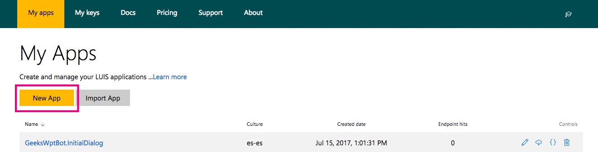

## Intents

Con la app creada, nos dirigiremos al menú lateral del Dashboard para comenzar a añadir *intents*. Personalmente, prefiero crear todos los *intents* con sendas *utterances*. Así tengo una visión global de cómo puede ir quedando nuestro modelo.

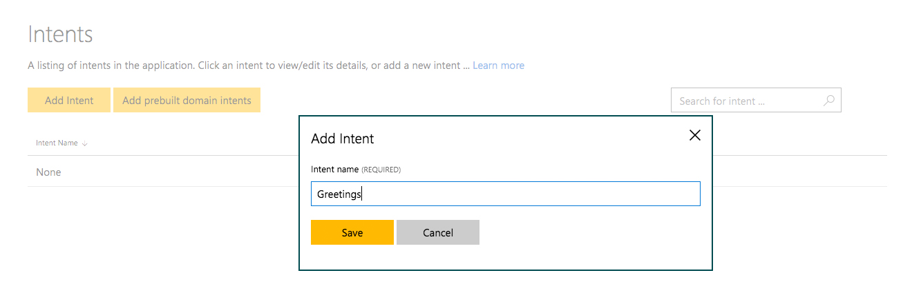

El resultado sería algo así:

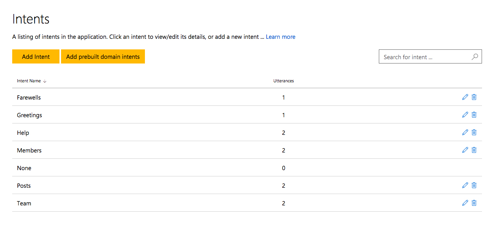

Es recomendable que se vaya entrenando a medida que vamos creando los *intents*  y las *utterances*, de esta manera será más sencillo controlar el *score* en cada entrenamiento. El entrenamiento lo encontrarás en el menú lateral como _**"Test your application"**_.

Como puede observarse en la siguiente imagen, esta *utterance "hola!"* está respondiendo con el máximo *score* posible y, además, con  bastante diferencia entre este primer *score* y el siguiente. Gracias a esta gran diferencia entre *scores* evitaremos que los *intents* se pisen entre ellos.

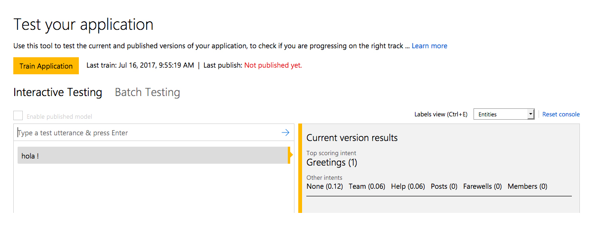

La mejor forma de recibir un *score* alto por cada *intent*, es la de generar *utterances* con un patrón muy similar por cada uno de ellos. Puede resultar algo tedioso añadir tantas *utterances* tan similares, pero la creación de un buen modelo de LUIS nos evitará muchos quebraderos de cabeza en la fase de desarrollo.

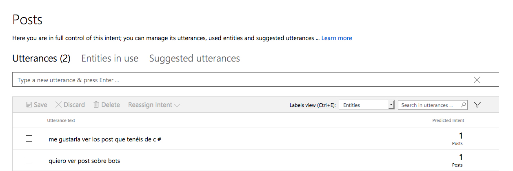

## Entities

Existen diferentes tipos de *entities*. Según cómo sea la complejidad de nuestro modelo de LUIS, pondremos uno u otro. A continuación voy a comentar  los tipos  que hemos ido utilizado en nuestro modelo.

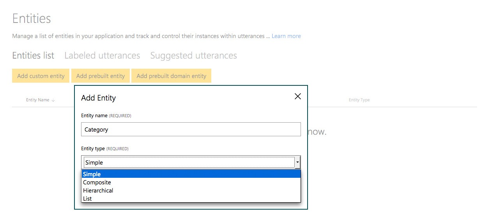


### Entity List

Por ejemplo, en las categorías hemos usado una *entity* de tipo **lista**. Esta *entity* nos ofrece la posibilidad de añadir una lista con diferentes valores canónicos y, a cada valor canónico añadirle una serie de sinónimos. La probabilidad de que reconozca la *entity* será muy superior en comparación a un tipo **simple**, que no admite más que un solo valor.

En la siguiente imagen, como usuario, si le pido al bot que me de los posts que tenga sobre *LUIS*, nuestro bot recibirá el mismo *score* y la misma *entity* que si le pido que me de los posts que tenga sobre *Language Understanding Intelligent Service*.

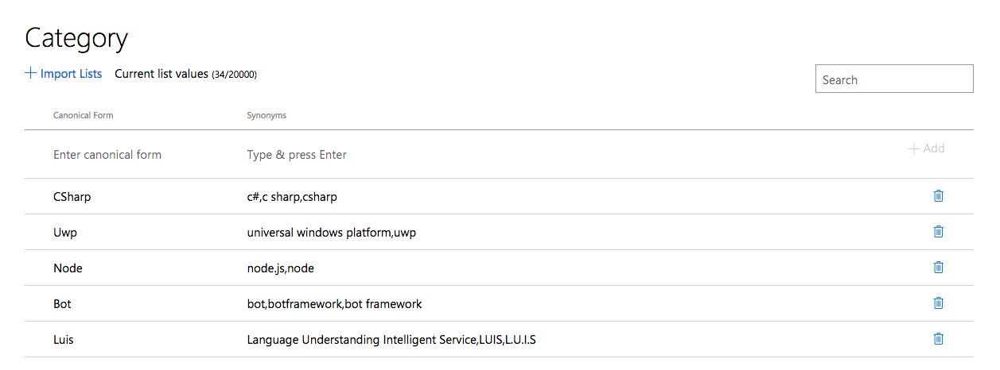

Ahora que tenemos una *entity* tipo lista configurada, es la hora de añadir más *utterances* para entrenar a nuestro modelo de LUIS. En la siguiente imagen hemos añadido dos *utterances* más. A través del siguiente comboBox, podremos ver las etiquetas que reconoce LUIS.

Si os fijáis, las opciones de visualización son las siguientes:

* **Tokens**: Muestra entre corchetes el texto que detecta como valor canónico.

* **Entities**: Esta vez mostrará entre corchetes el nombre de su *entity*.

* **Composite entities**: Esta visualización de etiquetas la veremos más adelante, pero aquí muestra unas *entities* compuestas.

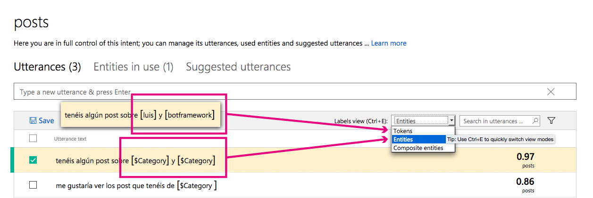

### Entity Pre-built

Antes de explicar las *entities Composite*, voy a comentar otro tipo de *entities* muy útiles. Son las *entities Pre-built* que ofrece LUIS. Son *entities* base que ya han sido previamente creadas. Si váis al siguiente [enlace](https://docs.microsoft.com/en-us/azure/cognitive-services/luis/pre-builtentities) veréis todas las que están disponibles por cada idioma.

Para estre proyecto vamos a utilizar únicamente la *Pre-built* de *number*. Me hubiese gustado añadirle la *Pre-built* de *Datetime*, pero ya han sacado la *v2* y aún no está disponible en español.

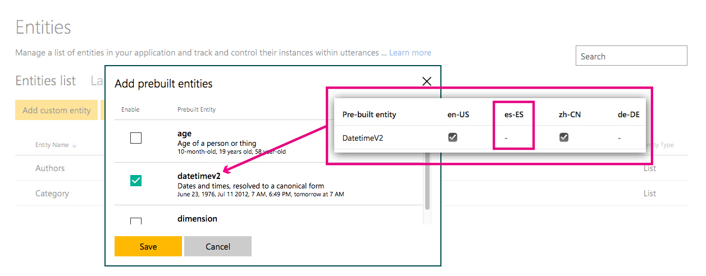

### Entity Composite

Puesto que aún no podemos utilizar la *Pre-built* de *Datetimev2*, y queremos que nuestros usuarios puedan solicitar post por fechas, vamos a crearnos nuestra *entity DateTime* personalizada.

Es una *entity* bastante compleja, ya que queremos que el filtro busque por fecha, día de la semana, por mes, por año, o incluso en un lapso concreto.

Para que LUIS lo reconozca como una sola *entity*, vamos a crearnos  una *entity Composite* compuesta de otras *entities* de tipo lista más la *Pre-built number* que hemos añadido en el anterior paso.

Gracias a este tipo de *entity*, si el usuario pide los post que se publicaron en la **tercera semana de enero**, LUIS nos devolverá:

Una única *entity composite DateTimeComposite* que contiene una *entity Pre-built number* **(tercera)**  **+**  *entity DateTime* con un valor canónico de *"Week"*  **(semana)** **+** *entity DateTimeMonth* con un valor canónico de *"January"* **(enero)**.

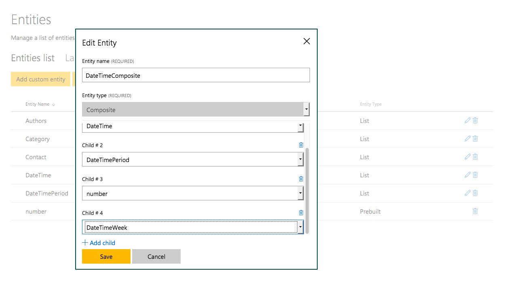

Como hemos visto antes, una vez tengamos creadas todas las *entities* que componen esta *Composite*, tendremos que añadir *utterances* y entrenar a nuestro modelo de LUIS.

Cuando añadimos una *utterance*, normalmente LUIS solo reconoce las *entities*. Para indicar que es una *Composite entity* tendremos que pulsar sobre la *entity* detectada en la *utterance*, borrar todas las etiquetas que te muestra y añadir nuestra *Composite* (normalmente te sugiere que la añadas).

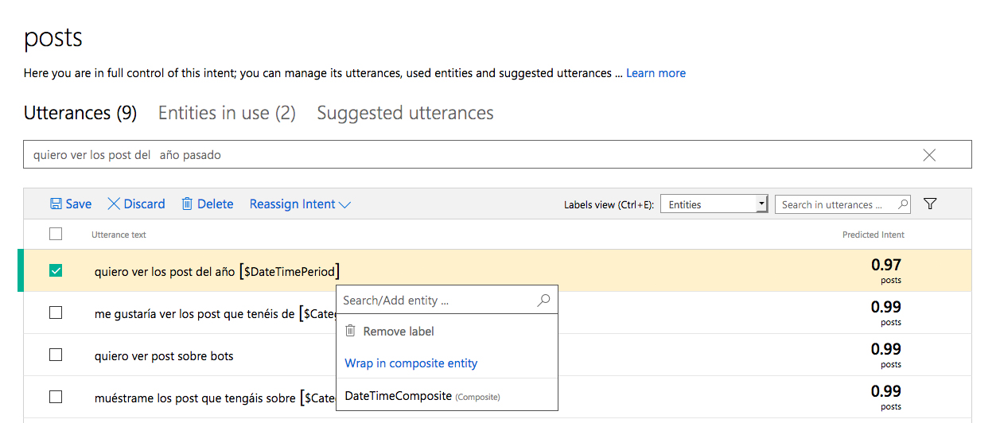

El resultado de una *entity Composite* sería el siguiente, en sus tres visualizaciones:

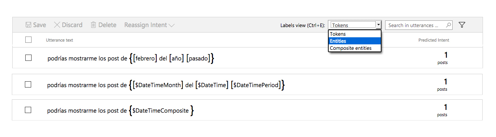

## ¿Cómo publicar la App?

Nos iremos a *Publish App*, y rellenaremos los campos que nos piden. Necesitaremos de un *Endpoint Key* para poder publicar la aplicación.
Es importante que haya sido entrenado antes de publicarla.

En cuanto lo publiquemos por primera vez, se generará un Endpoint url para hacer nuestras llamadas GET .

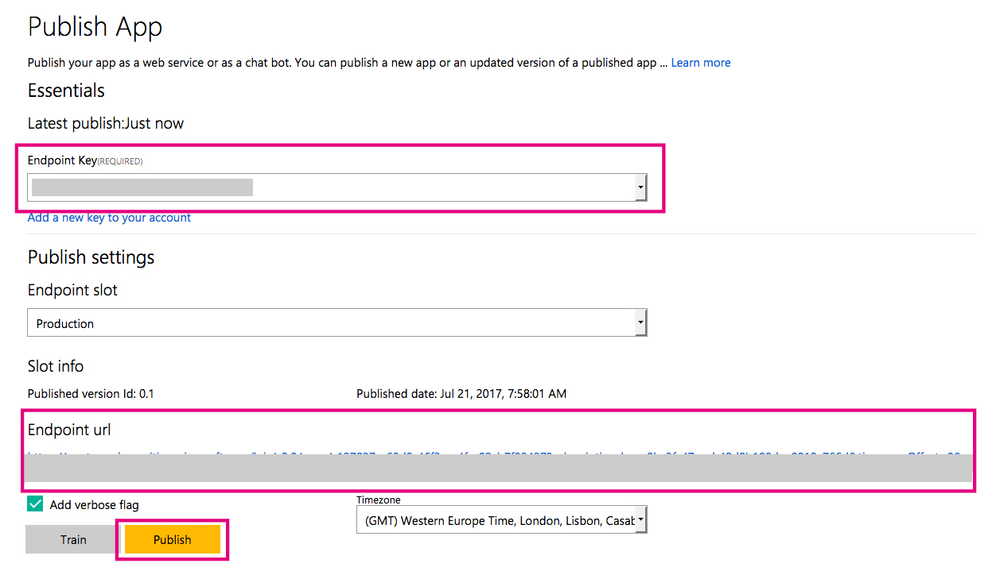

## Postman

Vamos a hacer unas pruebas a ver qué nos devuelve el modelo recién creado. Según el siguiente ejemplo:

> *Dame los posts de cSharp*

**Resultado:** Un *intent post* con un 0,9 de *score* y con una *entity Category* de un valor canónico *"CSharp"*

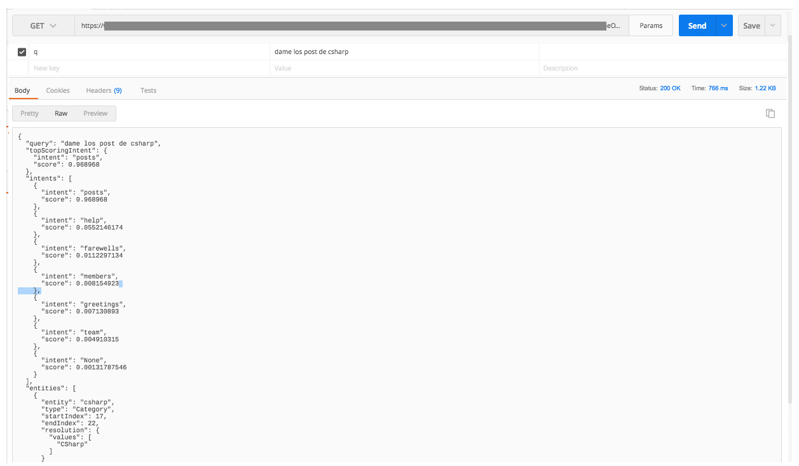

Ahora vamos a ver cómo nos devolvería la información de una ***entity composite***:

> *¿Podrías mostrarme los posts de febrero del año pasado?*

**Resultado:** Un *intent post* con un 0,98 de *score*. Además, nos devuelve una ***entity composite*** con un 0,88 de *score* compuesta de tres *entities* : *Datetime* (con un valor canónico *"Year"*), *DatetimePeriod* (con un valor canónico *"Before"*) y *DatetimeMonth* (con un valor canónico *"February"*).

```json
{
    "query": "podrías mostrarme los posts de febrero del año pasado",
    "topScoringIntent": {
        "intent": "posts",
        "score": 0.987381637
    },
    "intents": [
        {
            "intent": "posts",
            "score": 0.987381637
        },
        {
            "intent": "help",
            "score": 0.0315034
        },
        {
            "intent": "team",
            "score": 0.02026676
        },
        {
            "intent": "members",
            "score": 0.0175812021
        },
        {
            "intent": "farewells",
            "score": 0.00512256334
        },
        {
            "intent": "greetings",
            "score": 0.00164088979
        },
        {
            "intent": "None",
            "score": 0.00149371813
        }
    ],
    "compositeEntities": [
        {
            "parentType": "DateTimeComposite",
            "value": "febrero del año pasado",
            "children": [
                {
                    "type": "DateTime",
                    "value": "año"
                },
                {
                    "type": "DateTimePeriod",
                    "value": "pasado"
                },
                {
                    "type": "DateTimeMonth",
                    "value": "febrero"
                }
            ]
        }
    ],
    "entities": [
        {
            "entity": "febrero del año pasado",
            "type": "DateTimeComposite",
            "startIndex": 30,
            "endIndex": 51,
            "score": 0.8830154
        },
        {
            "entity": "año",
            "type": "DateTime",
            "startIndex": 42,
            "endIndex": 44,
            "resolution": {
                "values": [
                    "Year"
                ]
            }
        },
        {
            "entity": "pasado",
            "type": "DateTimePeriod",
            "startIndex": 46,
            "endIndex": 51,
            "resolution": {
                "values": [
                    "Before"
                ]
            }
        },
        {
            "entity": "febrero",
            "type": "DateTimeMonth",
            "startIndex": 30,
            "endIndex": 36,
            "resolution": {
                "values": [
                    "February"
                ]
            }
        }
    ]

}
```

En este punto me despido hasta el próximo post, donde veremos cómo desarrollar un bot conversacional en ***Node.js*** utilizando nuestro modelo de Luis.

## Documentación

Voy a dejar los modelos completos en nuestro [GitHub](./content/GeeksWptBot.InitialDialog.json).

[Documentación L.U.I.S (Language Understanding Intelligent Service)](https://docs.microsoft.com/es-es/azure/cognitive-services/LUIS/Home)

[Crear una cuenta luis.ai](luis.ai)

[Prebuilt entities disponibles por idiomas](https://docs.microsoft.com/en-us/azure/cognitive-services/luis/pre-builtentities)

[Documentación BotFramework](https://dev.botframework.com/)

[Postman](https://www.getpostman.com/)
