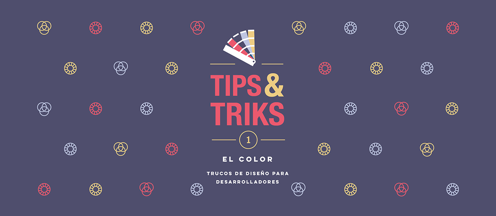
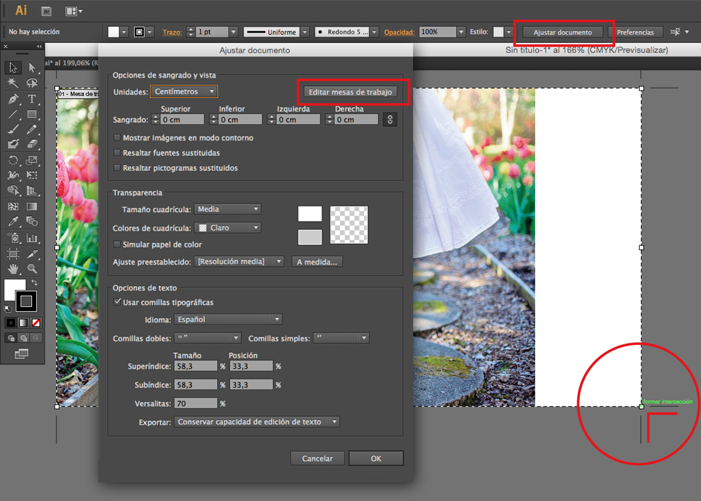
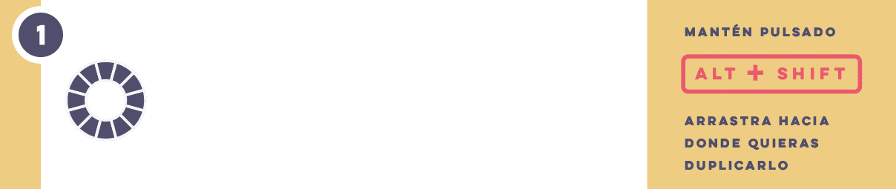
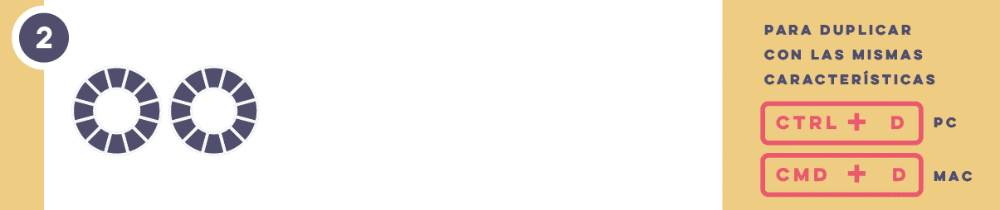
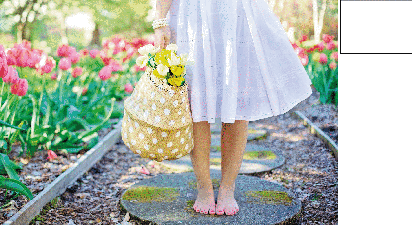
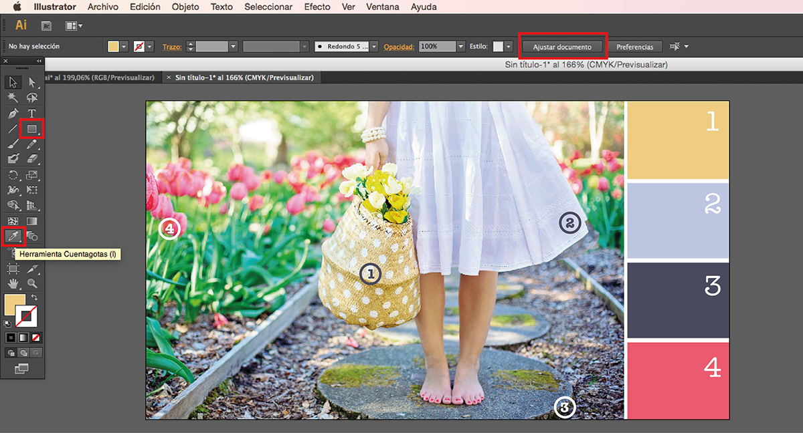

## [Tips&Triks] Diseño para desarrolladores - El Color

Mis compañeros de **No Country for Geeks** llevan tiempo pidiéndome que escriba tips and triks para desarrolladores que desean diseñar sus propias cabeceras de sus blogs personales.

El requisito básico es tener la predisposición de aprender algo que no parece muy extraño (¿quién no ha combinado una camiseta con un pantalón o dibujado y coloreado algo alguna vez?) pero que tiene su intríngulis si se quiere hacer bien.

Espero que con los siguientes tips puedas dar algún paso más en este mundillo, y como no podría ser de otra manera, lo primero que hay que hacer es investigar y curiosear.

## INVESTIGA Y CURIOSEA
Vamos a ver cuál es la mejor forma de transmitir tu mensaje a través de un elemento ilustrativo.

Escribe en una hoja palabras que creas que pueden representar tu post, tienes que conseguir abstraer el concepto principal preguntándote: 
¿Cómo puedes invitar a alguien a que lea tu post únicamente con una imagen?, ¿qué quieres destacar?, ¿qué elemento podría representarlo?,  ¿quién va a leerlo? o ¿cómo lo hacen en otros blogs o páginas tecnológicas que sueles usar de referencia?

Una vez superada la fase *Sherlock Holmes* y el concepto esté claro, es el momento de curiosear.

Una forma de nutrirse visualmente es curioseando, tienes que ver qué hay hecho, cuál es la tendencia más destacable o qué colores suelen prevalecer. 

Tenía un profesor que nos repetía todo el rato *“Para aprender hay que ver”*, es decir, hay que ver qué hay en el mercado, qué hubo e intentar adivinar lo que habrá. Conocer qué han hecho otros, tanto grandes, como no tan grandes; tanto genialidades como despropósitos; en definitiva, tener una visión global de lo que se hace, y a partir de ahí se podrá dar rienda suelta a la creatividad.

Como podéis ver, es muy similar al sector del desarrollo de software: un buen desarrollador necesita actualizarse para no perder valor profesional. El diseñador necesita educar sus ojos, y como he dicho antes, mirando se aprende.

Actualmente existen diversas fuentes de inspiración por internet. A continuación te propongo algunas que pueden gustarte:
- [Pinterest](www.pinterest.es)
- [Designspiration](www.designspiration.net)
- [Behance](www.behance.net)
- [Instagram](www.instagram.com)
- [Mr-cup](http://www.mr-cup.com/blog.html)

Este tipo de páginas te ayudarán a decidirte por, por ejemplo, una **tipografía** que te ha gustado, o de repente se te puede ocurrir una **composición** solo con ver cómo están distribuidos los elementos de una imagen.

Ahora bien, mucho cuidado con el copieteo, de lo que se trata es de inspirarte, no de fusilar un diseño. Lo divertido precisamente es la fase de creación y lo satisfactorio que es comprobar cómo una composición queda perfectamente compensada sólo con mover un elemento un par de píxeles hacia un lateral. 

Así que este será el primer tip que voy a darte, cómo sacar provecho de referencias visuales que te gusten, y vamos a hacerlo con **El Color** como tema principal. 

## Primer Tip: El Color
Podría explicarte qué son los **[colores primarios](https://es.wikipedia.org/wiki/Color_primario )**, qué es una **[armonía cromática](https://es.wikipedia.org/wiki/Armon%C3%ADa_crom%C3%A1tica)**, o por qué se dice que el negro es la **[ausencia de luz](https://es.wikipedia.org/wiki/Negro_(color))**, pero creo que sobre el **[color](https://es.wikipedia.org/wiki/Color)** hay mucha documentación que podréis encontrar en internet, y el objetivo principal de este post es para que el desarrollador pueda diseñar su cabecera de una manera fácil y rápida. Luego ya depende de cada uno si quiere profundizar más o menos.

Así que vamos a crearnos una cabecera utilizando el siguiente tip:

### La elección del color
Un buen tip para decidirte por una **gama de colores** de manera rápida sería sacando los colores que componen una imagen que te guste.

**¿Qué vamos a necesitar?**
* **RECURSOS**
-Una imagen.
Puedes seguir las instrucciones con una imagen tuya o también puedes descargarte alguna imagen de un banco de imágenes. Por ejemplo, **[Pixabay](https://pixabay.com/)**, que es un banco de imágenes libres de derechos de autor, donde encontrarás gran variedad de imágenes por temas. 

* **SOFTWARE**
-Un editor de gráficos vectoriales. Por ejemplo, ***Illustrator***, *Inkscape* o *CorelDraw*.
Hay diversos programas que podrás utilizar para tus diseños. A mí personalmente los que más me gustan y más utilizo son ***Photoshop*** e ***Illustrator***. 
Puedes hacerlo con lo que más te apañes, pero si te animas iremos viendo paso a paso cómo se hace con estos programas.
En este caso voy a utilizar ***Illustrator*** porque es más sencillo crear rectángulos e ir asignándoles un color con el cuenta gotas. Por norma general, únicamente utilizo ***Photoshop***  cuando quiero hacer un montaje con varias imágenes o cambiar las características de una imagen, como tamaño, color y resolución; o incluso cuando quiero darle un tratamiento especial a un fondo.

### Empezamos

Para abrir una imagen en illustrator se hace de la siguiente manera:

1- Crea un nuevo documento

2- Archivo/Colocar../Eliges la imagen que te guste

3- Ajusta el documento al tamaño de la imagen dejando un margen derecho para añadir cuatro rectángulos.

4- **[Trik]** Si creas un rectángulo y arrastras el rectángulo mientras mantienes presionados **Alt + Shift**, este se duplicará alineándose al rectángulo ya creado.

Si ahora pulsas **Ctrl + D** (PC) o **Cmd + D** (Mac), se duplicará de nuevo con las mismas características que el anterior. Es decir, mismo tamaño y mismo desplazamiento.

Quedaría algo parecido a esto:

5- Ahora utilizaremos el **cuenta gotas** para ir guardando los colores destacados.

Si haces esto cada vez que te enfrentes a un diseño nuevo, podrás crear tu propia biblioteca de gamas de colores.

6- Y por último vamos a utilizar estos colores en nuestro diseño

**En resumen:** hay que investigar e identificar de qué manera trasmitiremos de manera óptima nuestro mensaje. En este post hemos aplicado el proceso a la elección de colores, aunque un razonamiento similar podría aplicarse a la elección de la tipografía, estilo de ilustración, composición, etc.

Espero que os haya sido de gran utilidad e iré publicado más **Tips&Triks** de diseño para desarrolladores :)

