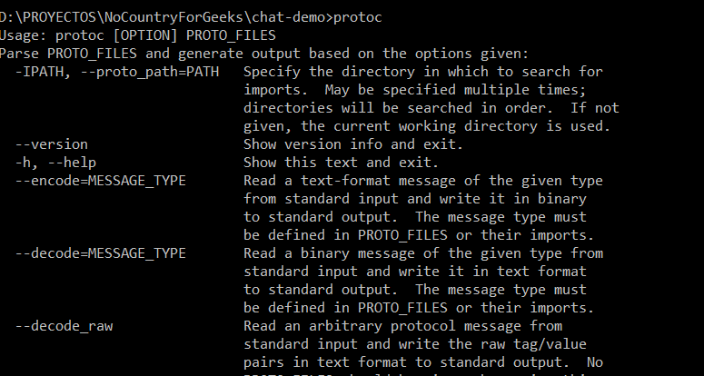
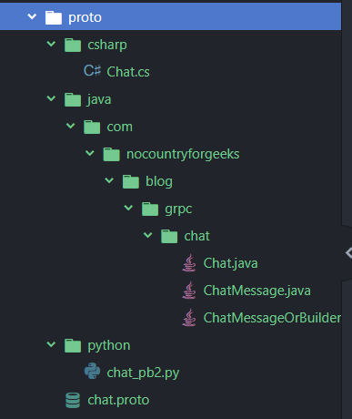
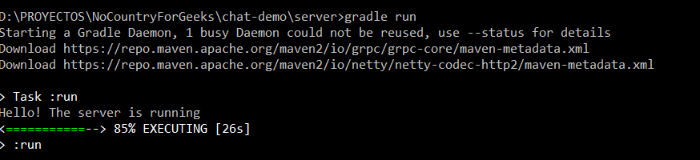
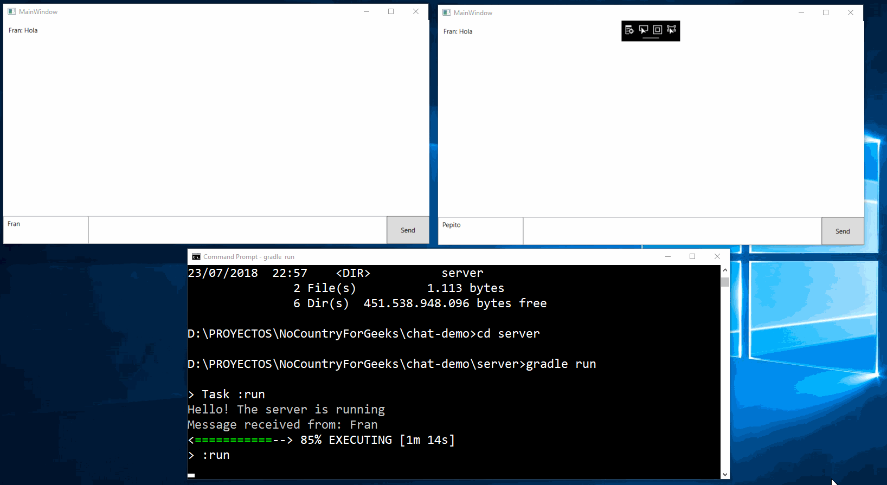

# GRPC: From Zero to Hero (1): Protocol buffers

Cuando queremos exponer un servicio (o conjunto de servicios) a aplicaciones externas, actualmente pensamos en crear un API REST que pueda ser accedida desde dichas aplicaciones. Esta solución es por la que, generalmente optaríamos.

También podríamos plantearnos crear un endpoint GraphQL para exponer nuestros servicios a través
de un esquema bien definido.

Sin embargo, si echamos la vista atrás, vemos que se utilizaban cosas como [CORBA](http://www.corba.org/) o [RMI](https://es.wikipedia.org/wiki/Java_Remote_Method_Invocation). Estos sistemas de
comunicación estaban basados en lo que se conoce como [RPC (Remote procedure call)](https://es.wikipedia.org/wiki/Llamada_a_procedimiento_remoto), imagino a un montón de gente huyendo del post en este momento, jaja. Esta técnica consiste en que desde una máquina podemos ejecutar código (un método por ejemplo) en otra máquina. Centrándonos en el modelo cliente-servidor que estamos considerando, realmente desde el cliente podremos llamar a métodos (o servicios) definidos en el servidor.
Sobre esta idea se construye GRPC.

## 1.- ¿Qué es GRPC?
[GRPC](https://github.com/grpc) es un proyecto open source desarrollado por Google , que forma parte de la CNCF (Cloud Native Computation Foundation). Permite llamar desde una aplicación cliente a un método o servicio que se encuentre definido en un servidor (que puede estar localizado en otra máquina) como si fuera un método
que estuviera definido localmente.

La idea se basa en definir servicios que constarán de una serie de métodos
RPC en los cuales se detallan el mensaje de entrada que reciben y el mensaje de salida que generan. Realmente, solo es necesario definir estos métodos y los mensajes que se van a intercambiar y GRPC se encargará de realizar toda la labor oscura por nosotros.


GRPC es moderno, rápido y eficiente de baja latencia, construido utilizando HTTP/2, que soporta streaming, es independiente del lenguaje empleado y que, además, hace relativamente sencillo el incorporar autenticación, balance de carga, trazas y monitorización.

Por defecto, GRPC utiliza Protocol Buffers (también llamados Protobuf) para definir los servicios y los mensajes que se intercambiarán. Estos [protobuf](https://developers.google.com/protocol-buffers/docs/overview) se enmarcan en un protocolo, también desarrollado por Google, para el serializado / deserializado de datos. Si comparamos el uso de Protobuf con otros sistemas de serialización / deserialización de datos (como, por ejemplo XML o JSON) vemos que consigue más eficiencia, mejor mantenibilidad y el tamaño de los mensajes intercambiados es también más pequeño. Como referencia os dejo un [artículo de Auth0](https://auth0.com/blog/beating-json-performance-with-protobuf/) en los que realizan una comporación entre Protocol Buffers y JSON en distintas circunstancias:

En esta pequeña entrada no vamos a entrar en comparaciones, sino que, nuestra idea, es mostrar cómo trabajar con protocol buffers y desarrollar un ejemplo sencillo de aplicación utilizando GRPC. En posteriores entradas hablaremos en más profundidad de GRPC, detallando los distintos tipos de servicios que podemos definir y cómo podemos implementarlos utilizando diferentes lenguajes de programación.


## 2. Construyamos un chat

Creo que es la aplicación de ejemplo clásica que se utiliza en todos los sitios para introducir GRPC y protocol buffers. En nuestro ejemplo vamos a crear un servidor en Java, que será quien reciba los mensajes de los clientes y los reenvíe a todos ellos en tiempo real.

### 2.1.- Utilizando protocol buffers

Como hemos comentado anteriormente, lo primero que vamos a realizar es definir los mensajes que se van a intercambiar entre el cliente y el servidor. Posteriormente, tendremos que definir el servicio que utilizará dicho mensaje.
Definiremos estos servicios y mensajes empleando una sintaxis de alto nivel, utilizando protocol buffers. Lo que haremos es crear un fichero con extension ___.proto___ donde utilizaremos la sintaxis de protocol buffers. En concreto, utilizaremos la versión 3 de la misma. La definición de nuestro mensaje quedaría de la siguiente forma:

```protobuf
syntax = "proto3";

message ChatMessage {
    string from = 1;
    string message = 2;
}
```

La primera línea de nuestro archivo ___.proto___ nos define la sintaxis que utilizaremos dentro del lenguaje. Utilizaremos la versión 3, aunque podríamos utilizar la versión 2.
Posteriormente, definimos nuestro mensaje. Para ello, se utiliza la palabra reservada ___message___ seguido del nombre que queramos. Nosotros hemos sido sumamente originales y lo hemos bautizado como _ChatMessage_. Cada mensaje constará de una serie de campos que situaremos entre llaves. Cada campo, a su vez, está compuesto, generalmente, por tres elementos:
- ___Tipo___: En nuestro ejemplo los dos campos van a ser de tipo _string_.
- ___Nombre___: El nombre del campo.
- ___Tag___: Es ese numerito que situamos tras el signo igual.

Hagamos un pequeño inciso para comentar detalles sobre los tags y los tipos que podemos utilizar.

#### Tags
Como acabamos de comentar, es necesario especificar un tag para cada campo de nuestros mensajes.
- __¿Por qué?__: Los mensajes que intercambiamos utilizando protocol buffers se transmiten en binario, con lo que se utiliza ese identificador para localizar cada campo dentro del mensaje. Por lo tanto, se podría decir que, para el mensaje en sí, lo realmente importante es el ___tag___ y no el nombre del campo.  
- __Consideraciones__: Podremos usar tags desde el número 1 hasta el 2^29 - 1 (excluyendo desde 19000 hasta 19999 que son reservados por ___Google___). Sin embargo, es interesante constar que, para codificar los tags entre 1 a 15 se empleará solamente un byte, por lo que es recomendable utilizarlos para los campos que se transmitan habitualmente.

#### Tipos
Es obvio decir que podremos definir diferentes tipos de campos en nuestros mensajes. Anterormente hemos visto el tipo _string_, pero existen muchos más:
- Enteros: _int32_, _int64_, _uint32_, _uint64_, _sint32_, _sint64_, _fixed32_, _fixed64_, _sfixed32_ y _sfixed64_. Toda esta gama es provista con el propósito de conseguir el mayor grado de eficiencia en la codificación de los mensajes, dependiendo del rango de valores que queramos representar, si se permiten o no números negativos y de cómo se va a realizar la codificación de los números negativos en el caso de que existan.
- Punto flotante: Tenemos dos tipos principales: _float_ y _double_, según queramos 32 o 64 bits de precisión.
- Booleanos: Con valores _True_ y _False_ y se representa con el tipo _bool_.
- Cadenas de caracteres: Es el tipo _string_ que hemos presentado antes.
- Array de bytes: Se representan como _bytes_.
- Enumerados: Se utiliza la palabra reservada ___enum___ para definir un enumerado y entre llaves se situarían los valores de los que consta. Veremos posteriormente un ejemplo.
- Lista: Para declarar una lista en nuestros mensajes utilizaremos el concepto de campos repetidos. Para ello, emplearemos la palabra reservada ___repeated___, de la siguiente forma:

```protobuf
message ChatMessage{  
  repeated string messages = 3;
}
```
Con lo que, nuestro mensaje ___ChatMessage___ estaría compuesto por una lista de mensajes.

#### Consideraciones de uso

Antes de proseguir con nuestro ejemplo del chat, vamos a comentar de forma somera algunos puntos interesantes a la hora de trabajar con protocol buffers:
- Es posible definir varios mensajes en el mismo fichero.
- Podemos definir mensajes dentro de otros con el fin de establecer "localidad" para un determinado tipo o para evitar conflictos de naming.
- Es conveniente utilizar varios archivos ___.proto___ donde definir la totalidad de nuestros mensajes. Por ello se introduce la palabra reservada _import_ que nos permite importar el contenido de un archivo a otro y poder utilizar tipos declarados en otros archivos.
- Es conveniente definir el paquete donde se van a generar los mensajes una vez que sean convertidos al lenguaje de programación con el que vayamos a trabajar. Para ello, se utiliza la palabra reservada _package_ seguida de un string con el nombre del paquete que deseemos.
- En relación a lo anterior, podemos establecer un conjunto de opciones específicas para cada lenguaje destino, donde nos permite especificar el paquete (para java, por ejemplo) o el namespace destino (para c#)... Estas opciones son:

```protobuf
option csharp_namespace = "nocountryforgeeks.blog";
option cc_enable_arenas = true;
option go_package = "nocontryforgeeks/blog";
option java_package = "com.nocountryforgeeks.blog.grpc.chat";
option java_outer_classname = "Chat";
option java_multiple_files = true;
option objc_class_prefix = "GRPC";
```
Todas las opciones explicadas, junto con el resto de especificación del lenguaje lo puedes encontrar [aquí](https://developers.google.com/protocol-buffers/docs/proto3)

Como reglas de estilo para estos ficheros ___.proto___ recomiendo basarse en la guía publicada por __Uber__ en [github](https://github.com/uber/prototool/blob/dev/etc/style/uber/uber.proto), aunque lo podemos resumir en cuatro puntos:
- Utilizar [___Camel Case___](https://es.wikipedia.org/wiki/CamelCase) para el nombre de los mensajes.
- Para el nombre de los campos utilizar [___Snake Case___](https://en.wikipedia.org/wiki/Snake_case), básicamente, en minúsculas con guión bajo separando cada palabra.
- Para el nombre de los enumerados también utilizamos ___Camel Case___.
- Por último, para los valores del enumerado utilizamos Mayúsculas con cada palabra separada por guión bajo.

```protobuf
message WhatTheFuckAreYouDoingWithThatName {
    string this_name_is_long = 1;
    int32 this_number_is_long_named_too = 2;
}

enum ThisEnumHasALongName {
    FIRST_VALUE_OF_THIS_ENUM = 1;
    SECOND_VALUE = 2;
}
```

#### Servicios

Hasta ahora solamente hemos definido nuestro mensaje para el chat que, recordemos, es el siguiente:

```protobuf
syntax = "proto3";

message ChatMessage {
    string from = 1;
    string message = 2;
}
```
Sin embargo, con el fin de poder comunicar una aplicación cliente con un servidor es necesario definir servicios que intercambien los mensajes. Aquí es donde entra en juego ___GRPC___.
Por lo tanto, en nuestro archivo ___.proto___ vamos a añadir un servicio que utilice el mensaje que hemos definido. El servicio se especificaría de la siguiente forma:

```protobuf
service ChatService {
    rpc chat (stream ChatMessage) returns (stream ChatMessage);
}
```

La sintaxis no es compleja. Definimos un servicio, _ChatService_, utilizando la palabra reservada ___service___, que tendrá varios métodos que podremos usar (en cada método utilizamos la palabra reservada ___rpc___ indicando que utilizaremos un protocolo rpc). Nosotros hemos creado el método ___chat___ el cual espera un mensaje del tipo _ChatMessage_ de entrada y responde con otro _ChatMesage_. Los más avispados habrán notado la presencia de la palabra reservada _stream_ situada previamente a la declaración del tipo del mensaje desde cliente a servidor y del tipo de mensaje desde servidor a cliente. Y aquí es donde se encuentra uno de los aspectos diferenciadores de ___GRPC___. Como hemos comentado antes, ___GRPC___ se basa en ___HTTP2___, lo que permite, entre otras cosas, habilitar el streaming en ambos sentidos (tanto desde servidor a cliente, como desde cliente a servidor). Con ello, podremos definir cuatro tipo de servicios diferentes:
- __Servicios tradicionales__: Servicios sin streming. El cliente envía una petición y servidor responde.
- __Servicios con streaming desde servidor__: El cliente envía una petición al servidor y se abre un canal de streaming que permite al servidor mandar datos por el canal creado conforme se vayan generando.
- __Streaming desde el cliente__: El cliente puede abrir un canal de streaming hacia el servidor.
- __Streaming bidireccional__: Es el ejemplo que nos ocupa. El canal se establece en ambos sentidos permitiendo al cliente y al servidor mandar mensajes en el momento que consideren oportuno.

Para declarar uno u otro tipo de mensajes basta con añadir la palabra reservada _stream_ delante del tipo de mensaje de cliente a servidor y/o del tipo de mensaje de servidor a cliente.

#### Generación del código para cada lenguaje

Perfecto, ya tenemos la definición de nuestro servicio, conjuntamente con la definición de nuestro mensaje. Ahora necesitamos generar el código en el lenguaje en el que nos sintamos más cómodos para empezar a trabajar en nuestra aplicación. Para ello tendremos que descargar la aplicación [___protoc___](https://github.com/google/protobuf/releases) que corresponda a nuestro sistema operativo (en nuestro caso _Windows_). Una vez descargado, descomprimimos el fichero en la carpeta destino deseada e incorporamos la subcarpeta __bin__ al ___PATH___. Podemos verificar si todo funciona correctamente desde el terminal:



Tenemos que especificar el archivo o los archivos de entrada y el lenguaje en los que queremos obtener la salida. Por ejemplo, nosotros tenemos el fichero _chat.proto_ dentro del directorio _proto_ y queremos generar la implementación en __python__, __java__ y __c#__. Para ello, utilizaremos los siguientes comandos:

```console
protoc -I=proto --python_out=proto/python proto/chat.proto
protoc -I=proto --csharp_out=proto/csharp proto/chat.proto
protoc -I=proto --java_out=proto/java proto/chat.proto
```

Previamente hemos creado tres carpetas (python, csharp y java dentro del directorio proto que es donde tendremos el fichero ___chat.proto___).
- En ___C#___ se genera el fichero ___Chat.cs___ con la implementación de nuestro servicio y el mensaje que podremos utilizar posteriormente en nuestra aplicación.
- En ___Java___, por el contrario, se genera la estructura de carpetas típica según el nombre del paquete indicado (nosotros hemos usado la opción java_package y java_multiple_files) y vemos que se generan 3 archivos: ___Chat.java___, ___ChatMessage.java___ y ___ChatMessageOrBuilder.java___
- Por último, para ___Python___ se genera, igualmente, un solo archivo ___chat_pb2.py___



### 2.2. Trabajando en el servidor

Por fin nos pondemos manos a la obra. Como hemos comentado en el apartado previo vamos a generar el servidor de nuestra aplicación utilizando ___Java___.
En concreto utilizaremos [___gradle___](https://gradle.org/) para construir nuestro proyecto y, gracias al uso de varios plugins, realizar el proceso de generación de los ficheros _java_ a partir de los ficheros _proto_ de forma automática. No vamos a entrar en la descripción punto a punto de como generar el proyecto utilizando _gradle_, pero podéis ver todo el código del proyecto en el [repositorio con el ejemplo](https://github.com/franmolmedo/GrpcChatExample).
Aparte de ello, nuestro proyecto consta de dos ficheros fundamentales:
- El primero de ellos, _ChatServiceImpl.java_ se encarga de extender la clase abstracta _ChatServiceImplBase_ que se ha generado a partir de nuestro fichero descriptor ___chat.proto___. El código queda como sigue:

```java
import java.util.LinkedHashSet;

import io.grpc.stub.StreamObserver;

import com.nocountryforgeeks.blog.grpc.chat.ChatMessage;
import com.nocountryforgeeks.blog.grpc.chat.ChatServiceGrpc.ChatServiceImplBase;

public class ChatServiceImpl extends ChatServiceImplBase{

	private static LinkedHashSet<StreamObserver<ChatMessage>> observers = new LinkedHashSet<StreamObserver<ChatMessage>>();

	@Override
	public StreamObserver<ChatMessage> chat(StreamObserver<ChatMessage> responseObserver) {
		observers.add(responseObserver);

		return new StreamObserver<ChatMessage>() {

			@Override
			public void onNext(ChatMessage value) {
				ChatMessage messageToSend = ChatMessage.newBuilder()
						.setMessage(value.getMessage())
						.setFrom(value.getFrom())
						.build();
				System.out.println("Message received from: " + value.getFrom());
				observers.stream().forEach(observer -> observer.onNext(messageToSend));
			}

			@Override
			public void onError(Throwable t) {
				observers.remove(responseObserver);
			}

			@Override
			public void onCompleted() {
				observers.remove(responseObserver);
			}			
		};
	}
}
```
Básicamente implementamos el método _chat_ definido por nuestro servicio que consta de un _StreamObserver_ de entrada y otro de salida, ambos tipados con nuestro _ChatMessage_. Para cada mensaje entrante lo que hacemos es incorporar al cliente que ha remitido el mensaje al conjunto de observadores (es un conjunto para prevenir que podamos insertar dos veces al mismo observador) y posteriormente tendremos que considerar 3 casos diferentes, para lo cual implementamos los métodos _onNext_ para cuando todo ha ido correcto, _onError_ cuando se haya producido un error y _onComplete_ si se ha terminado correctamente la comunicación.
El caso más interesante es el método _onNext_. En él vemos una de las características más interesantes de la implementación en ___Java___ que consiste en que todo se realiza a través de un __Builder Pattern__ (o patrón constructor). En este caso, para cada mensaje de entrada, generamos un mensaje de respuesta copiando el contenido del mensaje y el origen. Posteriomrnete lo que hacemos es recorrer los observadores que tenemos y llamar al método _onNext_ de cada uno de ellos con el mensaje que hemos construido.

- El segundo fichero (___ChatServer.java___) lo utilizamos para crear y arrancar el servidor. El código queda de la siguiente forma:

```java
package com.nocountryforgeeks.blog.grpc.chat.server;

import java.io.IOException;

import io.grpc.Server;
import io.grpc.ServerBuilder;

public class ChatServer {
	public static void main(String [] args) throws IOException, InterruptedException {
		System.out.println("Hello! The server is running");

		Server server = ServerBuilder
				.forPort(8080)
				.addService(new ChatServiceImpl())
				.build();

		server.start();

		Runtime.getRuntime().addShutdownHook(new Thread(() -> {
			System.out.println("Received shutdown request");
			server.shutdown();
			System.out.println("Shutdown resolved");
		}));

		server.awaitTermination();
	}
}
```
La implementación es aún más sencilla. En el método __main__ creamos el servidor utilizando el _ServerBuilder_ (de nuevo el patrón builder) proporcionado, indicándole el puerto en el que queremos que escuche y los servicios que queremos que proporcione.
Tras ello, lo arrancamos y lo dejamos ejecutándose hasta que termine (por error) o se invoque su apagado.

Para arrancar el servidor nos situamos en la carpeta base del proyecto y ejecutamos ___gradle run___.



### 2.2.- Clientes

Nuestros clientes van a estar implementados en __C#__. En este caso, es necesario utilizar el __paquete NuGet__ llamado _GRPC.Tools_ para generar los archivos que emplearemos en nuestra solución. Idealmente lo mejor es generar algún ficherito .bat con todos los pasos para generar los archivos e incorporar su ejecución en el proceso de build de la solución. En nuestro caso el ___.bat___ generado queda tal que así:

```
setlocal

@rem enter this directory
cd /d %~dp0

set TOOLS_PATH=packages\Grpc.Tools.1.13.1\tools\windows_x64

%TOOLS_PATH%\protoc.exe -I ..\proto chat.proto --csharp_out .
%TOOLS_PATH%\protoc.exe -I ..\proto chat.proto --grpc_out . --plugin=protoc-gen-grpc=%TOOLS_PATH%\grpc_csharp_plugin.exe

endlocal
```
Se generan dos archivos: ___Chat.cs___ y ___ChatGrpc.cs___ que incorporaremos a la solución.

Una vez hecho esto, lo que queda es más simple. Construimos una ventana inicial y en el _code behind_ incluimos el siguiente snippet de código:

```csharp
using System;
using System.Threading;
using System.Windows;
using Grpc.Core;
using Service;

namespace ChatClient
{
    public partial class MainWindow
    {
        private ChatService.ChatServiceClient _chatServiceClient;
        private AsyncDuplexStreamingCall<ChatMessage, ChatMessage> _call;

        public MainWindow()
        {
            InitializeComponent();

            InitializeGrpc();        
        }

        private async void InitializeGrpc()
        {
            var grpcChannel = new Channel("127.0.0.1:8080", ChannelCredentials.Insecure);

            _chatServiceClient = new ChatService.ChatServiceClient(grpcChannel);

            try
            {
                using (_call = _chatServiceClient.chat())
                {
                    while (await _call.ResponseStream.MoveNext(CancellationToken.None))
                    {
                        var serverMessage = _call.ResponseStream.Current;
                        var displayMessage =
                            $"{serverMessage.From}: {serverMessage.Message}{Environment.NewLine}";
                        ChatContent.Text += displayMessage;
                    }
                }
            }
            catch (RpcException)
            {
                _call = null;
                throw;
            }
        }

        private async void ButtonSend_OnClick(object sender, RoutedEventArgs e)
        {
            if (_chatServiceClient == null) return;

            await _call.RequestStream.WriteAsync(new ChatMessage
            {
                From = Name.Text,
                Message = Message.Text
            });

            Message.Text = string.Empty;
        }
    }
}
```
La implementación, a nuestro gusto, es mucho menos elegante que la que hemos visto en __Java__. En este caso, definimos nuestro canal con la dirección del servidor (consideramos una ejecución en local) y creamos el cliente a partir de dicho canal. Después nos quedamos escuchando a que se produzca la recepción de un mensaje a través del canal y mostramos el mismo por pantalla.
En la parte inferior mostramos el código asociado al evento de pulsar el botón de enviar un mensaje. En él, si tenemos el canal de stream abierto, escribimos un nuevo mensaje en el mismo que llegará a servidor.

El resultado de nuestra aplicación lo podemos ver en el siguiente gif:



## Conclusiones

Sólo hemos mostrado un pequeño ejemplo de lo que se puede conseguir. La idea es continuar la serie desgranando verdaderamente todo lo que nos puede ofrecer ___GRPC___ con ejemplos más realistas y usos avanzados. Queremos mostrar cómo usar ___GRPC___ en un desarrollo con microservicios y realizar pruebas de carga para ver como mejora su utilización comparándolo con un enfoque más tradicional (utilizando API REST con JSON), cómo podemos combinarlo con ___GraphQL___ y si merece la pena hacerlo, cómo lidiar con la evolución de los mensajes y servicios a lo largo del tiempo, hablar de los __flatbuffers__ y cómo podemos usarlos con __GRPC__...

Sin más, os dejo con algunos enlaces de referencia y el código del ejemplo:

- [Página oficial GRPC](https://grpc.io/)
- [Protocol buffers](https://developers.google.com/protocol-buffers/)
- [Ejemplo de chat en github](https://github.com/franmolmedo/GrpcChatExample)

Happy Coding!
