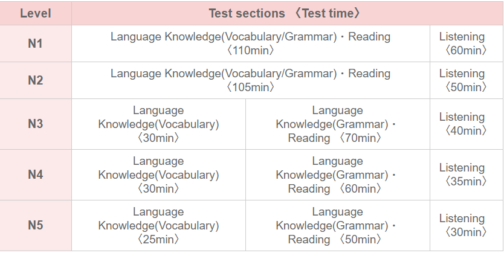
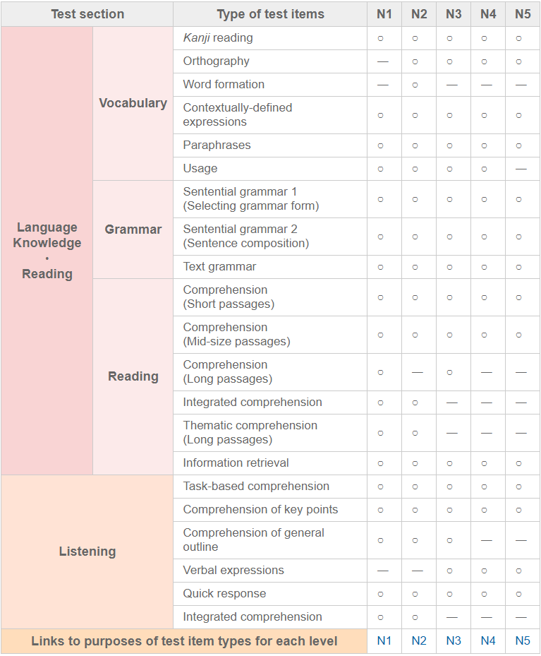
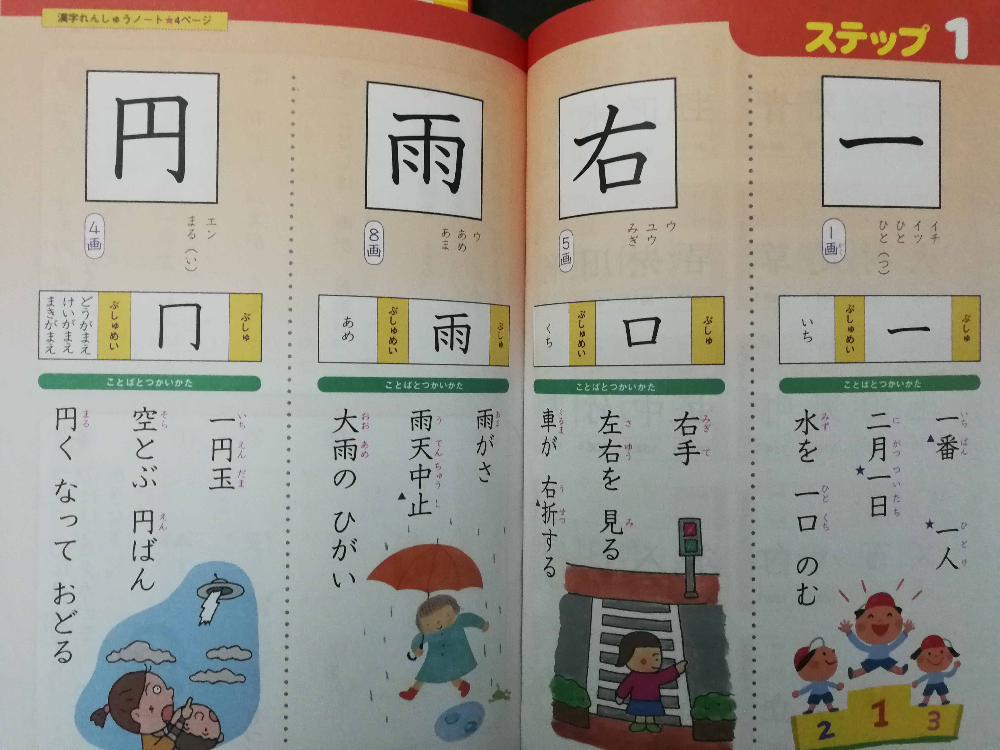
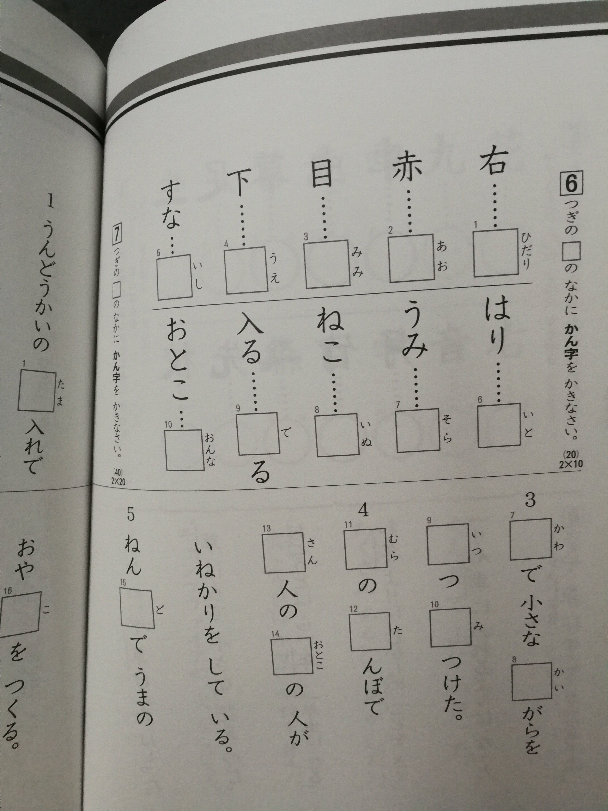

# Estudiemos japonés juntos

Al habla un estudiante frustrado de japonés. Y no porque no haya tenido constancia o porque nunca haya pasado del [Hiragana](https://es.wikipedia.org/wiki/Hiragana]) y [Katakana](https://es.wikipedia.org/wiki/Katakana); sino más bien por el hecho de haber alcanzado cierto nivel y haberlo perdido con los años. Sobre todo, el tema que más me duele son los [_Kanjis_](https://es.wikipedia.org/wiki/Kanji). De estudiarlos con ilusión, tratar de comprender el origen, repasarlos una y mil veces trazo a trazo a olvidarlos: básicamente debido a no usarlos en mi día a día.

Me encuentro en ese punto en el que o retomo el estudio dirigiéndome hacia un objetivo claro (en este caso superar el nivel __JLPT-2__) o dejo definitivamente el idioma de lado.

Y, de repente, me surge la inspiración. ¿Por qué no retomar los Kanjis desde el principio, compaginando el estudio con el desarrollo de una app que nos permita repasarlos, tenerlos estructurados por niveles y revisar vocabulario?  

## Idea

En mi opinión, la única forma de estudiar _kanjis_ y que el esfuerzo merezca la pena, consiste en la repetición. Por experiencia puedo decir que no sirve de nada el tratar de memorizar el ideograma, luego las lecturas y, posteriormente, varias palabras de voculabulario que lo usen si todo queda ahí. En estos casos, es necesario volver a revisar el _kanji_ cada cierto tiempo, ver que lo has afianzado, refrescar vocabulario y, muy importante y que a veces es dejado de lado, ver ejemplos de frases donde se haga uso del _kanji_ y poder identificar su significado por el contexto.

Todo lo anterior se refiere sólamente a la capacidad de reconecer un _kanji_, o una palabra que lo use, dentro de un texto. El hecho de poder escribirlo correctamente requiere un esfuerzo netamente superior y ahí no hay más que hacerlo una y otra vez repetidamente en el tiempo. Sin embargo, ésto no se requiere en los exámenes de certificación de idioma; por lo que, nosotros nos centraremos únicamente en tratar de reconocerlos.

¿Y qué vamos a hacer?
* Generar una base de conocimiento de kanji basándonos en varias fuentes (libros kanken, kanji in context, kanjidic, basic kanji book, intermediate kanji book, kanjivg, nihongo-pro...)
* Llevar a cabo un API que exponga todo este conocimiento a aplicaciones externas.
* Crear una aplicación que nos permita estudiar de la forma que hemos comentado:
    - Que nos vaya proponiendo _kanjis_ para que podamos identificarlos, haciéndolo según nuestro nivel y según el grado de experiencia con dicho _kanji_ que el usuario tenga. Por ejemplo, un día nos propone un kanji básico, el cual ya tenemos muy afianzado. Es importante que podamos comunicarle a la aplicación este hecho para que no nos vuelva a proponer este kanji hasta pasado un tiempo.
    - Que nos permita filtrar los kanjis, vocabulario y ejemplos de frases por nuestro nivel de idioma para poder estudiarlos.

¿Por qué hacerlo todo desde cero y no utilizar aplicaciones / base de datos existentes?
* La razón fundamental es que el realizar todo el proceso favorece el aprendizaje.
* No he encontrado ninguna aplicación que ofrezca toda la funcionalidad que deseo.
* Montar toda la estructura de una aplicación, desde la Base de datos, el servicio web que nos va a permitir conectarnos como usuario autenticado y nos va a proporcionar la información de nuestros progresos y los _kanjis_ a estudiar; hasta un frontal web y una aplicación multiplataforma que nos permitan presentarle al usuario toda esta información, nos va a permitir ir desgranando el cómo desarrollar una aplicación end-to-end, con tecnología moderna y aplicando, dentro de nuestro conocimiento, las mejores prácticas posibles.

## Objetivo

Como se ha comentado previamente el objetivo es superar el JLPT nivel 2. ___¿Qué es el JLPT?___ El ___Japanese language proficiency test___ o (日本語能力試験) es un examen de certificación de nivel de idioma japonés. Actualmente existen 5 niveles diferentes a los que se puede optar, yendo en nivel ascendente de dificultad; es decir, el nivel 5 es el nivel más básico, mientras que el nivel 1 es el más avanzado. De entre todos los niveles, he decidido prepararme para el segundo porque es el nivel mínimo exigido para poder trabajar en Japón (hablamos de trabajos medianamente cualificados) y porque, sinceramente, creo que el el salto existente entre los niveles 2 y 1 es demasiado elevado y se me presenta como algo inalcanzable en la actualidad.

En la página oficial del [JLPT](http://www.jlpt.jp/e/) podemos encontrar el siguiente cuadro donde se nos muestra la estructura del examen en cuestión:

Así mismo, se nos presenta un otro cuadro informativo con cada una de estas secciones más detalladas

Todo objetivo tiene que cumplir una serie de condicionantes para que realmente sea un objetivo y no una quimera. Uno de esos condicionantes es fijar una fecha límite para su cumplimiento. Actualmente se realizan dos convocatorias anuales del _JLPT_: una durante la primera semana de julio y otra durante la primera semana de diciembre. Nuestro objetivo es presentarnos al examen en __DICIEMBRE DE 2018__.

#### Alcance

En esta actividad nos vamos a centrar en preparar la parte dedicada al conocimiento del vocabulario y de los kanjis. Para el nivel 2 es necesario reconocer un total de __1140__ ___kanji___, que combinaremos para conseguir abarcar también el máximo número de palabras de vocabulario posible. Igualmente, con los ejemplos de frases y expresiones que iremos introduciendo avanzaremos un poco en el estudio de gramática; pero, lógicamente, será necesario un estudio más profundo posterior.

#### Pasar el test

Es interesante recopilar algunos consejos de personas que se han enfrentado a este reto y han conseguido superarlo. Quiero resaltar aquí algunos que nos daba el autor de la página [Nihongo pera pera](https://nihongoperapera.com):
* Sin conocer en profundidad los Kanjis exigidos no hay ninguna posibilidad de aprobar.
* Sólo se exige un 60% de respuestas acertadas para superar el examen y no existe penalización por errores; así que, en caso de dudas marcar alguna de las opciones existentes (recordemos que es un examen tipo test).
* Tras el estudio de Kajis, trata de enfrentarte a lectura de cada vez más nivel. En ella podrás poner en práctica tu conocimiento y, a su vez, afianzar todo lo aprendido.

## Material

Contamos con una gran variedad de libros, diccionarios, videos online o páginas web donde podemos ir recopilando el material necesario para nuestro estudio. Sin embargo, yo he seleccionado, como recurso principal, una serie de libros que constituyen el _"manual oficial"_ para presentarse a un examen conocido como __Kanken__ (漢検). Este examen constituiría, por denominarlo de algún modo, como el examen oficial de aptitud en _Kanji_. Si bien difiere respecto al __JLPT__ ya que tiene un sentido menos académico y se utiliza (incluso por propios japoneses) como un sistema para probarte a tí mismo tu conomiento de _kanji_.

Estos libros recorren el aprendizaje de _Kanji_ que realiza un niño japonés desde el primer curso de primaria en adelante. El primer libro, comienza presentando los silabarios _Hiragana_ y _Katakana_ para pasar, posteriormente a introducir los primeros 80 _Kanji_ (Estos son los que un niño de 6 años estudiaría durante su primer curso en la escuela).

En total la colección son de 10 libros y un recopilatorio; pero, nosotros, utilizaremos los nueve primeros, ya que con ellos abarcaremos la totalidad de _Kanji_ que se exigen para el __JLPT 2__.

Así mismo, la colección tiene un cuadernillo de trabajo para cada uno de los tomos, que nos proporcionará ejemplos de palabras y expresiones para asociar con los _Kanji_ que vayamos aprendiendo:

Igualmente, nos servirán de apoyo otros libros y herramientas como:

* [Kanji in context](http://bookclub.japantimes.co.jp/en/title/KANJI%20IN%20CONTEXT%20%5BRevised%20Edition%5D)
* [Basic kanji book](https://www.amazon.es/Basic-Kanji-Book-v-1/dp/4893580914)
* [Intermediate kanji book](https://www.amazon.es/Intermediate-Kanji-Book-VOL-1-Rev/dp/4893588109/ref=sr_1_1?ie=UTF8&qid=1513208868&sr=8-1&keywords=intermediate+kanji+book)
* [KanjiDIC](http://www.edrdg.org/kanjidic/kanjidic.html)
* [Nihongo pro](https://www.nihongo-pro.com/kanji-pal/list/jlpt): Esta página es muy útil e interesante ya que nos proporciona información de los _Kanji_ de cada nivel de __JLPT__ y una relación de palabras y frases asociados a cada uno. Al entrar en el detalle de cada _Kanji_, podemos ver el orden de trazos, la composición de radicales y algunos detalles más que tendremos ue tener en cuenta en nuestra aplicación.

## La aplicación

Y por último, y no por ello menos importante, tenemos que hablar un poco de qué tecnologías vamos a usar para desarrollar la aplicación que nos ayude en nuestro estudio.
Tendremos lo siguiente:

* Parte de servidor:
    - __Mongo DB__ como base de datos.
    - __Node.js__ con __express__ y __GraphQL__ como servidor.
* En cliente:
    - Una aplicación web _SPA_(Single page appliation) utilizando __React__ como librería de Interfaces de Usuario y __Redux__ para manejo del estado de la aplicación. Gracias a utilizar __GraphQL__ en servidor, emplearemos en nuestro cliente __ApolloClient__ para hacer las peticiones de datos a servidor, ver cómo añadir nuevos datos desde cliente, y como manejar elementos tan interesantes como el cacheo de peticiones.
    - Aplicaciones nativas de _iOS_ y _Android_ utilizando __React Native__, lo que nos va a permitir, reutilizar buena parte del código que hayamos realizado para la aplicación web, manteniendo intacto el mismo stack (react, redux, apollo client).

### Trabajo futuro
Y hasta aquí esta invitación para acompañarme en mi pequeña aventura. La idea es ir elaborando poco a poco toda la estructura de la aplicación, a la vez que vayamos introduciendo el contenido de esos __1140 Kanjis__
que tenemos por delante.

En la siguiente entrada, empezaremos a plantear nuestra capa de datos, como vamos a realizar los esquemas de nuestros documentos y qué información vamos a ir almacenando de cada uno de los Kanji.

A todos aquellos interesados en aprender un nuevo idioma, o que se estén preparando para el examen o si lo tuyo es la programación y te gustaría colaborar, no dudéis en poneros en contacto con nosotros o decirlo en los comentarios. Incluso, si alguien se anima, podemos formar un grupo de estudio.

Espero que os resulte atractiva la idea.
