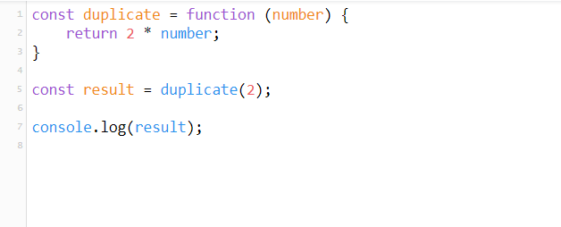

# Rambling Javascript #2: Fat arrow functions

Continuamos nuestro camino indagando sobre diversos aspectos de JavaScript. En este caso vamos a comentar sobre uno de los añadidos más relevantes que se hicieron con _ES6_ (ó _EcmaScript 2015_). Estamos hablando de las _Fat arrow functions_. Con su uso conseguiremos un código más legible y compacto.
Sin embargo, es conveniente hacer hincapié en algunos puntos que pueden pasarse de largo a la hora de trabajar con ellas. Comenzamos.

## Sintaxis

Tomaremos como base un ejemplo básico de función escrita en _ES5_. En este caso la función ```add``` tiene como argumentos dos números y nos devuelve la suma.

```javascript
const add = function(a,b) {
    return a + b;
}
```

Código totalmente correcto, pero quizás un pelín verboso para lo que realmente hace, que es la suma de dos números. De ahí partimos con las _fat arrow function_. En un primer momento podemos sustituir la palabra reservada ```function``` por el símbolo siguiente ```=>```, conocido como _fat arrow_, quedando la expresión de la siguiente forma:

```javascript
const add = (a,b) => {
    return a + b;
}
```
Hemos reducido algunos caracteres, pero la mejora tampoco es demasiado sustancial. Sin embargo, podemos seguir trabajando en la expresión. El siguiente aspecto en el que podemos dar cuenta, es que nuestra función consta de una única expresión. En casos como éste, podemos igualmente quitar la palabra reservada ```return``` e, incluso, quitar las llaves delimitadora de la función. Con ello, la palabra reservada ```return``` quedaría implícita en la única expresión de la que constaría nuestra función. Por lo tanto:

```javascript
const add = (a,b) => a + b;
```

Creo que se intuye que extendiendo su uso conseguiremos un código más claro y limpio.

El siguiente ejemplo también nos permite presentar un nuevo detalle relativo a la sintaxis:



Efectivamente, también hay puntos que aclarar sobre la sintaxis relativo a los argumentos:
* En funciones sin argumentos, o con dos o más, es necesario rodearlos con paréntesis:

```javascript
const sayHelloWorld = () => 'Hello World';

const sayHelloWorldTwo = (place, hour) => `Hello ${place} at ${hour}`
```

* Sin embargo, cuando tengamos un sólo argumento, los paréntesis son opcionales, tal y como hemos visto en el ejemplo previo.

## Uso en casos reales

Todo lo que se ha comentado está bien, pero realmente, y con los ejemplos vistos, tampoco parece un cambio demasiado relevante.
Sin embargo, cuando nos vamos a casos un poco más realistas, es donde empezamos a observar su valía. El ejemplo más claro en el que es muy útil su uso es en los predicados que utilizamos en las funciones para tratar con colecciones.
Mostramos el típico ejemplo de un array de números, y queremos extraer aquellos cuyo valor sea mayor o igual que 5:

```javascript
const numbers = [10,2,3,4,5,8]

const result = numbers.filter(function(number){
    return number >= 5;
});
```

En este caso, utilizando _fat arrow functions_, nuestro ejemplo quedaría de la siguiente forma:

```javascript
const numbers = [10,2,3,4,5,8]

const result = numbers.filter(number => number >= 5);
```

La mejora queda clara en cuanto a legibilidad. Imaginemos su uso en callbacks, donde ayudaran, sino a reducir, sí a mejorar, el temido [callback hell](http://callbackhell.com/) en javascript.

## Comportamiento de ```this```

Todo lo comentado tiene su valor, pero donde realmente está el factor diferenciador de las fat arrow function respecto al empleo de las funciones tradicionales es en el cambio de comportamiento que ha sufrido ```this```. Cualquier persona que haya trabajado con un código JavaScript relativamente complejo, saliendo de los ejemplos básicos, habrá obtenido comportamientos no esperables de ```this```. ¿Cuántos hemos hecho uso de alguno de los siguientes _workarounds_?:
* Guardarnos el contexto en una variable para poder utilizarlo en el callback. Todos hemos hecho alguna vez:

```javascript
function test(){
    var self = this;
    callOtherFunction(function(callbackResponse){
        console.log(this);
        console.log(self);
    })
}
```

* Utilizar el ```bind(this)```, a la hora de definir una función.

Con el uso de las _fat arrow functions_ esto ya no será necesario, ya que, por defecto, ```this``` se va a referir al contexto donde la función haya sido declarada. Lo vemos con el ejemplo siguiente:

```javascript
const testObject = {
    numbers: [10,20,30,40,50],
    title: 'Double of',
    double: function(){
        return this.numbers.map(function(number){
            return `${this.title} ${number} is ${2*number}`;
        })
    }
}

console.log(testObject.double());

```

Si ejecutamos el ejemplo obtenemos lo siguiente:

```javascript
["undefined 10 is 20", "undefined 20 is 40", "undefined 30 is 60", "undefined 40 is 80", "undefined 50 is 100"]
```

¿Qué está ocurriendo? Pues lo que todos sabíamos de antemano, el ```this``` dentro de la función que se ejecuta en el _map_ no es el que cabría esperarse (el objeto _testObject_, sino que es el contexto global, donde, lógicamente, no está definido _title_). Esto lo resolveríamos en _ES5_ con una de las formas siguientes:

```javascript
const testObject = {
    numbers: [10,20,30,40,50],
    title: 'Double of',
    double: function(){
        const self = this;
        return this.numbers.map(function(number){
            return `${self.title} ${number} is ${2*number}`;
        })
    }
}

console.log(testObject.double());
```

```javascript
const testObject = {
    numbers: [10,20,30,40,50],
    title: 'Double of',
    double: function(){
        return this.numbers.map(function(number){
            return `${this.title} ${number} is ${2*number}`;
        }.bind(this));
    }
}

console.log(testObject.double());
```

Mientras que, usando _fat arrow function_, el ejemplo quedaría:

```javascript
const testObject = {
    numbers: [10,20,30,40,50],
    title: 'Double of',
    double: function() {
      return this.numbers.map(number =>
          `${this.title} ${number} is ${2*number}`);
    }
};

console.log(testObject.double());
```

En todos los casos el resultado sería el esperado:

```javascript
["Double of 10 is 20", "Double of 20 is 40", "Double of 30 is 60", "Double of 40 is 80", "Double of 50 is 100"]
```


### Conclusiones
En este caso no hay mucho que comentar:
* Sintaxis más sencilla.
* Código más legible.
* Facilidad a la hora de escribir callbacks o predicados.
* Quita problemas al usar ```this```

Todo son ventajas.

En la siguiente entrega hablaremos de los operadores rest / spread y de los valores por defecto que podemos indicar a nuestras funciones.

## Links
* [Practica ES6](http://jsbin.com/?console,output)
