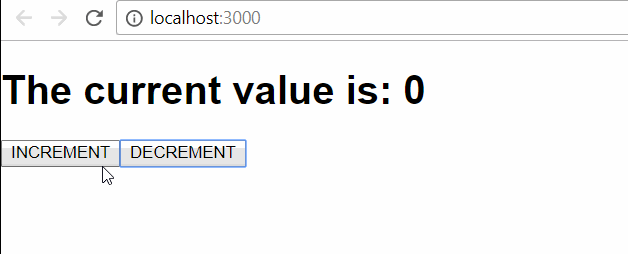

# React: Context API y Portals

Cuando abrazas una tecnología o forma de hacer las cosas es agradable ver como cada cierto tiempo van introduciendo sucesivas mejoras que hacen que ciertas limitaciones que has ido encontrando dejen de serlo.
La comunidad en torno a React es impresionante. No sólo los creadores originales de la librería (Facebook), sino infinidad de personas que han aportado su granito de arena para hacer que la experencia de desarrollo y, sobre todo, los resultados sean muy buenos. Librerías como [Flux](https://github.com/facebook/flux), [Redux](https://github.com/reactjs/redux), [Apollo](https://github.com/apollographql/react-apollo), [Formik](https://github.com/jaredpalmer/formik), [redux-saga](https://github.com/redux-saga/redux-saga)... nos hacen la vida más sencilla a aquellos que trabajamos dia a día con todas ellas.
Para este mismo año se han anunciado nuevas mejoras (como el [async rendering](https://www.youtube.com/watch?v=v6iR3Zk4oDY&t=230s)) muy interesantes para aplicar en nuestras aplicaciones.
En esta pequeña entrada me gustaría hablar sobre dos de los últimos añadidos a React, que son el context API y los React Portals. Empecemos.

## Preparando el entorno

Para hacer las pruebas vamos a utilizar la última versión disponible de React, en este momento (16.03.alpha1). Para ello, partimos de [create-react-app](https://github.com/facebook/create-react-app), el starter amparado por Facebook para aplicaciones React que nos monta la estructura básica de la aplicación. Nos vamos a nuestra consola y creamos la aplicación de ejemplo:

```javascript
npx create-react-app react-context-portals-example
```


Nos situamos en la carpeta que nos ha creado y abrimos la aplicación en nuestro editor favorito. **_Create React App_** nos crea una aplicación React bastante estándar.
.

Vamos a abrir el fichero package.json y vamos a actualizar la versión de los paquetes correspondientes a react y a react-dom. En concreto, vamos a utilizar, como ya hemos comentado, la última disponible en estos momentos. El fichero tiene que quedar de la siguiente forma:

```javascript
{
    "name": "react-context-portals-example",
    "version": "0.1.0",
    "private": true,
    "dependencies": {
        "react": "^v16.3.0-alpha.3",
        "react-dom": "^v16.3.0-alpha.3",
        "react-scripts": "1.1.1"
    },
    "scripts": {
        "start": "react-scripts start",
        "build": "react-scripts build",
        "test": "react-scripts test --env=jsdom",
        "eject": "react-scripts eject"
    }
}
```

Una vez hecho esto, nos vamos a la consola y ejecutamos `yarn start` para que se nos lance la aplicación en nuestro navegador:

.

### Context API

En React, cuando queremos pasar información desde un componente padre a un componente hijo utilizamos las props. El ejemplo más sencillo que se me ocurre es un contador. Tenemos el componente padre que gestiona la cuenta y en su estado mantiene el valor actual de la misma. Por otro lado, tenemos un componente hijo que se va a encargar de mostrar dicho valor por pantalla.
Nuestro componente aplicación sería algo parecido a esto:

```javascript
import React, { Component, Fragment } from 'react';
import Counter from './Counter';

class App extends Component {
    state = {
        current: 0
    };

    increment = () => this.setState({ current: this.state.current + 1 });
    decrement = () => this.setState({ current: this.state.current - 1 });

    render() {
        return (
            <Fragment>
                <Counter currentValue={this.state.current} />
                <button onClick={() => this.increment()}>INCREMENT</button>
                <button onClick={() => this.decrement()}>DECREMENT</button>
            </Fragment>
        );
    }
}

export default App;
```

Tenemos el estado que definimos con el valor inicial de 0 dentro de la propiedad current y, posteriormente, declaramos dos funciones, una para incrementar este valor y otra para decrementarlo, estableciendo el nuevo valor en el state. Posteriormente, tenemos un par de botones que invocan a estas funciones en el evento click y el componente hijo **Counter** que se encarga de mostrar por pantalla el valor actual del contador. Este componente consistiría realmente en un componente funcional muy sencillo que recibe como prop **_currentValue_** y la muestra por pantalla.

```javascript
import React from 'react';

export default ({ currentValue }) => (
    <h1>The current value is: {currentValue}</h1>
);
```

Así, la aplicación quedaría de la siguiente forma:

.

El proceso se hace un poco más farragoso si hubieran más niveles de componentes intermedios. Imaginemos ahora que toda la funcionalidad de nuestro contador se encuentra en un componente Counter, y dentro de éste tendríamos los botones y la referencia al componente presentacional, al cual le tenemos que pasar el valor actual del contador desde el componente aplicación. La estructura sería la siguiente:

*   Componente App:

```javascript
import React, { Component } from 'react';
import Counter from './Counter';

class App extends Component {
    state = {
        current: 0
    };

    render() {
        return (
            <Counter
                currentValue={this.state.current}
                actions={{
                    increment: () =>
                        this.setState({ current: this.state.current + 1 }),
                    decrement: () =>
                        this.setState({ current: this.state.current - 1 })
                }}
            />
        );
    }
}

export default App;
```

*   Componente Counter:

```javascript
import React, { Fragment } from 'react';

import CounterValue from './CounterValue';

export default ({ currentValue, actions }) => (
    <Fragment>
        <CounterValue currentValue={currentValue} />
        <button onClick={() => actions.increment()}>INCREMENT</button>
        <button onClick={() => actions.decrement()}>DECREMENT</button>
    </Fragment>
);
```

*   Componente CounterValue:

```javascript
import React from 'react';

export default ({ currentValue }) => (
    <h1>The current value is: {currentValue}</h1>
);
```

En este caso vemos que el valor actual del contador tiene que llegar desde el componente **_App_** hasta el componente **_CounterValue_** pasando por **_Counter_**. Todavía en este caso sería manejable este paso de elementos por **_props_**, pero podemos extrapolarlo a un caso en el que hayan 6, 7 o 10 niveles intermedios y ya no sería tan manejable. Igualmente, hemos remodelado el state para definir las funciones dentro del mismo y pasarlas a los componentes hijos de forma más sencilla.

#### Context API al rescate

En un caso como el comentado, quizás se nos ocurra utilizar una librería externa para el manejo del estado de la aplicación (como [redux](https://github.com/reactjs/redux)) conectaría mis componentes a la store utilizando el **HOC** **_connect_** de [react-redux](https://github.com/reactjs/react-redux) para mapear las propiedades de nuestro estado como prop del componente deseado.
Con **_context_** el procedimiento sería parecido. En primer lugar, generaremos nuestro contexto para mapear nuestra store:

.

El código final de nuestro conexto quedará de la siguiente forma:

```javascript
import React, { Component } from 'react';

export const AppContext = new React.createContext();

export class AppProvider extends Component {
    state = {
        current: 0
    };

    increment = () => this.setState({ current: this.state.current + 1 });
    decrement = () => this.setState({ current: this.state.current - 1 });

    render() {
        const value = {
            state: this.state,
            actions: {
                increment: this.increment.bind(this),
                decrement: this.decrement.bind(this)
            }
        };

        return (
            <AppContext.Provider value={value}>
                {this.props.children}
            </AppContext.Provider>
        );
    }
}
```

Resumimos lo que hemos hecho:

*   Se ha creado un contexto en AppContext, que se tiene que exportar para ser utilizado por los componentes que quieran utilizar el contexto.
*   En el componente AppProvider almacenamos el estado que queramos compartir y las diferentes acciones que modifican dicho estado.
*   En el método render utilizamos el **Provider** de nuestro **AppContext** y le pasamos el objeto que hemos generado con el estado y las acciones como prop **_value_**
*   Renderizamos los hijos

Ahora vamos a ir modificando los componentes que habíamos codificado anteriormente para que utilicen nuestro nuevo contexto:

*   Componente App:

```javascript
import React from 'react';

import { AppProvider } from './AppContext';
import Counter from './Counter';

const App = () => (
    <AppProvider>
        <Counter />
    </AppProvider>
);

export default App;
```

En nuestro componente inicial de la aplicación, simplemente wrappeamos el método render con nuestro provider para tener el contexto disponible en cualquier componente hijo. Como vemos, al componente **Counter** ya no necesitamos pasarle ningún valor por props, ya que los recogerá en el contexto.

*   Componente Counter:

```javascript
import React, { Fragment } from 'react';

import { AppContext } from './AppContext';
import CounterValue from './CounterValue';

const Counter = ({ currentValue, actions }) => (
    <AppContext.Consumer>
        {({ state: { current }, actions: { increment, decrement } }) => (
            <Fragment>
                <CounterValue currentValue={current} />
                <button onClick={() => increment()}>INCREMENT</button>
                <button onClick={() => decrement()}>DECREMENT</button>
            </Fragment>
        )}
    </AppContext.Consumer>
);

export default Counter;
```

En este caso, hemos importado nuestro contexto e invocado al **Consumer** para poder recuperar los datos del contexto de la aplicación. Como vemos, utilizamos una **renderProp** en donde recibimos todo lo que habíamos añadido en el contexto: el **state** y las **actions**. Utilizando destructuring accedemos a esos elementos que lo usamos en el componente.

Por último, el componente **CounterValue** queda igual que en el caso anteior. Le podemos seguir pasando el valor por props al tratarse de una relación directa padre-hijo. Sin embargo, si quisieramos podríamos, de la misma forma, utilizar el valor recuperándolo directamente del contexto y nos ahorraríamos establecer esa relación.

### React Portals

La otra idea que quería comentar en esta entrada son los Portals. Cuando hablamos de una aplicación en React, generalmente se renderizará en un contenedor definido en el **_HTML_** principal. Revisando la aplicación que hemos desarrollado anteriormente vemos lo siguiente:

```javascript
ReactDOM.render(<App />, document.getElementById('root'));
```

.

En **_index.js_** estamos estableciendo que nuestra aplicación se renderice dentro del elemento con id **_root_**, que, como vemos, es un **div**.
Sin embargo, algunas veces podemos querer cambiar este comportamiento y renderizar componentes fuera de este contenedor. Para ello, utilizaremos los portals.
Imaginemos que queremos renderizar un **div** de nuestro componente **_Counter_** fuera del contenedor principal:

```javascript
import React, { Fragment } from 'react';
import ReactDOM from 'react-dom';

import { AppContext } from './AppContext';
import CounterValue from './CounterValue';

const Counter = ({ currentValue, actions }) => (
    <AppContext.Consumer>
        {({ state: { current }, actions: { increment, decrement } }) => (
            <Fragment>
                <CounterValue currentValue={current} />
                <button onClick={() => increment()}>INCREMENT</button>
                <button onClick={() => decrement()}>DECREMENT</button>
                {ReactDOM.createPortal(
                    <div>PORTAL EXAMPLE</div>,
                    document.getElementById('portal')
                )}
            </Fragment>
        )}
    </AppContext.Consumer>
);

export default Counter;
```

Importamos **ReactDOM**, para poder crear el portal. El método **_createPortal_** tiene dos parámetros:

*   El primero es lo que queremos renderizar en el portal (componentes, elementos jsx...) y el segundo parámetro es el elemento del DOM donde queremos que se renderice. En este caso, hemos añadido un nuevo div con id **_portal_** que es el que utilizamos aquí.
    El resultado es el siguiente:

.

## Conclusiones

Sólo hemos mostrado un pequeño ejemplo de lo que se puede conseguir con estas nuevas APIs. Día a día se van añadiendo más y más posibilidades por lo que continuamente hay que estar revisando los nuevos avances para incorporarlos a nuestros proyectos.

Happy ReactCoding!!!!
