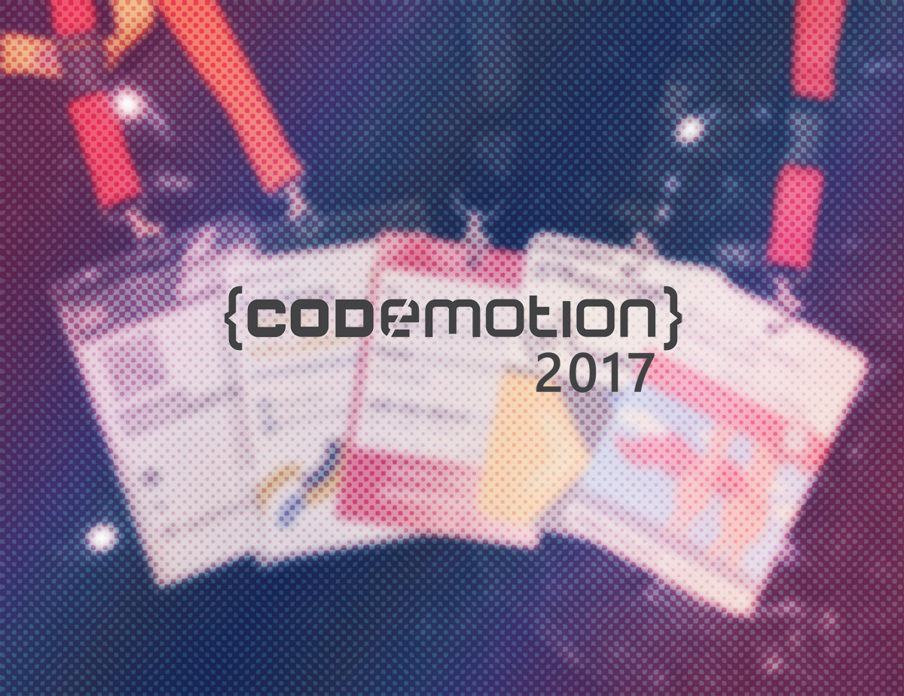

# Codemotion 2017

¡Hola a todos! **El pasado 24 y 25 de noviembre se celebró en Madrid la sexta edición del Codemotion en España**. No Country for Geeks estuvo allí. Hoy vamos a ver un resumen de las charlas que pudimos disfrutar.

En mi caso es el quinto año que asisto. Este evento **además de ser un evento muy importante es un punto de encuentro con amigos** que no tengo el placer de ver a diario.

<blockquote class="instagram-media" data-instgrm-captioned data-instgrm-version="7" style=" background:#FFF; border:0; border-radius:3px; box-shadow:0 0 1px 0 rgba(0,0,0,0.5),0 1px 10px 0 rgba(0,0,0,0.15); margin: 1px; max-width:658px; padding:0; width:99.375%; width:-webkit-calc(100% - 2px); width:calc(100% - 2px);">
 
 

 
 <a href="https://www.instagram.com/p/Bb7Z0Brnr1I/" style=" color:#000; font-family:Arial,sans-serif; font-size:14px; font-style:normal; font-weight:normal; line-height:17px; text-decoration:none; word-wrap:break-word;" target="_blank">Sumando un nuevo Codemotion #Codemotion2017 #CodemotionMadrid</a>
 
Una publicación compartida de Ikeín y yo (@ikeinyyo) el <time style=" font-family:Arial,sans-serif; font-size:14px; line-height:17px;" datetime="2017-11-25T18:24:38+00:00">25 de Nov de 2017 a la(s) 10:24 PST</time>

</blockquote> 

## Codemotion

[Codemotion](https://2017.codemotion.es/) es un evento de informática que se celebra en varios países y cuenta con charlas y formaciones de diferentes ámbitos dentro del mundo de la tecnología y el desarrollo. Podemos disfrutar de charlas técnicas, charlas organizativas e incluso motivacionales. Este año se ha celebrado la sexta edición en España.

## Seamos "Hipster", pensemos en ServerLess

En esta charla [Manu Delgado Díaz](https://twitter.com/mdelgadodiaz83) nos hablaba del concepto de ser *Hipster*: coger cosas antiguas y hacerlas modernas.

Este concepto aplica también al desarrollo y a la infraestructura. El objetivo de esta charla era conocer el paradigma *ServerLess*, ser agnósticos al servidor.

Pudimos conocer algunas soluciones que nos ofrece la nube y más en detalle, cómo crear un *Azure Function* configurando sus *triggers*, *inputs* y *outputs*.

Lo mejor de esta charla es que pude ver en acción las *Azure Function*, que aun no había podido ver. Me parece muy interesante el poder, sin tener un servidor, ejecutar pequeña funcionalidad. Faltó un poco de tiempo en la charla para poder haber visto la demo completa.

## Tu MVP listo en 45 minutos

De la mano de [Meriem El Yamri](https://twitter.com/melyamri), cofundadora de [Crowtec](https://twitter.com/crowtec_), **pudimos conocer su forma de trabajar a la hora de llevar a cabo un MVP** (Minimum Viable Product).

En la charla se hizo hincapié en el **gran peso que tiene la etapa de arquitectura** donde debemos definir aspectos importantes como la tecnología que vamos a utilizar.

**Otro aspecto importante es la de gestión de proyectos**. Saber qué quiere el cliente, saber trasmitir cómo será el resultado y seguir iterando sobre el MVP.

**Lo mejor de la charla fue ver el proceso real** que sigue una empresa a la hora de planificar cómo llevar a cabo un MVP.

## Progressive Web Applications Orientadas a Componentes con VueJS

[Rafael Casuso](https://twitter.com/Rafael_Casuso) nos introdujo al mundo de las PWA (Progressive Web Application) y cómo poder desarrollarlas con VueJS.

La mayor parte de la charla estuvo enfocada a qué es una PWA y cómo se integran con el Sistema Operativo.

Una **PWA es una web que se integra en el sistema operativo gracias al ServiceWorker**, un proxy de red. Es importante para poder crear una PWA que **las peticiones sean por HTTPS** para poder evitar ataques de *[man in the middle](https://es.wikipedia.org/wiki/Ataque_de_intermediario)*.

Las Progressive Web Applications deben estar enfocadas al Offline-first, pensar que la aplicación va a ejecutarse sin conexión.

## ¿Cómo aceleramos la formación de desarrolladores?

Este es un ejemplo de una charla no técnica pero de mucho valor para los profesionales del mundo del desarrollo. [Agustín Cuenca](https://twitter.com/agustincnc) nos enseña a mejorar la manera en la que nos formamos.

Yo me quedo con una frase:

> Hay que pasar del profesor de contenido al profesor de criterio.

Me parece la clave de esta charla. El **profesor de contenido es aquél que te provee de información**, que podrías encontrar en internet, simplemente buscando en Google. En cambio, **el profesor de criterio es aquél que te aconseja qué información te conviene en función de tus conocimientos y tu *background***.

El profesor de criterio tiene que adaptar la información que recibe el alumno en función de cómo es, hacia dónde quiere ir, qué conocimientos tiene, etc. No limitarse a ofrecer la misma información para todo el mundo.

También me pareció muy interesante un dato acerca de la formación online y su baja tasa de finalización de los cursos.

> Aproximadamente, sólo un 5% de los [MOOCs](https://es.wikipedia.org/wiki/Massive_Open_Online_Course) se acaban con éxito.

Por último mencionó las **3 claves del aprendizaje**:

* Motivación: la gasolina del aprendizaje.
* Cooperación: 1 sola persona aprende peor que 3 trabajando juntas.
* Aprender haciendo: Lo hice, lo aprendí.

## Anarchy.JS

[Dani Latorre](https://twitter.com/dani_latorre) y [Alberto Gualis](https://twitter.com/gualison) nos enseñaron en esta charla su Framework de testing para el frontend.

Cuentan la historia de lo difícil que les resulta hacer tests en el frontend y el tiempo que conlleva lanzar una batería completa.

Por esta razón, han implementado un Framework de test para el frontend con el que pueden crear tests para aplicaciones hechas con Angular, React y Vue.

## PWAs (Progressive Web Apps) como Dios manda

> “A good game is easy to learn but hard to master.” — Nolan Bushnell

En tecnología pasa lo mismo: es sencillo aprender, pero difícil llegar a ser un experto.

Así empieza la charla de [Víctor Sánchez](https://twitter.com/VictorSanchez) en la que nos habla de las PWA explicando cómo ha evolucionado la web desde el HTML estático a las PWA.

**La web no se pensó para hacer las cosas que hacemos hoy en día**: acceso a bluetooth, cámara, micrófono, caché, red, etc..

Como ya vimos en una charla anterior, **las PWA necesitan que las peticiones se hagan por HTTPS**. Para ello Víctor nos propone **[Let's Encrypt](https://letsencrypt.org/), una web que nos ofrece certificados gratuitos** y automáticos. Es sencillo, sin HTTPS no podemos acceder a las *capabilities* del dispositivo.

Ya vimos en otra de las charlas el concepto de Offline-First. En esta charla Víctor nos cuenta que **es sencillo que la aplicación trabaje sin conexión o buena conexión. Lo difícil es hacer la gestión de la aplicación con mala conexión** o cortes intermitentes.

Otro aspecto importante de las Progressive Web Applications es el **App Shell. Que es el marco de la aplicación que se cachea y carga instantáneamente** al abrir la PWA. Es importante que sea identificativo de la app, lo que hace que la gente reconozca rápido que es tu aplicación y van por buen camino.

Por último cabe destacar que si tenemos la PWA instalada en nuestro dispositivo nos seguimos aprovechando de la navegación por clicks de la web, ya que **cuando hagamos click en un enlace de nuestro dominio se abrirá nuestra aplicación** en vez de la web en el navegador.

## Desorientados a Objetos

Como en otras ocasiones, nos encontramos ante otra muy buena charla de [Modesto San Juan](https://twitter.com/msanjuan). En este caso nos hace reflexionar sobre cómo trabajamos con nuestro objetos.

En la universidad nos enseñan qué estos son los 3 principios de la programación orientada a objetos:

* Polimorfismo
* Encapsulación
* Herencia

En la charla Modesto nos cuenta que **expertos de la programación a objetos**, hablando sobre qué era para ellos, **sólo se pusieron de acuerdo en un punto: la encapsulación**.

> La encapsulación consiste en juntar de manera cohesiva comportamiento y datos.

Por último, Modesto nos habló de **ejemplos de errores que cometemos con frecuencia a la hora de trabajar con orientación a objetos**: Objetos tontos, sin funcionalidad, servicios a donde nos llevamos la lógica que debería tener un objeto, patrones envenenados, Herencia vs Composición, etc.

Esta es una charla que, en mi opinión, le saca los colores a más de uno; entre los que me incluyo. Como casi todas las charlas de Modesto te hace reflexionar y pararte a pensar cuando estás desarrollando.

Además me interesa mucho profundizar en el concepto de Herecia VS Composición, repasando qué aspectos se resuelven mejor con una u otra opción.

Una charla muy buena que recomiendo que veáis:

Esta charla cerraba el evento el viernes.

## From Java to Scala sin morir en el intento

Ya el sábado, [Álvaro Fidalgo](https://twitter.com/dmj200) nos enseñaba a trabajar en Scala si vienes de programar en Java.

Al tratarse de Java, la mayoría de los conceptos se me hacía difíciles de seguir. Pero sí es importante mencionar **las principales diferencias que aprendí entre Java y Scala**.

* Java es un lenguaje orientado a objetos, mientras que **Scala es una combinación de un lenguaje funcional y orientado a objetos**.
* **Scala trabaja con objetos inmutables**, sin embargo, en Java se abusa de la mutabilidad.
* En **Scala hay que evitar los *efectos de lado***, en Java se modifica el estado interno.

## ¿Cómo dar una charla memorable y no morir en el intento?

Sin duda, la charla que más me gustó fue la de [Edin Kapić](https://twitter.com/ekapic). Cualquier comunicador que esté empezando o que quiera mejorar debería ver esta charla.

En esta charla se intenta evitar *la muerte por Power Point*, con algunos consejos que se llevan a la práctica durante la charla.

> Empieza siendo memorable.

Es importante **arrancar la charla captando la atención del público**. Dispones solo de los 30 primeros segundos ¡hazlo bien!

Al hacer una formación o charla hay **tres tipos de oradores: Story Teller, Teacher y Presenter**.

**El Teacher** es la figura del profesor, **enseña en clases de una duración considerable** y puede estar acompañado por prácticas.

El **Presenter se dedica a exponer hechos con datos**. Esta figura es la que más *muertes por Power Point* provoca en el mundo. En este caso, la figura del orador es prescindible.

El **Story Teller es el que más nos interesa**. El objetivo de este tipo de orador es **plantar la semilla de una idea en quienes lo escuchan**. A lo Origen.

> Los humanos estamos predispuestos a escuchar.

Es importante **acompañar tus charlas con anécdotas** que te ayuden a transmitir lo que quieres contar. Hacer la charla como si estuvieras contando una historia.

> Cuenta, no expongas

### Preparar la charla

A la hora de preparar la charla hay que empezar por el final. Tenemos que partir de la idea que queremos transmitir.

**Es importante tener claro cuál es el objetivo de la charla**. ¿Es vender un producto? ¿Es intentar que nos contraten? ¿Es que la gente se interese por un tema?

**Intenta no contar demasiadas ideas**. Es mejor contar una y saber transmitirla bien, con ejemplo y contando la historia.

> Menos es más

Y recuerda que las **Slides son muletas** para la historia que quieres contar, podrían ser prescindibles **y nunca tendría que distraer al oyente de tu discurso**.

**Adapta la charla al nivel de conocimientos del público**. Una charla por debajo de su nivel hará que se aburra. Y una charla por encima de su nivel hará que se pierda.

> Adapta siempre la charla a tu público

### El entorno

Es importante conocer dónde vas a dar la charla. ¿Qué tipo de proyector tiene? ¿Conexiones? ¿Tipo de sala? ¿Te van a poder escuchar bien?

**Adelántate a todos los imprevistos que te puedan aparecer**. Si tienes una demo siempre puedes grabarla en video antes por si falla la conexión.

> Intenta tener un plan B... y C, D, E...

### Por último...

**Al final de la charla no introduzcas conceptos nuevos** que hagan perderse al público. Remata lo que has contado hasta ahora.

Es mejor que sobren 15 minutos para preguntas que tener 15 minutos de rollo.

Cada 8 minutos intenta llamar de nuevo la atención de publico con algo divertido o con un silencio. **Tienes que mantener la atención del público**.

> Una charla memorable es un pequeño milagro, tu público verá el mundo de otra manera después de ella.

## Cómo hacer una presentación y no matar a tu audiencia

Esta charla es complementaria a la anterior. En esta charla [Toni Recio](https://twitter.com/tonirecio) y [Laura Camino](https://twitter.com/lauracamino2_0) nos explican cómo hacer buenas Slides y que no desvíen la atención del público.

Al igual que en la charla anterior, nos explican que **es importante tener claro qué queremos conseguir con una slide y qué audiencia vamos a tener**.

Además nos dan algunos consejos a la hora de elaborar las slides:

* Elimina los WordArts de tu vida.
* Evita los logos de la empresa: Distraen la atención.
* **No incluyas links en las slides**. Haz saber al público que luego las tendrán disponibles con toda la información.
* No hace falta poner el título en cada slide.
* **No añadas textos largos**, código que distraigan al usuario y deje de escucharte. Si es necesario, haz una pausa para que puedan leer y luego continúas. **Desgrana la información en conceptos**.
* **No añadas mucha información o diagramas**, el publico intentará entenderlo y perderás su atención. **Divide la información**.

> Divide y vencerás. Es mejor crear más slides que añadir mucha información en una sola.

## Escalando equipos técnicos paso a paso

En esta charla, [Marta Garrido](https://twitter.com/Garrido_Ledesma) nos cuenta de primera mano cómo han evolucionado en [Flywire](https://twitter.com/FlywireEng).

**Lo interesante de este tipo de charlas es ver a qué problemas se han enfrentado otras empresas** y cómo lo han solucionado. Qué cosas les ha funcionado y qué cosas no.

En el caso de Flywire han pasado por varias estructuras organizativas: un solo equipo, varios equipos y por último *squads*.

Mantienen diferentes rituales para la transmisión de la información entre toda la empresa.

Algunas de las claves para Flywire han sido:

* Escalar: Adaptarse al tamaño de los equipos.
* Abrazar el cambio: Probar cosas nuevas sin miedo a equivocarse.
* Aprendizaje: Organización de Meetups dentro y fuera de la empresa.

## ¿Qué es un Senior Developer?

Esta es otra charla que invita a la reflexión. [Luis G. Valle](https://twitter.com/lgvalle) nos pregunta ¿qué es ser un Developer Senior?

¿Un Developer Senior es...

* ... porque lo dice en LinkedIn?
* ... porque eres más caro?
* ... aquel que hace código que nadie entiende?
* ... lleva mucho tiempo en la empresa?

> Senior = Madurez

**Un Developer Senior es un desarrollador maduro**. Que esta **comprometido** con la empresa y con las necesidades del cliente. Alza la voz cuando es necesario, con datos que respalden sus críticas.

Es aquel que se cuestiona los dogmas y va más allá.

> Lo importante es aportar valor para la empresa y el cliente.

Un Developer Senior debería cumplir 4 principios:

* **Confianza:** nunca prometas nada que sepas que no vas a cumplir.
* **Responsabilidad:** Afronta los errores y aprende de ellos.
* **Flexibilidad:** No ligues tu carrera a una única herramienta.
* **Pragmatismo:** Nuestro trabajo es más que escribir código. Resolvemos problemas. Hay que encontrar el punto medio entre perfección y pragmatismo.

Este último punto es importante, porque un **Developer Senior debe** conocer el destino, las habilidades y el contexto para **ayudar a obtener el mejor producto posible**.

Para conseguir llegar a ser un Developer Senior, Luis nos ofrece algunas reglas:

* **Escuchar y aprender:** Acepta consejos y críticas.
* **Lidera dando ejemplo:** Tienes que ser proactivo.
* **Enseñar a los demás:** Ayuda los demás a crecer.
* **Cuestiona los procesos:** Aportar nuevas ideas y soluciones.
* **Ayuda a mejorar la cultura de empresa**.

## Cómo Crear un Sistema de Diseño UX Basado en Componentes Web

La web ha sufrido una evolución muy grande desde su nacimiento. Ha pasado de ser una web de paso, a una más social y de consumo.

Ha tenido que adaptarse pero sin abandonar HTML. Es que cada vez han surgido más frameworks del lado del cliente.

En esta charla [Javier Vélez](https://twitter.com/javiervelezreye) nos cuenta qué son los sistemas de diseño y su importancia para las empresas.

## El Informático

Recién entrado en los 40, [David Bonilla](https://twitter.com/david_bonilla) nos invita a reflexionar sobre el papel de los informáticos en la sociedad.

¿Qué es ser informático? ¿Es tener la carrera? ¿Trabajar con Software o Hardware? ¿Ser una persona con animadversión hacia el deporte?

David se siente que no encaja en ninguna de esas definiciones. Ser informático es algo más.

**La informática es uno de los sectores con mayor potencial para luchar contra el *statu quo***. ¿Pero realmente lo estamos haciendo?

Es interesante ver la charla de David Bonilla para poder reflexionar sobre esta pregunta.

Estoy de acuerdo con David en que nosotros, al trabajar con información, somos el colectivo con mayor potencial para frenar muchas de las cosas que sabemos que están mal. Pero es muy difícil luchar contra grandes compañías como Facebook o Google.

En cualquier caso, creo que las figuras más mediáticas, como él, son las primeras que deben mojarse en este aspecto, porque además de trabajar con información, su opinión influye en mucha gente.

## ¡Hasta el año que viene!

Y con esto se cerraba el Codemotion 2017 en Madrid. Un evento que cada año se supera con más charlas y mayor número de asistentes. Un evento *multicomunidad* que te ayuda a salir de tu zona de confort.

Me gustaría destacar la cantidad de charlas no tan técnicas que podemos ver en este evento. El conocer cómo dar charlas o ver cómo hacen las cosas otros equipos de desarrollo te hacen crecer como profesional del sector.

Me despido con ganas de más Codemotion.

Un saludo y ¡nos vemos en el futuro!
