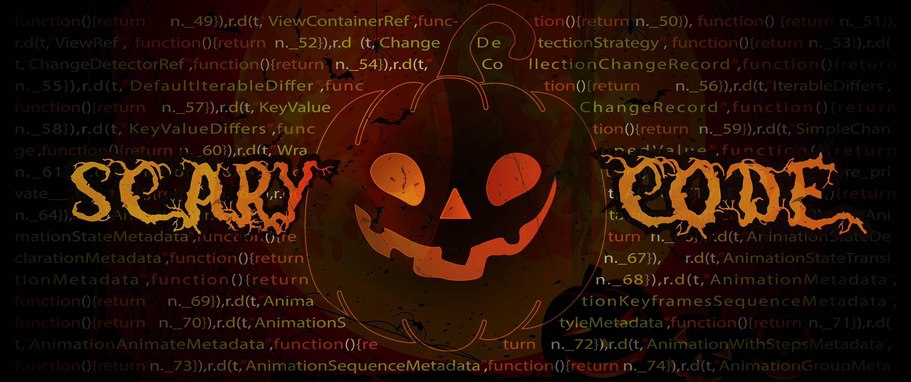

# Scary Code

Halloween: noche de las brujas, de los muertos y de los Scary Codes.

Hoy vamos a repasar los códigos más escalofriantes que los integrantes de *No Country for Geeks* han protagonizado o han presenciado.

**Advertencia:** Este post contiene código que podría dañar la sensibilidad del lector. Pedimos disculpas de antemano por el código que estáis a punto de leer.

## Comentarios Everywhere

Este código pertenece al [Stracomter III dos puntos espacio el mejor juego de la historia](https://github.com/maktub82/StracomterIII/blob/af9e94a75b54af1dbc36ad0f3ec6d8792504e575/trunk/Graphics/lib/GraphicTree.cc#L51). Un juego de mi etapa universitaria. Al parecer tener código comentado no era un problema.

En el poco código que no está comentado en este método encontramos palabras como `node`, `hijos`, `GraphicTree`, `raiz`, `tree`... **no había problema en mezclar idiomas.**

```cpp
GraphicNode::GraphicNode(const GraphicNode & node) {
	//item= new Element(*node.item);//Borrar en arreglar lo comentado de abajo.
	/*switch (node.item->getElementType())
	 {
	 case Core::Element::e_camera:
	 item= new Camera(*(Camera*)node.item);
	 break;
	 case Core::Element::e_light:
	 item= new Light(*(Light*)node.item);
	 break;
	 case Core::Element::e_transform:
	 item= new Transform(*(Transform*)node.item);
	 break;
	 case Core::Element::e_entity:
	 //	CREAR SWITCH PARA IDENTIFICAR QUE TIPO DE ENTIDAD ES.
	 //item= new Entity(*(Entity*)node.item);
	 switch(((Entity*)node.item)->getType()) {
	 case Core::Entities::e_captain:
	 break;
	 case Core::Entities::e_enemy1:
	 case Core::Entities::e_enemy2:
	 case Core::Entities::e_enemy3:
	 //Todo item= new Bot(*(Bot*)node.item);
	 break;
	 //case Core::Entities::e_columne
	 }
	 break;
	 default:
	 cerr << "Warning: Element con tipo none no copiado" << endl;
	 break;
	 }*/
	item = node.item;

	for (unsigned int i = 0; i < node.hijos.size(); i++) {
		hijos.push_back(new GraphicTree(*hijos[i]));
	}
}

GraphicTree & GraphicTree::operator=(const GraphicTree & tree) {
	if (this != &tree) {
		if (raiz != NULL) {
			delete raiz;
			raiz = NULL;
		}
		//this->~GraphicTree();
		if (tree.raiz != NULL) {
			//GraphicNode *aux = new GraphicNode();
			//aux->item = new Element(*tree.raiz->item); //Cambiado de aux->item = tree.raiz->item;
			raiz = new GraphicNode(new Element(*tree.raiz->item));
			//raiz = aux;
			//aux = NULL;

			/*if(!raiz->hijos.empty())
			 {
			 for(unsigned int i=0; i<raiz->hijos.size(); i++)
			 {
			 if(raiz->hijos[i]!=NULL)
			 {
			 delete raiz->hijos[i];
			 raiz->hijos[i]=NULL;
			 }
			 }
			 raiz->hijos.clear();
			 }*/
			for (unsigned int i = 0; i < tree.raiz->hijos.size(); i++) {
				raiz->hijos.push_back(new GraphicTree(*tree.raiz->hijos[i]));
			}
		}
	}
	return (*this);
}
```

## Programación orientada a Booleanos

¿Excepciones? ¿Qué es eso? ¿Se come? Yo hago mis cosas en el método y si falla devuelvo `false`, y si todo va bien devuelvo `true`.

```csharp
public Task<bool> AddUser(string userId)
{
    var success = true;

    try
    {
        await _provider.GetUserById(userId);
    }
    catch
    {
        success = false;
    }

    return success;
}
```

## Programación orientada a Enteros

Nada de excepciones, ni objetos de error ni nada. Nosotros usamos enteros y ya está. Los enteros los entiende todo el mundo.

```csharp
public async Task<int> RegisterValidate(UserReciveViewModel user)
{
    if (!UserNameValidate(user.username))
    {
        return USERNAME_ERROR;
    }

    if (!EmailValidate(user.email))
    {
        return EMAIL_ERROR;
    }

    if (!PasswordValidate(user.password))
    {
        return PASSWORD_ERROR;
    }

    if (!ConfirmPasswordValidate(user.password, user.confirmPassword))
    {
        return PASSWORD_COINCIDENCE_ERROR;
    }

    if (!await UserNameRepositoryExisting(user.username))
    {
        return USERNAME_REPEATED;
    }

    if (! await EmailRepositoryExisting(user.email))
    {
        return EMAIL_REPEATED;
    }

    return CORRECT;
}
```


## Los terroríficos Enums

En noches de luna llena los objetos se transforman en Enums y pueden llegar a tener propiedades. Se cuentan historias de que hasta los han oído aullar.

```csharp
[AttributeUsage(AttributeTargets.Field)]
public class FilterAttribute : Attribute
{
    public string Query { get; set; }
    public string FieldToOrderBy { get; set; }
    public int MaxResult { get; set; }
}

public enum FilterType
{
    [Filter(Query = "SELECT * FROM User WHERE Username == {0}", FieldToOrderBy = "Username", MaxResult = 50)]
    Username,
    [Filter(Query = "SELECT * FROM User WHERE Category == {0}", FieldToOrderBy = "Category", MaxResult = 12)]
    Category,
    [Filter(Query = "SELECT * FROM User WHERE Country == {0}", FieldToOrderBy = "Username", MaxResult = 50)]
    Country,
}
```

## Un dado...

Lo creáis o no, este código es para hacer un dado. Yo no logro entenderlo... pero funciona.

```js
loop = setInterval(function () {
    var random = Math.floor(Math.random() * 5) +1;
    lanzar.textContent = random;
    contador++;

    if (contador == 6) {
        clearInterval(loop);

        loop = setInterval(function () {
            var random = Math.floor(Math.random() * 5) +1;
            lanzar.textContent = random;
            contador++;

            if (contador == 12) {
                clearInterval(loop);
                contador = 0;
                valueDados = random;

            }

        }, 100);
    }

}, 50);
```

## Es tan absurdo...

...cuando haces una comprobación que devuelve `true` o `false` para acabar devolviendo `true` o `false`... 🙃

```csharp
public bool IsAdult(int age)
{
    if(age >= 18)
    {
        return true;
    }
    else
    {
        return false;
    }
}
```

¿Quién no ha intentado hacer un *parser* de JSON porque el "False" con mayúsculas no sabía deserializarlo?

```js
function parseBool(bool) {
  if(bool === "False") {
    return false;
  }
  return true;
}
```
**Importante:** Podríamos calificar este código de *panojita fina*.

## ¡Usemos nuestros propios formatos!

No nos gusta usar ni JSON ni XML, lo que nos gusta es usar S#: Serialización con almohadillas.

```csharp
public void SendMessage(Message message)
{
    var userSend = SocketCollection.Where(p => p.Id = message.Id).SingleOrDefault();

    if(userSend != null)
    {
        string send = message.Type + "#" + message.GameId + "#" + message.RivalName + "#" + message.Score + "#" + message.Position;
        userSend.Send(send);
    }
}
```

Es importante que el nombre del rival no contenga almohadillas... 😂

```js
function deserialize(json) {
  var fields = json.split("#");

  return {
    Type: fields[0],
    GameId: fields[1],
    RivalName: fields[2],
    Score: fields[3],
    Position: fields[4]
  };
}
```

¿Y quién no ha almacenado los datos de las aplicaciones en un fichero de texto local serializado con S#?

**Nota:** De nuevo, pedimos disculpas.

## No siempre fue fácil cerrar la aplicación

En versiones antiguas de Windows Phone no existía una API que te permitiera cerrar la aplicación... Así que teníamos que ser más... *imaginativos*.

```csharp
public static void Exit()
{
    var zero = 0;
    var throwException = 1 / zero;
}
```

## ¿El algoritmo mas ineficiente del mundo?

**Nota:** Esto es una recreación de un código que hice en la universidad.

La idea era hacer un algoritmo que dado un número par me diera dos números primos que sumados dan como resultado ese número par.

Y este fue el resultado. Obviamente tardaba mucho tiempo en ejecutarse el algoritmo.

```csharp
public static void GetSumFactor(int num)
{
    for (int i = 2; i < num; i++)
    {
        if(IsPrimo(i))
        {
            for (int j = 2; j < num; j++)
            {
                if(IsPrimo(j))
                {
                    if(j + i == num)
                    {
                        Console.WriteLine($"{num}: {i} + {j}");
                        return;
                    }
                }
            }
        }
    }
}

public static bool IsPrimo(int num)
{
    var isPrimo = true;

    for (int i = 2; i < num-1; i++)
    {
        if(num % i == 0)
        {
            isPrimo = false;
            break;
        }
    }
    return isPrimo;
}
```
Hay muchos y grandes fallos. Más allá de las mejoras que se puedan hacer con conocimientos matemáticos avanzados sobre los número primos hay fallos de concepto muy importantes.

1. **El cálculo de si es primo o no es muy mejorable.** Sin conocer las reglas de la búsqueda de primos, lo mínimo sería que recorriéramos en el for hasta num / 2.
1. Si os fijáis en el algoritmo, **cuando encontramos un número primo, vuelvo a iterar buscando primos y cuando encuentro uno compruebo si la suma es igual al numero par introducido**. Simplemente bastaría con comprobar si es primo el número menos el primo que ya he encontrado... **¡un despropósito!**
1. Al igual que en la búsqueda de primos, no es necesario iterar hasta num en el for.
1. Y ya simplemente por afinar... **en ningún momento compruebo que el número introducido sea par...**

**Nota:** Sentimos cualquier daño que este código haya podido causar.

## Bonus Track: La gente de JavaScript se lo monta a lo grande

Un ejemplo para ordenar números de una forma muy creativa. Visto en [Twitter](https://twitter.com/JavaScriptDaily/status/856267407106682880).

```js
numbers = [8, 42, 38, 111, 2 39, 1];

numbers.forEach(num =>
{
  setTimeout(() => { console.log(num) }, num);
});
```

## Buenas noches

Desde *No Country for Geeks* esperamos que ninguno de los ejemplos anteriores os provoquen pesadillas...

Estos son solo algunos ejemplos de los Scary Codes ¿Qué otros ejemplos de códigos terroríficos se os ocurren? ¡Dejadlo en comentarios!

Un saludo y... Scary coding!
