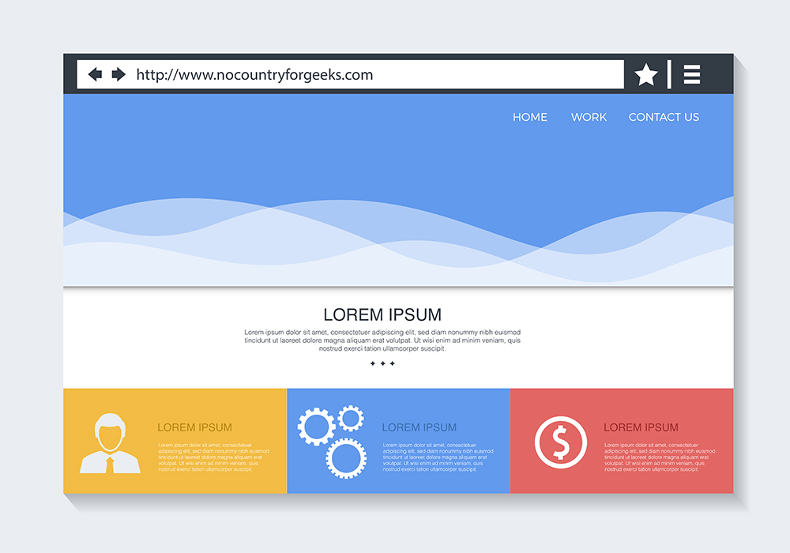
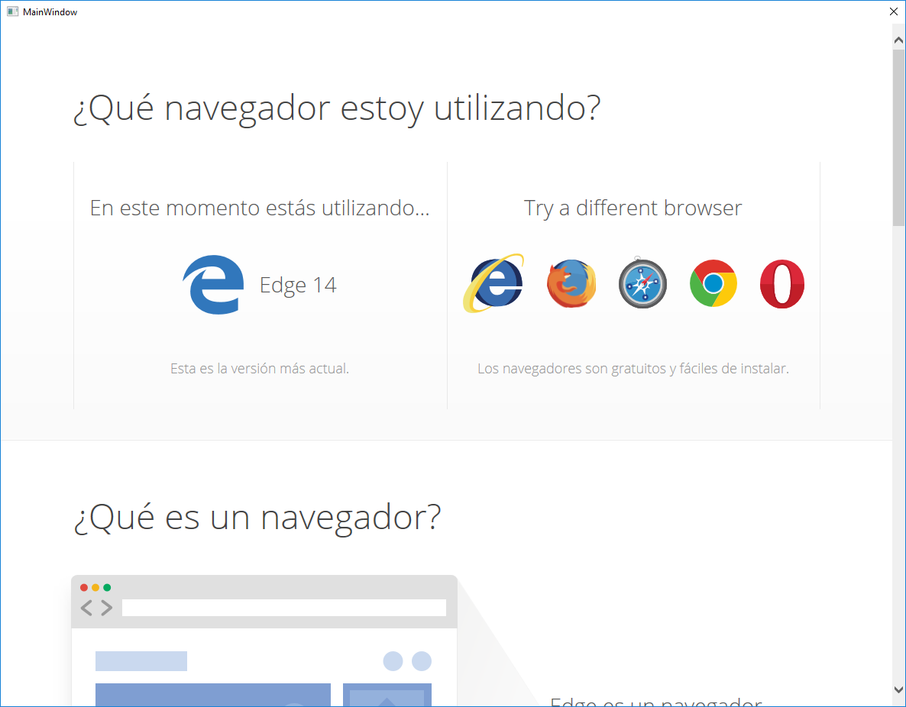
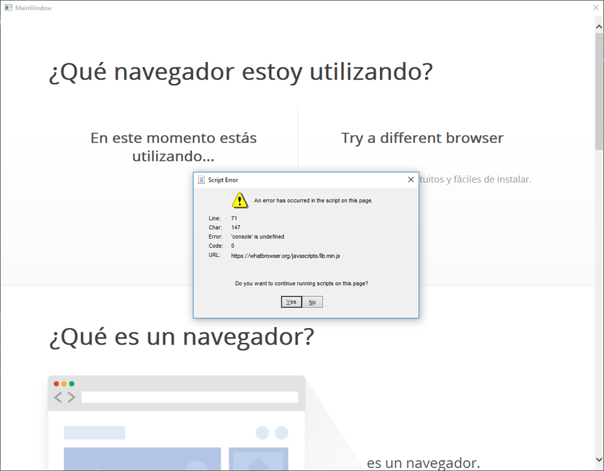
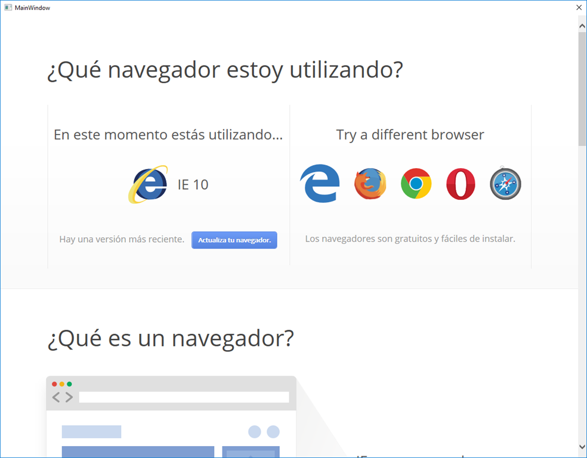
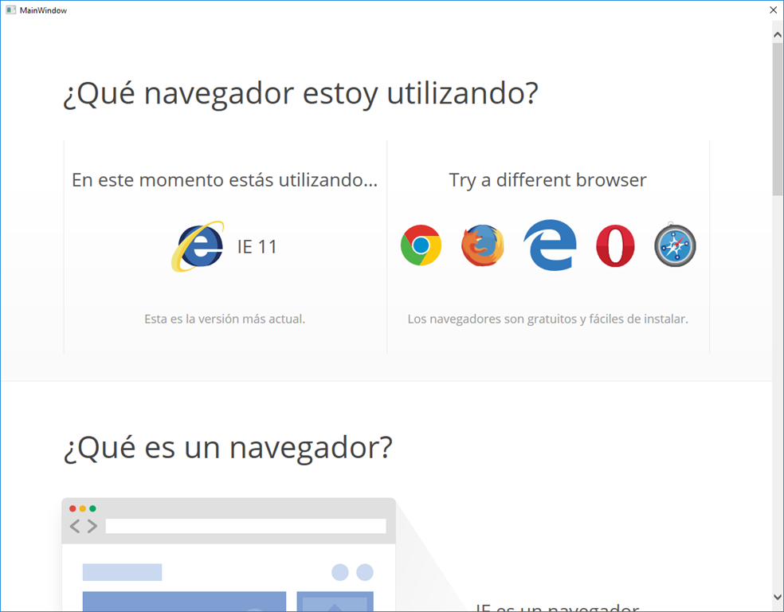

# Cómo cambiar la versión de Internet Explorer en el WebBrowser de WPF

Cuando trabajamos con **aplicaciones UWP** y utilizamos el WebView podemos estar seguros de que la mayoría de páginas webs van a funcionar sin ningún problema, ya que por debajo el WebView **utiliza la última versión de Microsoft Edge, en mi caso Edge 14**.



**Pero no ocurre lo mismo cuando creamos una aplicación WPF.** En la mayoría de casos las páginas no se visualizarán correctamente e incluso obtendremos errores de JavaScript ya que **el WebBrowser utiliza una versión antigua de Internet Explorer, IE7**.



Por suerte, dada la gran flexibilidad que nos brinda WPF, **podemos cambiar la versión del Internet Explorer** que debe utilizar el WebBrowser de WPF. Para ello **necesitamos modificar el registro de Windows**.

## Modificar la versión de Internet Explorer

Para cambiar la versión de Internet Explorer que debe utilizar el WebBroser de WPF en nuestra aplicación debemos crear una clave de registro en `FEATURE_BROWSER_EMULATION` con el nombre de nuestra aplicación y el valor de la versión de Internet Explorer que queremos que utilice.

### Clave de registro

Debemos crear la clave en:

`[HKEY_CURRENT_USER\SOFTWARE\Microsoft\Internet Explorer\Main\FeatureControl\FEATURE_BROWSER_EMULATION]`

El **nombre de la clave debe ser el nombre de nuestra aplicación** que lo podemos obtener de la siguiente forma.

```csharp
private static string GetApplicationName()
{
  string applicationName = "*";
  #if RELEASE
    applicationName = $"{Process.GetCurrentProcess().ProcessName}.exe";
  #endif
    return applicationName;
}
```

**Nota:** Como podéis ver, en modo Debug podemos utilizar el asterisco para indicar que cualquier aplicación utilice la versión de Internet Explorer que indiquemos.

**Importante:** Lo ideal sería al cerrar la aplicación borrar la clave de registro para evitar que alguna otra aplicación se vea afectada, sobre todo si hemos desplegado en modo Debug.

**Podemos asignar un valor diferente en función de la versión de Internet Explorer que queramos utilizar**. [Aquí](https://msdn.microsoft.com/en-us/library/ee330730%28v=vs.85%29.aspx?f=255&MSPPError=-2147217396#browser_emulation) podéis ver los posibles valores.

**Nota:** Podemos hacer que utilice Microsoft Edge con el valor `0x00002EE1`.

En nuestro caso vamos a probar con los siguientes valores:

```csharp
private const int BrowserEmulationValueEdge14 = 0x00002EE1; // Microsoft Edge
private const int BrowserEmulationValueIE11 = 0x00002AF9; // IE11
private const int BrowserEmulationValueIE10 = 0x00002711; // IE10
private const int BrowserEmulationValueIE9 = 0x0000270F; // IE9
```

### Modificar la clave

Ahora, con todos los datos simplemente tenemos que cambiar la clave de registro.

```csharp
private const string BrowserEmulationSubKey = @"SOFTWARE\Microsoft\Internet Explorer\Main\FeatureControl\FEATURE_BROWSER_EMULATION";
private const int BrowserEmulationValue = BrowserEmulationValueIE11;

public static void ChangeInternetExplorerVersion()
{
  RegistryKey registrybrowser = Registry.CurrentUser.OpenSubKey(BrowserEmulationSubKey, true);

  if (registrybrowser == null)
  {
    registrybrowser = Registry.CurrentUser.CreateSubKey(BrowserEmulationSubKey, RegistryKeyPermissionCheck.ReadWriteSubTree);
  }

  string applicationName = GetApplicationName();
  object currentValue = registrybrowser?.GetValue(applicationName);

  if (currentValue == null || (int)currentValue != BrowserEmulationValue)
  {
      registrybrowser?.SetValue(applicationName, BrowserEmulationValue, RegistryValueKind.DWord);
  }
  registrybrowser?.Close();
}
```

**Nota:** Es importante llamar a este método cuando la aplicación se ha iniciado y antes de cargar el WebBrowser. En mi caso cambio la clave de registro en el OnStartup de App.xaml.cs.


```csharp
protected override void OnStartup(StartupEventArgs e)
{
  base.OnStartup(e);
  IE11WebBrowserRegisitry.ChangeInternetExplorerVersion();
}
```

### Eliminar la clave

Como hemos visto antes **es importante eliminar la clave de registro al cerrar la aplicación para evitar afectar a otras aplicaciones** en caso de haber puesto el asterisco como nombre de la clave **o simplemente para no dejar rastro** de que nuestra aplicación ha pasado por allí.

En ese caso basta con crear un método para eliminar la clave y llamarlo en el OnExit.

```csharp
public static void RemoveRegistry()
{
  RegistryKey registrybrowser = Registry.CurrentUser.OpenSubKey(BrowserEmulationSubKey, true);
  string applicationName = GetApplicationName();
  object currentValue = registrybrowser?.GetValue(applicationName);

  if (currentValue != null)
  {
      registrybrowser?.DeleteValue(applicationName);
  }
  registrybrowser?.Close();
}

// App.xaml.cs
protected override void OnExit(ExitEventArgs e)
{
  base.OnExit(e);
  IE11WebBrowserRegisitry.RemoveRegistry();
}
```

## Resultado

Vamos a probar la aplicación con diferentes versiones de Internet Explorer. Para realizar la prueba vamos a navegar a [https://whatbrowser.org](https://whatbrowser.org), una web que intentará obtener desde qué navegador estamos accediendo.

### Internet Explorer 9 - 0x0000270F

En este caso seguimos obteniendo un error de JavaScript.


### Internet Explorer 10 - 0x00002711

En este caso ha desaparecido el error de JavaScript y podemos ver que se ejecuta el WebBrowser como Internet Explorer 10.



### Internet Explorer 11 - 0x00002AF9

Como podemos ver, ahora la web nos indica que estamos utilizando Internet Explorer 11.



### Microsoft Edge 14 - 0x00002EE1

Con este cambio conseguimos que el WebBrowser utilice Microsoft Edge.


## Conclusiones

Como hemos podido ver **no es nada difícil cambiar la versión de Internet Explorer que utiliza el WebBrowser en WPF**. Aunque también es una pena que no haya una forma directa, como un miembro del control, de cambiar este aspecto ya que hoy en día el utilizar una versión tan vieja de Internet Explorer hace que la mayoría de las páginas no se visualicen correctamente o tengamos problemas con el JavaScript.

Podéis ver el código del ejemplo en [GitHub](https://github.com/maktub82/Samples/tree/master/IE11).

## Referencia

* [Browser Emulation Values](https://msdn.microsoft.com/en-us/library/ee330730%28v=vs.85%29.aspx?f=255&MSPPError=-2147217396#browser_emulation)
* [Código de ejemplo](https://github.com/maktub82/Samples/tree/master/IE11)

Free Vector Graphics by [Vecteezy.com](https://www.vecteezy.com/vector-art/145255-free-web-browser-with-website-vector).

Un saludo y nos vemos en el futuro.
