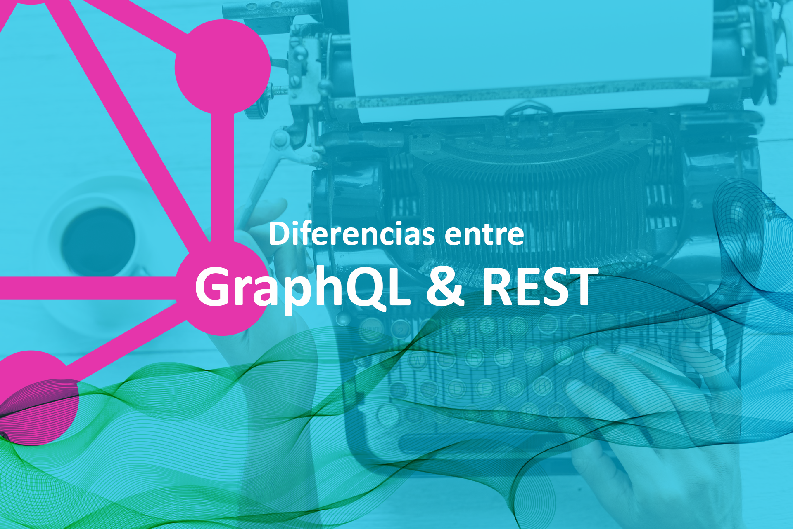

En el mundo de las **APIs** la necesidad de avanzar más rápido en productos más complejos hace que estemos en una constante innovación y evolución, esto hace que las tecnologías sean remplazadas por otras más innovadoras. **REST** y **GraphQL** son dos maneras distintas de enviar datos a través de **HTTP**.

La arquitectura **REST** es la forma más tradicional y usada para el desarrollo de **APIs**, ha ganado muchos adeptos debido a su robustez. En la actualidad este tipo de arquitectura denota cada vez más sus limitaciones y su inflexibilidad. 

**GraphQL** se presenta como una nueva y revolucionaría forma de pensar acerca de las **APIs**. De hecho, **GraphQL** quiere mejorar las debilidades que tiene **REST**

# REST

**REST** utiliza los verbos **HTTP CRUD (GET, POST, PUT, DELETE)** para realizar las operaciones, una **API** necesita (Crear, Eliminar, Modificary Consultar). **REST** sigue un modelo orientado a recursos que están representados por una **URL** única. Hacer una **API** totalmente **REST** es un trabajo complicado debido a todas las normas que esta arquitectura requiere, debido a eso, hay muchas **API REST** que tienen **custom endpoints**.

# GraphQL

**GraphQL** en un lenguaje de consultas que permite definir de una forma sencilla e independiente de la tecnología los datos que queremos que nos devuelva el servidor. Solo tiene un único **endpoint** y se basa en los **Schemas**, para conseguir realizar las mismas acciones que permite **REST**, **GraphQL** usa **Query**, **Mutation** y **Suscription** los cuales nos van a permitir realizar las acciones de Crear, Eliminar, Modificar, Consultar y hacer conexiones en tiempo real. Fue creada por **Facebook** en 2012 pero no fue de código abierto hasta 2015. Este lenguaje de consultas surgió por las necesidades de producto que tenía **Facebook** con su aplicación móvil cuando la quiso migrar a plataforma nativa, ya que anteriormente era un **Web View**. **GraphQL** puede ser usado en cualquier lenguaje como **Node, Python, Ruby, C#, Java, etc**.

# Diferencias

## Obtención de datos

En la actualidad las aplicaciones móviles y web requieren grandes conjuntos de datos que necesitan de recursos relacionados. Obtener esos datos a través de **API REST** requiere de múltiples llamadas (paralelas o secuenciales) para obtener toda la información que se necesita. 
Uno de los puntos más importantes que nos ofrede **GraphQL** es la obtención de datos. En **GraphQL** solo tenemos un único **endpoint** (`/graphql`) con el que accedemos a los datos del servidor. Con una única llamada podemos obtener un objeto con sus objetos relacionados.

Si nos imaginamos el caso de querer mostrar la información de una **serie** con su información básica, sus **episodios** e información del **autor**. Para **REST** primero tendremos que traernos la serie `myApi.com/series/:id` y luego tendremos que consultar sus **episodios** uno a uno. que son recursos relacionados `myApi.com/episodes/:id` y también cargar su **autor** llamando a `myApi.com/author/:id`. Esto significa que necesitamos más de una llamada para componer todos nuestros datos.

En el caso de **GraphQL** con una única **query** podemos obtener todos los datos.

```
{
    serie (id: {id}) {
        id,
        title,
        language,
        image,
        published,
        author {
            name,
            lastName,
        }
        episodes {
            id,
            title,
            description,
            image,
            time,
        }
    }
}
```

El resultado de esta query, será un **JSON** con el mismo formato que el que describe la query.

```javascript
{
    "id": 5,
    "title": "Peaky Blinders",
    "language": "English",
    "image": "myApp.com/peakyBlinders.jpg",
    "published": "2017-09-01",
    "author": {
        "name": "Steven",
        "lastName": "Knight"
    },
    "episodes": [
        {
            "id": 1,
            "title": "Episode 1",
            "description": "",
            "image": "myApp.com/peakyBlinders1.jpg",
            "time": 60000
        },
        {
            "id": 2,
            "title": "Episode 2",
            "description": "",
            "image": "myApp.com/peakyBlinders2.jpg",
            "time": 60000
        }
    ]
}
```


## Over Fetching / Under Fetching


**Over Fetching**: Con **REST** nos encontramos el problema que podemos obtener datos innecesarios. Cada **endpoint** tiene una estructura fija de datos que nos va a retornar cada vez que hagamos una petición. En muchas ocasiones no necesitamos toda la información y acabamos ignorando muchos de los datos, lo que indica que no estamos siendo eficientes. Este problema hace que consumamos más ancho de banda y tengamos una carga más lenta, en dispositivos móviles le estaremos consumiendo más datos de los necesarios al usuario.

Si volvemos al caso anterior y solo necesitamos pedir los campos **image y title** de los episodios de una **serie**, con **REST** no podríamos hacerlo, siempre recibiremos toda la información de cada uno de los episodios.

**GraphQL** nos permite pedir únicamente los campos que necesitamos.

```javascript
    serie (id: {id}) {
        id,
        title,
        language,
        image,
        published,
        author {
            name,
            lastName,
        }
        episodes {
            title,
            image,
        }
    }
```

**Under Fetching**: Es el problema contrario comentado anteriormente, quizás necesitamos información que un único **endpoint** no nos va a dar por completo, en este caso necesitamos hacer una llamada adicional para traerse la información. En este caso nos encontramos con el problema de  **N + 1** peticiones y es un problema de rendimiento de **API REST** y consultas a base de datos.

## Versionado

Otro gran problema que tiene **REST** es el versionado, este no es trivial. Si necesitamos soportar múltiples versiones normalmente significa crear nuevos **endpoints**. Esto nos generará más problemas cuando es usado y su mantenimiento será más costoso, esto puede causar **código spagetti** o que tengamos que duplicar código en el servidor.

Con **GraphQL** no tenemos la necesidad de versionado, nosotros podemos añadir campos o tipos facilmente sin modificar o romper las queries existentes. También podemos marcar campos como **deprecated** para excluirlos de la respuesta.

## Documentación

Tener una buena documentación de la **API** es esencial para que el consumidor pueda hacer un buen consumo de ella y conozca los **endpoints** y sepa que parámetros tiene que enviar y que le van a devolver. Los desarrolladores por norma general odiamos hacer documentación, muchas veces nos encontramos **APIs** que no tienen una buena documentación o no esta actualizada y el tiempo de desarrollo de nuestras aplicaciones aumenta cuando queremos consumirlas. Existen herramientas como **Swagger** que nos ayuda a tener una documentación pero si nos salimos del standar **REST** no lo va a soportar.

## Cacheo

**REST** está implementado mediante **HTTP** y este tiene implementado el almacenamiento en **caché**, el cliente puede usar el almacenamiento en **caché** para evitar volver a buscar recursos. **GraphQL** no tiene un mecanismo de almacenamiento en **caché** lo que deja a los clientes con la responsabilidad de encargarse del almacenamiento en **caché**.

## Manejo de errores

El manejo de errores en **REST** es sencillo, solo nos basta con mirar los headers de la llamada **HTTP** para conocer el status de la respuesta. Existen varios códigos de status que cada uno respresenta un tipo de error, redireccion o correcto (2xx, 3xx, 4xx, 5xx) debido a estos códigos podemos conocer facilmente el error y solucionarlo. En **GraphQL** siempre obtendremos una respuesta con un código 200, cuando ocurre un error procesando **Queries** el mensaje de error es enviado al cliente en la respuesta. Esto es debido a que en **GraphQL** nosotros podemos lanzar mas de una query a la vez, si una de las consultas falla, no deberíamos cambiar el código de estado para toda la solicitud. Algunas de las consultas en la petición se pueden resolver adecuadamente, otras pueden fallar, pero aún tenemos que devolver el status 200. 


## Analisis de datos en el servidor

**GraphQL** nos permite obtener información precisa sobre los datos que se solicitan al servidor. A medida que cada cliente especifica la información que le interesa, es posible entender como se están usando los datos disponibles. Esto nos puede ayudar a eliminar campos especificos que ya ningún cliente usa. También podemos analizar el rendimiento de las peticiones solicitadas por el servidor. **GraphQL** utiliza **resolvers** para recopilar los datos que solicita un cliente, podemos medir el rendimiento de estos **resolvers** para obtener información de cuellos de botella en el sistema.

# Ecosistema GraphQl

El ecosistema **GraphQL** nos da una gran cantidad de librerías, herramientas y servicios. Aqui os dejo un par de ellos.

## Cliente

- [Apollo Client](https://www.apollographql.com/docs/): Es una librería potente y flexible. Está soportado para varias plataformas y frameworks (React, Vuea, Angular, iOS, Android).

## Tools

- [GraphiQL](https://github.com/graphql/graphiql): Es una interfaz interactiva en el navegador que nos permite explorar y probar los **Schemas** que existen en el **Server**

- [Apollo Optics](https://www.apollographql.com/engine/): Nos permite visualizar, monitorizar y scalar nuestros servicios **GraphQL**


# Conclusión

**GraphQL** implementa funcionalidades que solventan los problemas que tiene **REST**. Se centra en las necesidades de desarrollo que tenemos actualmente para crear **APIs** que se amolden a cualquier tipo de uso, su mantenimiento es menos costoso y nos permite agilizar los tiempos de desarrollo y cambios en la parte cliente. Tiene una comunidad muy activa que trata de mejorar el producto y sobre todo la experiencía de desarrollo. 


