Con la llegada del estándar **HTML5** ha resurgido el formato **SVG** en el desarrollo web. **HTML5** reconoce el formato **SVG** como un estándar, lo que ha obligado a los navegadores a soportarlo de manera nativa. 

## ¿Qué es SVG?

SVG **(Scalable Vector Graphics)** es un formato vectorial que nos permite crear vectores escalables, esto nos permite agrandar y disminuir el tamaño de nuestras imágenes sin perder calidad. Una de las grandes ventajas de este formato es que tiene un tamaño reducido independientemente del tamaño de la imagen, este formato se exporta como XML.

SVG nos permite usar tres tipos de vectores gráficos
*   Formas (líneas, círculos, polígonos, etc)
*	Imágenes
*	Texto


## Cómo usar un SVG en la web

En la web podemos usar **SVG** escribiendo directamente en el **HTML** las etiques que representen las formas **(rect, cicle, line, polygon,  etc)** o podemos usar ficheros **.svg** exportados desde editores gráficos como **Illustrator, Inkscape o sketch.**

**Hay que tener en cuenta que no todas las maneras de usar un SVG los tratan como un gráfico vectorial y vamos a perder las ventajas que esto nos ofrece.**

**Como imagen**  
```html

```

**Como iframe** 
```html
<iframe src="circle.svg"></iframe>
```

**Como objeto** 
```html
<object data="circle.svg"></object>
```

**Embebido** 
```html
<embed src="circle.svg" />
```

**Como fondo** 
```html 
<div class="circle"></div>

.circle {
        width: 200px;
        height: 200px;
        background: url('circle.svg');
    }
```


**Como SVG** 
```html
<svg>
    <circle cx="65" cy="65" r="65"/>
</svg>
```

Las única manera que lo mantiene como un gráfico vectorial es la etiqueta ``<svg>``

## Ventajas de usar SVG

*	Podemos cambiar el color y el tamaño directamente con CSS incluso solo cambiar el color de partes específicas
*	Reducimos el peso de imágenes a la hora de descargar
*	Podemos ahorrar peticiones al servidor si generamos un Sprite SVG
*	No perderemos calidad

## Sprite SVG

Un **sprite SVG** consiste en coger todos los **SVG** que contiene nuestra web y crear un único fichero **SVG** que los contenga a todos. Esto nos permite ahorrarnos múltiples llamadas al servidor lo que podría provocar bloqueo de llamadas por parte del navegador y ralentizaría nuestra carga de la web.

Para generar un **sprite SVG** podemos realizarlo a mano (es un trabajo tedioso y en el que podemos equivocarnos) o usar tareas **gulp, grunt o webpack** para crearlos, estas tareas nos permiten configurar los plugins con los cuales podemos eliminar cosas innecesarias de nuestros **SVG** y que ocuparían espacio innecesario en el **sprite**.

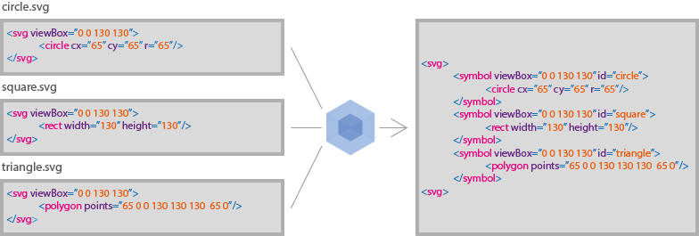

## Generando un sprite SVG con Webpack en mi aplicación React

En este punto vamos a ver como generar un **sprite SVG** con **Webpack** en una aplicación **React**, esta configuración **Webpack** también serviría para aplicaciones con **Angular 2, Vue, etc**

En mi caso voy a partir de una configuración **Webpack** básica con el loader de **Babel** para el **JavaScript** y el plugin de **React hot loader** para la recarga del proyecto cuando haya cambios.

```javascript
const webpack = require('webpack');
const HtmlWebpackPlugin = require('html-webpack-plugin');
const path = require('path');

module.exports = {
    entry: [
        './app',
        'react-hot-loader/patch',
        'webpack-dev-server/client?http://localhost:8080',
        'webpack/hot/only-dev-server',
    ],
    output: {
        path: path.join(__dirname, './build'),
        filename: '[name].[hash].js'
    },
    module: {
        rules: [
            {
                test: /\.(js|jsx)$/,
                loader: 'babel-loader',
                exclude: /node_modules/,
                options: {
                    cacheDirectory: true
                }
            }
        ]
    },
    plugins: [
        new webpack.HotModuleReplacementPlugin(),
        new webpack.NamedModulesPlugin(),
        new HtmlWebpackPlugin({ template: './index.template.html'})
    ],
    devServer: {
        historyApiFallback: true,
        open: true,
        hot: true,
        stats: 'errors-only',
        overlay: {
            errors: true,
            warnings: true,
        },
        headers: {
            'Access-Control-Allow-Origin': '*'
        },
        watchOptions: {
            poll: true,
            ignored: [/node_modules/]
        }
    }
}
``` 

Para poder generar nuestro **sprite SVG** vamos a necesitar un loader que se encargue de ello, yo en mi caso voy a usar **svg-sprite-loader** en el siguiente [enlace](https://github.com/kisenka/svg-sprite-loader) podéis ver toda la documentación.

Para instalarlo: 

```
npm install svg-sprite-loader -D
# via yarn
yarn add svg-sprite-loader -D
```

Una vez instalado volveremos a nuestra configuración de **Webpack** y añadiremos la configuración necesaria para usar este loader, añadiendo una regla y el plugin correspondiente.

Añadiremos la siguiente regla
```javascript
{
    test: /\.svg$/,
    loader: 'svg-sprite-loader',
    options: {
        extract: true,
        spriteFilename: './svgSprite/images.svg'
    }
}

```
Como vemos, el **sprite SVG** nos lo va a servir en la ruta **./svgSprite** en el fichero **images.svg**

También añadiremos el correspondiente plugin que nos obliga a usar el loader anterior.

```javascript
new SpriteLoaderPlugin()
```

Nuestro **webpack.config.js** quedaria de la siguiente manera

```javascript
const webpack = require('webpack');
const HtmlWebpackPlugin = require('html-webpack-plugin');
const SpriteLoaderPlugin = require('svg-sprite-loader/plugin');
const path = require('path');

module.exports = {
    entry: [
        './app',
        'react-hot-loader/patch',
        'webpack-dev-server/client?http://localhost:8080',
        'webpack/hot/only-dev-server',
    ],
    output: {
        path: path.join(__dirname, './build'),
        filename: '[name].[hash].js'
    },
    module: {
        rules: [
            {
                test: /\.(js|jsx)$/,
                loader: 'babel-loader',
                exclude: /node_modules/,
                options: {
                    cacheDirectory: true
                }
            },
            {
                test: /\.svg$/,
                loader: 'svg-sprite-loader',
                options: {
                    extract: true,
                    spriteFilename: './svgSprite/images.svg'
                }
            }
        ]
    },
    plugins: [
        new webpack.HotModuleReplacementPlugin(),
        new webpack.NamedModulesPlugin(),
        new HtmlWebpackPlugin({ template: './index.template.html'}),
        new SpriteLoaderPlugin()
    ],
    devServer: {
        historyApiFallback: true,
        open: true,
        hot: true,	
        stats: 'errors-only',
        overlay: {
            errors: true,
            warnings: true,
        },
        headers: {
            'Access-Control-Allow-Origin': '*'
        },
        watchOptions: {
            poll: true,
            ignored: [/node_modules/]
        }
    }
}
```

Cuando arranquemos nuestra aplicación este loader se encargara de generar un **sprite svg** con todos los iconos a los que se les este haciendo un **import** en la aplicación.

## Probando mi Sprite SVG

Para probar y ver como funciona nuestro nuevo loader generando un **sprite,** vamos a probar a hacer una barra de navegación con los típicos iconos de redes sociales, para ello yo los voy a insertar en una carpeta icons que he creado en mi componente **navigationBar.js**

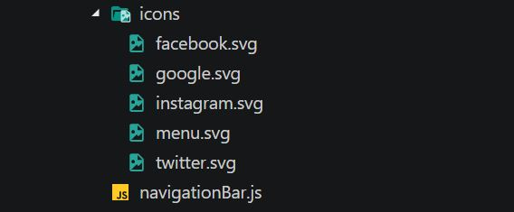

Despues desde nuestro componente **NavigationBar** vamos a importar los **SVG** y usar con la etiqueta ``<use>`` al cual le pasaremos la url del icono.

```javascript
import React, { Component } from 'react';
import facebookIcon from './icons/facebook.svg';
import twitterIcon from './icons/twitter.svg';
import instagramIcon from './icons/instagram.svg';
import googleIcon from './icons/google.svg';
import menuIcon from './icons/menu.svg';

class NavigationBar extends Component {
    render() {
        return(
            <nav>
                <div className='menu'>
                    <svg viewBox={ menuIcon.viewBox }>
                        <use xlinkHref={ menuIcon.url } />
                    </svg>
                </div>
                <a href='https://twitter.com'>
                    <svg viewBox={ facebookIcon.viewBox } className='icon'>
                        <use xlinkHref={ facebookIcon.url } />
                    </svg>
                </a>
                <a href='https://twitter.com' className='icon'>
                    <svg viewBox={ twitterIcon.viewBox }>
                        <use xlinkHref={ twitterIcon.url } />
                    </svg>
                </a>
                <a href='/https://www.instagram.com' className='icon'>
                    <svg viewBox={ instagramIcon.viewBox }>
                        <use xlinkHref={ instagramIcon.url } />
                    </svg>
                </a>
                <a href='https://plus.google.com' className='icon'>
                    <svg viewBox={ googleIcon.viewBox }>
                        <use xlinkHref={ googleIcon.url } />
                    </svg>
                </a>
            </nav>
        )
    }
}

export default NavigationBar;

```

La url que le pasamos a la etiqueta ``<use>`` es la que nos pasa directamente el loader de **Webpack,** la url contandra la ruta al fichero y el id del **SVG** que queramos usar por ejemplo
``./svgSprite/images.svg#twitter-usage``esta seria la url que nos daria para el icono de **Twitter**.

El resultado de la barra de navegación seria el siguiente.

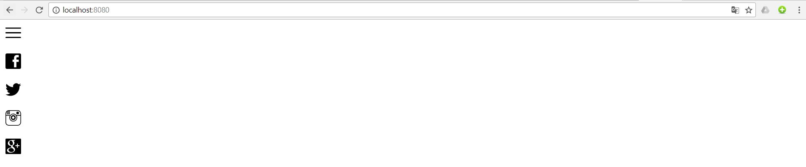

Si nos fijamos estamos repitiendo mucho código, vamos a extraerlo a un componente **Icon** al cual simplemente le pasemos el **SVG,** de esta manera centralizaremos todos los cambios que queramos hacer en todos los iconos de la aplicación. Mi componente **Icon** quedaria de esta manera:

```javascript
import React, { Component } from 'react';

class Icon extends Component {
    render() {
        const { svgIcon } = this.props;
        return (
            <svg viewBox={ svgIcon.viewBox } className='icon'>
                <use xlinkHref={ svgIcon.url } />
            </svg>
        );
    }
}

export default Icon;
```

De esta manera nuestro componente **NavigationBar** quedaria de esta manera tan simple:

```javascript
class NavigationBar extends Component {
    render() {
        return(
            <nav>
                <div className='menu'>
                    <Icon svgIcon={ menuIcon } />
                </div>
                <a href='https://twitter.com'>
                    <Icon svgIcon={ facebookIcon } />
                </a>
                <a href='https://twitter.com' className='icon'>
                    <Icon svgIcon={ twitterIcon } />
                </a>
                <a href='/https://www.instagram.com' className='icon'>
                    <Icon svgIcon={ instagramIcon } />
                </a>
                <a href='https://plus.google.com' className='icon'>
                    <Icon svgIcon={ googleIcon } />
                </a>
            </nav>
        )
    }
}

export default NavigationBar;
```


Ahora que ya tenemos nuestro **sprite SVG** funcionando podemos estilarlo y dar color directamente a los estilos con las propiedad **CSS fill** si queremos dar color a los border usaremos **stroke.**

```css
.icon {
    fill: #939393;
}
```

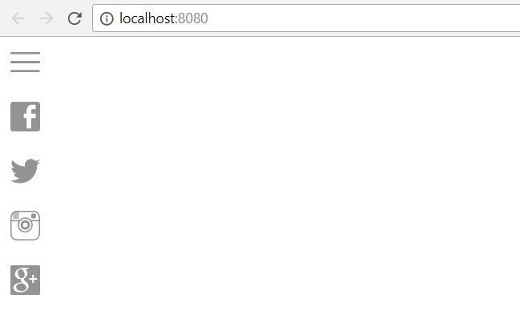

## Comparando carga de una aplicacion, sprite VS no sprite

Para comparar la carga de una página usando **sprite SVG** y otra que no lo usa he creado una página web básica con unos cuantos **SVG**, hay que tener en cuenta que las diferencias no serán demasiado grandes, ya que es una aplicación pequeña, pero serán notorias. Ambas aplicaciones las he desplegado en un **webapp de azure** para hacer la prueba.

#### Aplicación con sprite
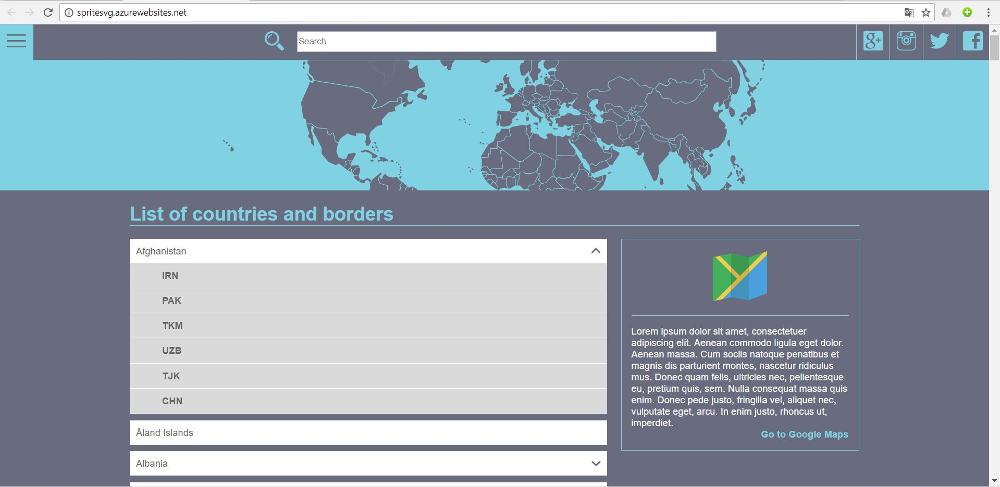

#### Aplicación sin sprite
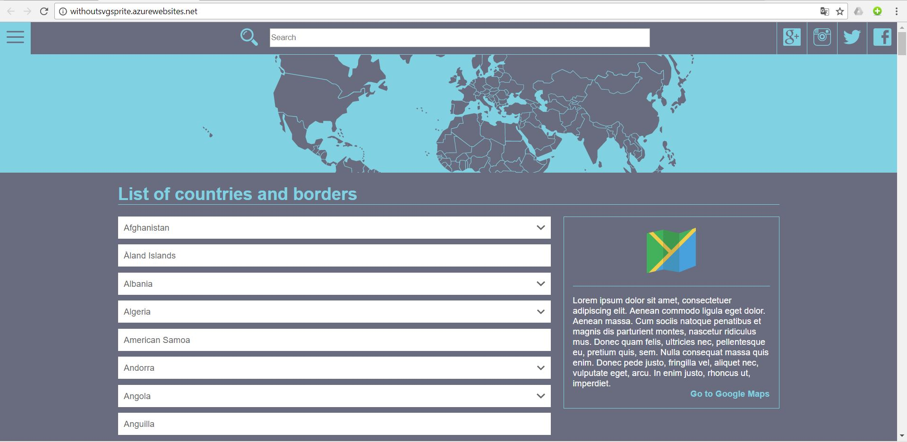

De una manera no muy precisa podemos ver el tiempo de carga de ambas aplicaciones si abrimos las **devTool de Chrome**

#### Página con sprite SVG
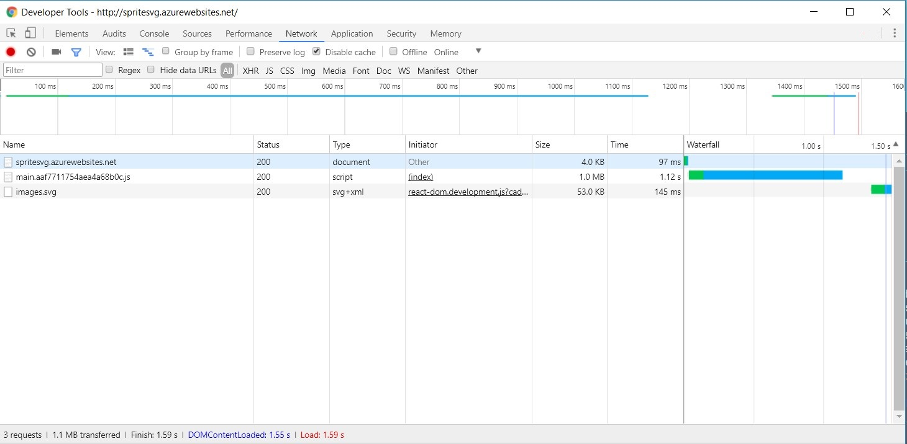

#### Página sin sprite
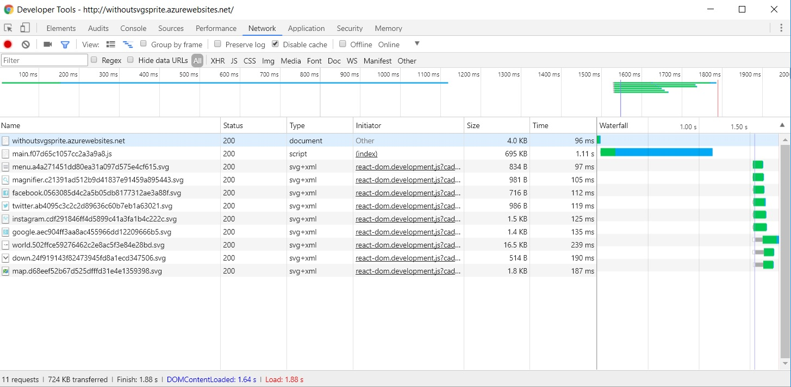

Como podemos ver no hay mucha diferencia, pero si nos fijamos en las llamadas, la pagina con el **sprite SVG** solo necesita una llamada mientras que la otra necesita una para cada una.

Para comparar de una forma mas precisa el tiempo de carga voy a uar la herramienta online [dareboost](https://www.dareboost.com)


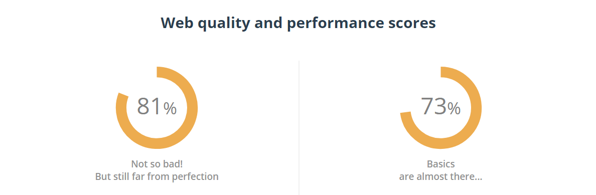

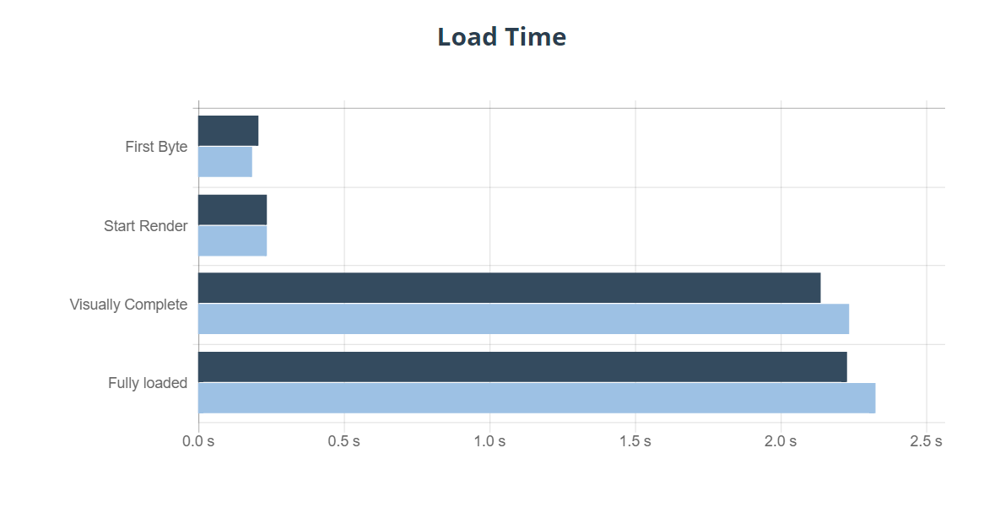

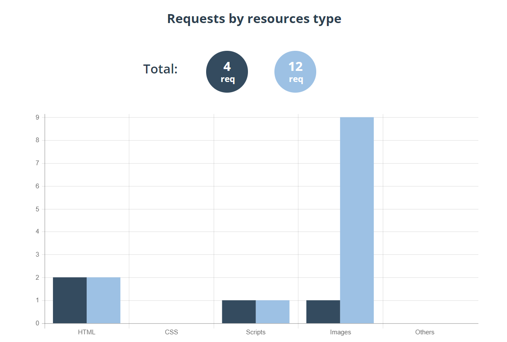


Como podemos ver la web saca mas o menos las mismas conclusiones que podiamos haber sacado viendo las devTools, lo que mas llama la atencion es el **performace score** ya que hay una gran diferencia entre la página que usa **sprite SVG** y la que no.

En el tiempo de carga vemos que tarda un poco menos la página con **sprite** y la cantidad de peticiones vemos que es mas elevada cuando no tenemos el **sprite**, esto en página web de mayor tamaño y mayor cantidad de **SVG** puede hacer que el tiempo de carga sea mas lento notablemente.

## Mejorando la accesibilidad de nuestros SVG

Ahora que hemos conseguido mejorar un poco la carga de nuestra aplicación con el **sprite SVG** nos toca darles accesibilidad ya que nuestras webs pueden ser usadas por personas con discapacidad visual.

Para la etiqueta ```` existe el atributo ``alt``, este atributo permite a personas con discapacidad visual hacerse una idea de lo que representa esa imagen mediante un screen reader. Con los **SVG** tenemos que conseguir lo mismo, pero en este caso no existe un atributo ``alt``, para los **SVG** tenemos que añadir las etiquetas ``<title>`` y ``<desc>``.

Lo primero que vamos ha hacer es añadir a nuestro componente **Icon** los roles ``role='img'`` y ``role='presentation'`` uno irá en la etiqueta ``<svg>`` y el otro en la etiqueta``<use>``. 

```javascript
import React, { Component } from 'react';

class Icon extends Component {
    render() {
        const { svgIcon } = this.props;
        return (
            <svg role='img' viewBox={ svgIcon.viewBox } className='icon' >
                <use role='presentation' xlinkHref={ svgIcon.url } />
            </svg>
        );
    }
}

export default Icon;
```

El siguiente paso es conseguir que los **screen readers** tengan la informacion que sea util para el usuario, si ahora mismo pusiésemos el ratón encima de algún SVG de la página, no aparecería ningún tipo de tooltip indicando lo que representa esa imagen. 


Existe una [web](http://describler.com/#image) que nos permite revisar todo el **SVG** a falta de las etiquetas ``<title>`` y ``<desc>``, hay que tener en cuenta que un **SVG** puede tener una etiqueta ``<title>`` y ``<desc>`` por cada uno de lo vectores que contiene.

Si abro mi **SVG** de twitter en dicha web, me aparece lo siguiente:

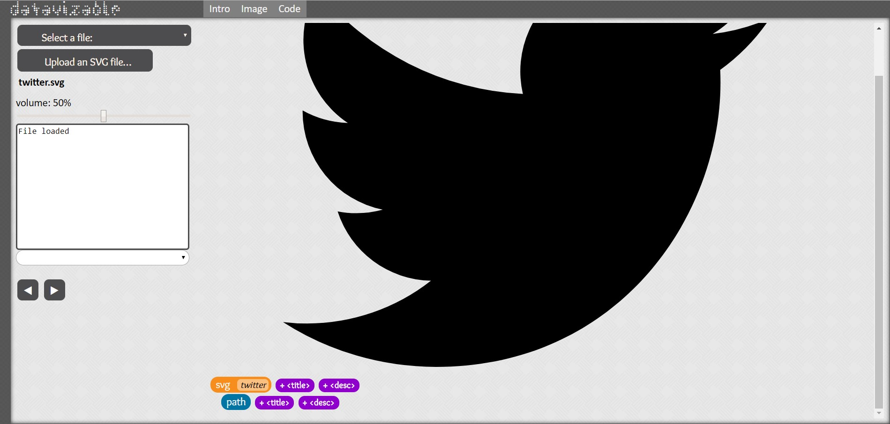

Me dice que debería de tener varios ``<title>`` y ``<desc>``, en este caso no sería necesario añadir ambos, ya que solo representa una única figura, si ejecuto el screen reader que tiene la página, no me da ningún tipo de información.

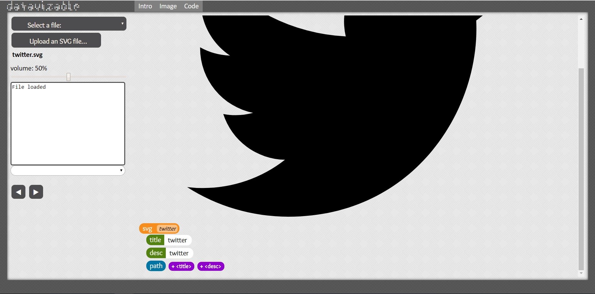

Cuando le añadimos el title y desc si ejecutamos el screen reader veremos como interpreta los nuevos valores que le hemos introducido. Si nos bajamos el archivo que hemos modifica y lo insertamos en nuestra web, obtendremos el resultado que queríamos.


También podemos hacer que cada uno de los vectores de nuestro svg reaccione a su propio ``<title>`` y ``<desc>`` esto nos puede venir bien en el ejemplo del mapa que tenemos. Si hacemos los mismos pasos que antes y añadimos los títulos y descripciones a cada uno de los vectores que nos marque podemos hacer que reaccione de esta manera.

 

## Soporte para IE11

**IE11** no soporta la etiqueta ```<use>``` por lo que si ejecutamos la app en **IE11** no vamos a ver nada. Para conseguir que funcione tenemos que usar un polyfill, en mi caso voy a usar [svgxuse](https://github.com/Keyamoon/svgxuse).

1. ```npm install svgxuse``` o ```yarn add svgxuse```
2. En el fichero de entrada de la aplicación (index.js) o en el caso de tener un fichero de polyfills, añadir 
```javascript 
import 'svgxuse'
```
3. Crear un estilo global (recomiendo solo aplicarlo para IE11) que aplique a la clase **sprite-symbol-usage** un display block.

```css
   sprite-symbol-usage {
       display: block !important;
   } 
```

Con estos 3 pasos ya tendremos visibles nuestros svg en **IE11**.


De esta manera conseguiremos darle un poco mas de accesibilidad a nuestra web y así ayudar a que personas con discapacidad visual puedan usar nuestra web sin problemas ya que son los más olvidados.