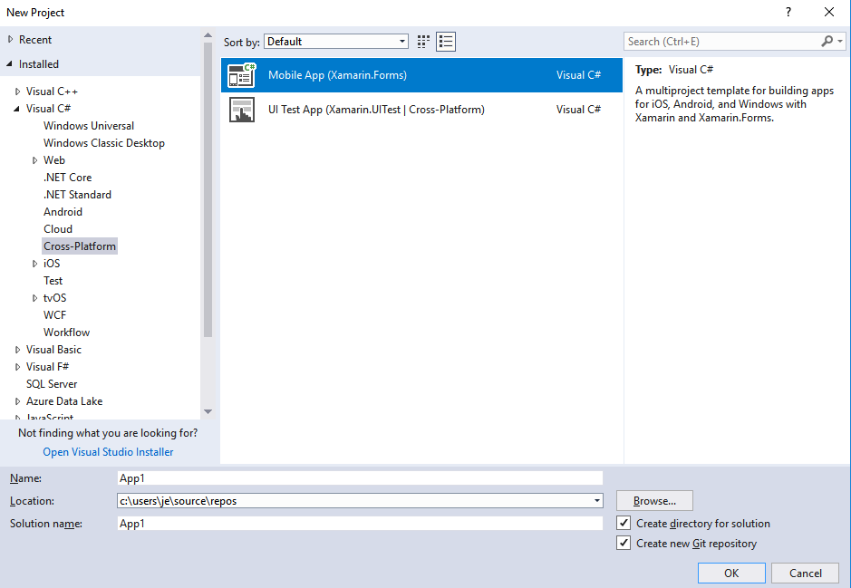
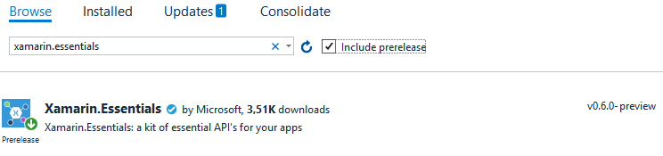
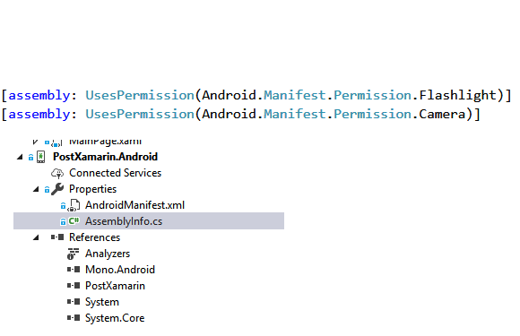
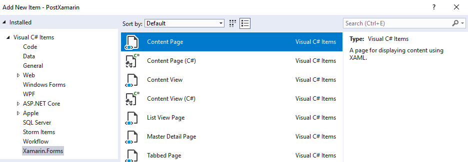

# MORSE TO LIGHT
Muy buenas, en esta ocasión vamos a aprender a realizar una app con Xamarin para dispositivos Android. Básicamente la función de nuestra app será traducir un texto a código morse y transmitirlo usando para ello el flash de la cámara de nuestro smartphone.
Para ello vamos a apoyarnos en la API multiplataforma Xamarin Essentials, la cual permite hacer uso de los sensores del dispositivo (giroscopio, brújula, etc..) de una manera sencilla.
Comenzamos:
Abrimos un nuevo proyecto en Visual Studio. En este caso nuestro proyecto será del tipo Xamarin.forms como se indica en la imagen.




Además vamos a instalar el paquete Nugget Xamarin Essentials, que nos permitirá hacer uso del flash de la cámara.



Para ello es importante que marquemos la casilla Include prerelease, ya que al ser una versión pre-lanzamiento si no la marcamos no nos aparecerá.
Ahora necesitamos dar permisos a nuestra APP para que pueda hacer uso del flash, para ello debemos editar el archivo AssemblyInfo.cs en Android e incluir las siguientes líneas de código.



Nos crearemos una Carperta Views y dentro de ella una vista del tipo ContentPage:



En este tipo de elementos podremos incluir la parte visual (archivo XAML) , donde crearemos cuatro botones y un "entry" donde escribiremos el texto a traducir , además podremos implementar  la parte lógica de nuestra APP en el archivo CS de nuestro ContentPage.
En el archivo XAML escribiremos el siguiente código:


```
<?xml version="1.0" encoding="utf-8" ?>
<ContentPage xmlns="http://xamarin.com/schemas/2014/forms"
             xmlns:x="http://schemas.microsoft.com/winfx/2009/xaml"
             x:Class="MorseToLight.Views.LinternaView">
    <ContentPage.Content>
        <StackLayout>
            <Label Text="Morse Light Traductor"               
                HorizontalOptions="CenterAndExpand" VerticalOptions="CenterAndExpand"  />
            <Label x:Name="lblmorse" FontSize="20" TextColor="BlueViolet" VerticalOptions="CenterAndExpand" 
                HorizontalOptions="CenterAndExpand" />
            <Button Text="Encender linterna" x:Name="btnencender"/>
            <Button Text="Apagar linterna" x:Name="btnapagar"/>
            <Button Text="Morse to Text" x:Name="btnmorsetext"/>
            <Button Text="Morse to Light" x:Name="btnmorse"/>
            <Entry x:Name="txtTexto" Placeholder="Introduce un texto"/>
        </StackLayout>
    </ContentPage.Content>
</ContentPage>
```

En el archivo CS de nuestro ContentPage vamos a escribir las funciones que nos van a permitir encender y apagar el flash y además implementaremos el traductor a Código Morse.

```
using System;
using System.Collections.Generic;
using System.Threading;
using Xamarin.Essentials;
using Xamarin.Forms;
using Xamarin.Forms.Xaml;

namespace MorseToLight.Views
{
    [XamlCompilation(XamlCompilationOptions.Compile)]
	public partial class LinternaView : ContentPage
	{
        static Dictionary<char, string> translator;
        public LinternaView()
        {
            InitializeComponent();
            InitialiseDictionary();
            this.btnencender.Clicked += Btnencender_Clicked;
            this.btnapagar.Clicked += Btnapagar_Clicked;
            this.btnmorse.Clicked += Btnmorse_Clicked;
            this.btnmorsetext.Clicked += Btnmorsetext_Clicked;
        }

        private void Btnmorsetext_Clicked(object sender, EventArgs e){...}
        private void Btnmorse_Clicked(object sender, EventArgs e){...}
        private void Btnapagar_Clicked(object sender, EventArgs e){...}
        private void Btnencender_Clicked(object sender, EventArgs e){...}
        private static void InitialiseDictionary(){...}
        private static string translate(string input){...}
    }
}
```

Como veis haciendo uso del Nugget Xamarin.Essentials podemos encender y apagar el flash con una simple línea de código:

```
private void Btnencender_Clicked(object sender, EventArgs e)
        {
            // Turn On
            Flashlight.TurnOnAsync();
        }
```

Ahora vamos a crear la lógica que nos permitirá encender y apagar el flash en base a un texto traducido a código Morse, el cuál traduce un texto a una serie de rayas, puntos y espacios;  nosotros convendremos en que las rayas sean un destello de luz largo, los puntos destello corto y los espacios entre palabras ausencia de luz de dos segundos.
Para ello vamos a necesitar un diccionario que contenga las correspondencias de los caracteres alfabéticos y numéricos con el sistema raya/punto del morse.

```
translator = new Dictionary<char, string>()
            {
                {'a', string.Concat(dot, dash)},
                {'b', string.Concat(dash, dot, dot, dot)},
                {'c', string.Concat(dash, dot, dash, dot)},
                {'d', string.Concat(dash, dot, dot)},
                {'e', dot.ToString()},
                {'f', string.Concat(dot, dot, dash, dot)},
                {'g', string.Concat(dash, dash, dot)},
                {'h', string.Concat(dot, dot, dot, dot)},
                {'i', string.Concat(dot, dot)},
                {'j', string.Concat(dot, dash, dash, dash)},
                {'k', string.Concat(dash, dot, dash)},
                {'l', string.Concat(dot, dash, dot, dot)},
                {'m', string.Concat(dash, dash)},
                {'n', string.Concat(dash, dot)},
                {'o', string.Concat(dash, dash, dash)},
                {'p', string.Concat(dot, dash, dash, dot)},
                {'q', string.Concat(dash, dash, dot, dash)},
                {'r', string.Concat(dot, dash, dot)},
                {'s', string.Concat(dot, dot, dot)},
                {'t', string.Concat(dash)},
                {'u', string.Concat(dot, dot, dash)},
                {'v', string.Concat(dot, dot, dot, dash)},
                {'w', string.Concat(dot, dash, dash)},
                {'x', string.Concat(dash, dot, dot, dash)},
                {'y', string.Concat(dash, dot, dash, dash)},
                {'z', string.Concat(dash, dash, dot, dot)},
                {'0', string.Concat(dash, dash, dash, dash, dash)},
                {'1', string.Concat(dot, dash, dash, dash, dash)},
                {'2', string.Concat(dot, dot, dash, dash, dash)},
                {'3', string.Concat(dot, dot, dot, dash, dash)},
                {'4', string.Concat(dot, dot, dot, dot, dash)},
                {'5', string.Concat(dot, dot, dot, dot, dot)},
                {'6', string.Concat(dash, dot, dot, dot, dot)},
                {'7', string.Concat(dash, dash, dot, dot, dot)},
                {'8', string.Concat(dash, dash, dash, dot, dot)},
                {'9', string.Concat(dash, dash, dash, dash, dot)}
            };
```

Y este diccionario lo usaremos en la función traductora del texto :

```
private static string translate(string input)
        {
            System.Text.StringBuilder sb = new System.Text.StringBuilder();
            foreach (char character in input)
            {
                if (translator.ContainsKey(character))
                {
                    sb.Append(translator[character] + " ");
                }
                else if (character == ' ')
                {
                    sb.Append("/ ");
                }
                else
                {
                    sb.Append(character + " ");
                }
            }
            return sb.ToString();
        }
```

Ahora nuestro texto ya está representado en código Morse como una cadena de rayas y puntos  y le diremos al flash del teléfono la duración del destello cada vez que se encuentre con uno de estos caracteres:

```
private void Btnmorse_Clicked(object sender, EventArgs e)
        {
            String texto = this.txtTexto.Text;
            String morse = translate(texto);
            Thread.Sleep(500);

            foreach (char letra in morse)
            {

                if (letra == '.')
                {
                    Flashlight.TurnOnAsync();
                    Thread.Sleep(500);
                    Flashlight.TurnOffAsync();
                }
                if (letra == '−')
                {
                    Flashlight.TurnOnAsync();
                    Thread.Sleep(1300);
                    Flashlight.TurnOffAsync();
                }
                if (letra == '/')
                {
                    Flashlight.TurnOffAsync();
                    Thread.Sleep(2000);
                }
            }
        }
```

Espero que os haya gustado, esta APP es totalmente funcional para teléfonos Android con una version 4.4 o superiores.

Un saludo.
